# 原子结构模型

## 核物理初步

### 原子与原子核

原子由原子核和核外电子组成。原子核的体积约为原子体积的 $10^{-15}$ 倍，但集中了原子 $99.9\%$ 以上的质量。

- **组成**：原子核由质子（Proton）和中子（Neutron）组成，统称为核子。质子带正电（电荷数 $+1$），中子不带电（电荷数 $0$）。

- **基本数量关系**：

  - 质子数 $Z =$ 核电荷数 $=$ 原子序数 $=$ 核外电子数（电中性时）。
  - 质量数 $A =$ 质子数 $Z +$ 中子数 $N$。
  - **同位素**：质子数相同而中子数不同的原子互为同位素。
  - **同素异形体**：同一元素的不同单质形态，如石墨与金刚石。
  - **核素**：具有特定质子数和中子数的原子核称为核素。

- **核力与稳定性**：

  - **核力**：核子间存在强相互作用力（核力），是一种短程强相互作用力（有效作用距离约 $10^{-15}$ m），能克服质子间的库仑斥力，维持原子核稳定。

  - **核力的特点**：具有饱和性（每个核子只与相邻的几个核子作用）、电荷无关性（对质子和中子作用相同）、短程性（有效作用距离约 $10^{-15}$ m）、色荷特性（强相互作用的载体是胶子）。

  - **核子质量**：质子质量 $m_p = 1.6726 \times 10^{-27} \text{kg} = 1.0073 \text{u}$，中子质量 $m_n = 1.6749 \times 10^{-27} \text{kg} = 1.0087 \text{u}$。原子质量单位（u）定义为 $^{12}\text{C}$ 原子质量的 $1/12$，$1 \text{u} = 1.6605 \times 10^{-27} \text{kg}$。

  - **电子质量**：电子质量 $m_e = 9.1094 \times 10^{-31} \text{kg} = 5.4858 \times 10^{-4} \text{u}$。

- **核结合能**：将原子核分解为自由核子所需的最小能量。比结合能（结合能除以核子数）越大，原子核越稳定。

  - **比结合能**：原子核结合时释放的能量（质量亏损）与核子数之比。比结合能越大，原子核越稳定。

  - **质量亏损**：原子核质量小于组成它的核子质量之和，差额 $\Delta m$ 对应的能量释放遵循 $E = \Delta m c^2$。

  - 中等质量数（$A \approx 60$）的核（如 $\ce{^{56}Fe}$）比结合能最大，最为稳定。

  - **原子核半径**：原子核半径 $R$ 与质量数 $A$ 的关系为 $R = R_0 A^{1/3}$，其中 $R_0 \approx 1.2 \times 10^{-15} \text{m}$。这表明原子核密度近似为常数。

  - **库仑势垒**：原子核中的质子间存在库仑斥力，形成势垒，阻碍核反应的发生。

**大学知识衔接**：

- **核磁共振（NMR）**：利用原子核在磁场中的能级分裂现象，广泛应用于化学结构分析和医学成像。
- **穆斯堡尔谱学**：利用原子核的 $\gamma$ 射线共振吸收，研究原子核与周围环境的相互作用。
- **量子隧穿效应**：解释 $\alpha$ 衰变中 $\alpha$ 粒子如何克服库仑势垒逃逸原子核。

### $\alpha$ 粒子散射实验

1909 年，卢瑟福（Ernest Rutherford）指导他的助手盖革（Hans Geiger）和马斯顿（Ernest Marsden）进行了著名的 $\alpha$ 粒子散射实验。该实验旨在探索原子内部的结构，特别是正电荷在原子中的分布情况。

**实验装置**：

- **放射源**：发射高速 $\alpha$ 粒子（氦原子核，带正电）。

- **金箔**：极薄的金箔作为靶材。

- **荧光屏**：用于检测散射后的 $\alpha$ 粒子。

- **显微镜**：观察荧光屏上的闪光点。

**实验现象**：$\alpha$ 粒子以高速射向金箔，由于金原子中的带电粒子对 $\alpha$ 粒子有库仑力的作用，一些 $\alpha$ 粒子的运动方向会发生改变，即发生散射。实验观察到三种情况：

1. **绝大多数 $\alpha$ 粒子**（约 99.9%）穿过金箔后仍沿原来的方向前进，偏转角度很小（通常小于 2°）。

2. **少数 $\alpha$ 粒子**（约 0.1%）发生了较大角度的偏转（几度到几十度）。

3. **极少数 $\alpha$ 粒子**（约 1/8000）发生了大角度偏转，甚至被反弹回来（偏转角度大于 90°）。

**实验结论**：卢瑟福根据实验结果提出了原子的核式结构模型：

1. **原子核的存在**：由于 $\alpha$ 粒子的质量远大于电子（约 $7300$ 倍），电子对 $\alpha$ 粒子的散射影响可以忽略不计。因此，大角度散射必然是由原子中质量较大且带正电的部分引起的。

2. **原子核的尺寸**：绝大多数 $\alpha$ 粒子几乎不受影响地穿过，说明原子内部大部分是空的。只有当 $\alpha$ 粒子非常接近原子中心的某个极小区域时，才会受到强烈的库仑斥力而发生大角度偏转。

3. **原子核的电荷与质量**：原子核集中了原子的全部正电荷和几乎全部质量，但体积只占原子体积的极小部分（约 $10^{-15}$ m，而原子半径约 $10^{-10}$ m）。

卢瑟福提出的原子核式结构模型认为：

- 原子中心有一个带正电的原子核，集中了几乎全部原子质量。

- 原子核的尺寸极小，约为原子尺寸的十万分之一。

- 电子在核外空间绕核运动，占据原子的大部分体积。

这一模型成功解释了 $\alpha$ 粒子散射实验的结果，并为后续的原子物理学研究奠定了基础。从现代核物理的角度看，$\alpha$ 粒子散射实验不仅是原子结构研究的里程碑，还揭示了以下重要概念：

1. **库仑散射公式**：卢瑟福推导出的散射截面公式，描述了 $\alpha$ 粒子被原子核散射的概率分布。

2. **核力与稳定性**：原子核的稳定性不仅依赖于质子间的库仑斥力，还涉及强相互作用力（核力）的作用。

3. **量子力学的发展**：虽然卢瑟福模型成功解释了散射实验，但它无法解释原子的稳定性（经典电磁理论预测电子会因辐射能量而螺旋式坠入原子核）。这一矛盾最终促成了量子力学的发展。

**考试要点**：在高中物理考试中，$\alpha$ 粒子散射实验常考的知识点包括：

1. **实验现象**：绝大多数 $\alpha$ 粒子直线穿过，少数发生偏转，极少数大角度偏转。

2. **实验结论**：原子内部大部分是空的，正电荷集中在很小的原子核内。

3. **核式结构模型**：原子由原子核和核外电子组成，原子核集中了正电荷和质量。

4. **与汤姆孙模型的对比**：汤姆孙的“葡萄干布丁”模型无法解释大角度散射现象。

$\alpha$ 粒子散射实验不仅揭示了原子的核式结构，还为后续的核物理研究提供了重要启示。例如，通过测量不同元素对 $\alpha$ 粒子的散射情况，可以推算出原子核的电荷数，进而验证元素周期表的排列规律。此外，该实验也为后来的粒子加速器和核反应研究奠定了基础。

### 基态与激发态

处于最低能量状态的原子叫做基态。基态原子吸收能量后，电子会跃迁到较高能级，原子变为激发态。

{ width="60%" }

- 电子从较高的激发态跃迁到较低的激发态，甚至基态时会释放能量。

- **易错点**：电子不一定跃迁到基态，有可能跃迁到较低的激发态。

- 光（辐射）是电子跃迁释放能量的重要形式，原子光谱都与原子核外电子跃迁释放能量有关。

- **跃迁条件**：只有当入射光子的能量 $h\nu = |E_2 - E_1|$ 时，才能发生共振吸收或发射。

**光谱：**

- **光谱的定义**：利用仪器将物质吸收的光或发射的光的波长和强度分别记录下来，就得到光谱。

- **连续光谱**：若光谱是由各种波长的光所组成，且相近的波长差别极小而不能分辨，则这种光谱为连续光谱，例如阳光的光谱即为连续光谱。

- **线状光谱**：若光谱是由具有特定波长、彼此分立的谱线组成，则所得的光谱为线状光谱。

- **吸收光谱**：原子从基态跃迁到激发态时，吸收特定波长的光，在连续光谱上形成暗线。

- **发射光谱**：原子从激发态跃迁到较低能态时，发射特定波长的光，形成明线光谱。

- **原子光谱**：通常是线状光谱。原子光谱源自核外电子在能量不同的轨道之间的跃迁，而电子所处的轨道的能量是量子化的，电子从一个轨道跃迁到另一个轨道时，辐射或吸收的能量是不连续的，以光的形式表现出来的光的波长是不连续的。

- **光谱分析**：每种元素都有其特征光谱，可用于元素鉴定。例如，钠的 D 线（$\pu{589.0 nm}$ 和 $\pu{589.6 nm}$）是其特征发射线。

{ width="80%" }

不同元素的电子发生跃迁会释放或吸收不同的光，可以用光谱仪摄取各种原子的「吸收光谱」（从低能量到高能量）或「发射光谱」（从高能量到低能量），总称为原子光谱。

{ align=right width="35%" }

如右图所示：

- 电子从能量较高的轨道跃迁到 $n=1$ 的轨道所形成的谱线在紫外光区（赖曼系）。

- 电子从能量较高的轨道跃迁到 $n=2$ 的轨道所形成的谱线在可见光区（巴尔末系）。可见光区的四条谱线分别为一条红色的、一条蓝色的和两条紫色的。

- 电子从能量较高的轨道跃迁到 $n=3$ 的轨道所形成的谱线在红外光区（帕邢系）。

- **大学知识**：氢原子光谱的波长公式为 $\dfrac{1}{\lambda} = R\left(\dfrac{1}{n_1^2} - \dfrac{1}{n_2^2}\right)$，其中 $R = 1.097 \times 10^7 \text{m}^{-1}$ 为里德伯常数。

**应试技巧**：

- 记住巴尔末系在可见光区，常考四条谱线。

- 跃迁时 $n$ 越大，光子能量越小，波长越长。

- 发射光谱的明线位置与吸收光谱的暗线位置相同。

在现代化学中，常利用原子光谱上的特征谱线来鉴定元素，称为光谱分析。

### 放射性衰变

某些原子核由于质子和中子比例不协调，处于不稳定状态，会自发地通过释放粒子或电磁辐射转变为另一种核，这一过程称为**放射性衰变**。

1. **衰变类型与本质**：

    | 衰变类型 | 本质 | 反应方程示例 | 变化规律 | 穿透力 | 半衰期范围 |
    | :--- | :--- | :--- | :--- | :--- | :--- |
    | **$\alpha$ 衰变** | 释放 $\ce{^4He}$ 核 | $\ce{^{238}_{92}U -> ^{234}_{90}Th + ^4_2He}$ | $A-4, Z-2$ | 弱（纸挡） | $10^{-7} \sim 10^{10}$ 年 |
    | **$\beta^-$ 衰变** | 中子转变为质子并释放电子 | $\ce{^{14}_6C -> ^{14}_7N + ^0_{-1}e + \bar{\nu}_e}$ | $A$不变, $Z+1$ | 中（铝板） | $10^{-2} \sim 10^{15}$ 年 |
    | **$\beta^+$ 衰变** | 质子转变为中子并释放正电子 | $\ce{^{18}_9F -> ^{18}_8O + ^0_{+1}e + \nu_e}$ | $A$不变, $Z-1$ | 中（铝板） | $10^{-10} \sim 10^{5}$ 年 |
    | **电子捕获** | 核捕获内层电子，质子变中子 | $\ce{^7_4Be + ^0_{-1}e -> ^7_3Li + \nu_e}$ | $A$不变, $Z-1$ | - | $10^{-17} \sim 10^{18}$ 年 |
    | **$\gamma$ 衰变** | 核从激发态跃迁至基态释放光子 | $\ce{^{A}_{Z}X^* -> ^{A}_{Z}X + \gamma}$ | 不变 | 强（铅砖） | $10^{-19} \sim 10^{9}$ 年 |

    **高考易错点**：

    - $\alpha$ 衰变质量数减 $4$，电荷数减 $2$。
    - $\beta^-$ 衰变质量数不变，电荷数加 $1$。
    - $\beta^+$ 衰变质量数不变，电荷数减 $1$。
    - $\gamma$ 衰变不改变原子核的组成，只释放能量。

2. **统计规律与半衰期**：

    - 衰变是**随机**的。半衰期 $T_{1/2}$ 是样品中一半原子核发生衰变所需的时间，由核本身结构决定，与外界物理、化学条件无关。

    - 剩余核数量公式：$N = N_0 \left(\dfrac{1}{2}\right)^{\frac{t}{T_{1/2}}}$。

    - 衰变常数 $\lambda = \dfrac{\ln 2}{T_{1/2}}$，衰变规律 $N = N_0 e^{-\lambda t}$。

    - **易错点**：放射性衰变是原子核层面的变化，与化学反应无关；半衰期是统计概念，对单个原子核没有意义；$\beta^+$ 衰变和电子捕获都需要克服库仑势垒，通常发生在轻核中。

    - **应试技巧**：质量数和电荷数在核反应中严格守恒。在配平核方程时，只需保证等式两边左上角和左下角的数字之和相等即可。

3. **大学视角与深度思考**：

    - **稳定岛假说**：随着质子数增加，原子核由于电磁斥力增大而趋向不稳定。科学家预言在 $Z=114, N=184$ 附近可能存在相对稳定的“稳定岛”元素。

    - **质能方程 $E=\Delta m c^2$**：核反应释放的巨大能量源于质量亏损。这说明质量和能量在本质上是统一的。

    - **宇称不守恒**：杨振宁和李政道预言并在吴健雄的 $\ce{^{60}Co}$ $\beta$ 衰变实验中证实了弱相互作用下宇称不守恒，这是物理学史上的重大突破。

    - **核壳层模型**：类似于电子壳层，原子核也存在幻数（$2, 8, 20, 28, 50, 82, 126$），具有这些质子或中子数的核特别稳定。

    - **活度**：单位时间内发生衰变的核数，$A = \lambda N = \dfrac{\ln 2}{T_{1/2}}N$，国际单位为贝克勒尔（Bq），$1 \text{Bq} = 1 \text{衰变/秒}$。

    - **医用放射性同位素**：$\ce{^{99m}Tc}$（锝-99m）用于医学成像，$\ce{^{60}Co}$ 用于癌症放疗，$\ce{^{131}I}$ 用于甲状腺疾病诊断和治疗。

### 核反应与人工转变

除了自发的衰变，人们还可以通过人工手段引发核反应。

- **人工转变**：利用高速粒子轰击原子核。

    - 卢瑟福发现质子：$\ce{^{14}_7N + ^4_2He -> ^{17}_8O + ^1_1H}$。

    - 查德威克发现中子：$\ce{^9_4Be + ^4_2He -> ^{12}_6C + ^1_0n}$。

    - 居里夫妇发现放射性同位素：$\ce{^{27}_{13}Al + ^4_2He -> ^{30}_{15}P + ^1_0n}$。

- **重核裂变**：重核（如 $\ce{^{235}U}$）俘获一个慢中子后分裂成两个中等质量的核，并释放出更多中子。

    - 反应式：$\ce{^{235}_{92}U + ^1_0n -> ^{144}_{56}Ba + ^{89}_{36}Kr + 3^1_0n}$。

    - **链式反应**：释放的中子继续引发其他核裂变，产生爆发性能量。

- **轻核聚变**：两个轻核（如氘 $\ce{^2H}$ 和氚 $\ce{^3H}$）结合成质量较大的核。

    - 反应式：$\ce{^2_1H + ^3_1H -> ^4_2He + ^1_0n}$。

    - 聚变单位质量释放的能量比裂变更大，且产物更清洁（无放射性），是受控核聚变（人造太阳）的研究方向。

### 分子光谱

分子光谱与分子内部的运动密切相关，涉及的分子运动方式主要为：

1. **分子的转动**：吸收或发射的光处在远红外区或微波区，称为远红外光谱或微波谱。

2. **分子中原子间的振动**：通常振动光谱在近红外区和中红外区，一般称为红外光谱。

3. **分子中电子在不同能级的分子轨道间跃迁**：得到紫外 $\sim$ 可见光谱。

因此：

- 键长缩短、键能加强，化学键的伸缩振动频率升高，在红外光谱中对应吸收峰值的频率依次增加。

- 基于红外光谱中吸收峰值的频率可以推测分子中存在的官能团，进而为推测分子结构提供证据。

- 物质的浓度越高，其吸收峰的强度则越大，因此分子光谱还被广泛用于测定物质浓度。

## 原子结构模型

### 原子模型

| 时间 | 科学家 | 模型名称 | 备注 |
| :-: | :-: | :-: | :-: |
| 公元前 $400$ 多年 | （古希腊）德谟克利特 | 原子唯物论 | 构成物质的最小单位 |
| $1803$ 年 | （英国）道尔顿 | 原子论 | 具有实在意义的微粒的概念 |
| $1904$ 年 | （英国）汤姆孙 | 葡萄干布丁模型 | 在发现电子的基础上 |
| $1911$ 年 | （英国）卢瑟福 | 核式模型 | 根据 $\alpha$ 粒子散射实验 |
| $1913$ 年 | （丹麦）玻尔 | 原子结构模型 | 氢原子光谱 |
| $20$ 世纪 $20$ 年代中期 | 薛定谔等 | 量子力学模型 | 电子云 |

玻尔的原子结构模型：

1. 原子中的电子在具有确定半径的圆周轨道上绕原子核运动，并且不辐射能量。

2. 在不同轨道上运动的电子具有不同的能量（$E$），而且能量值是不连续的，这称为能量“量子化”。轨道能量依 $n$ 值（$1, 2, 3, \dots$）的增大而升高，$n$ 称为量子数。对氢原子而言，电子处在 $n=1$ 的轨道时能量最低，这种状态称为基态；能量高于基态能量的状态，称为激发态。

3. 只有当电子从一个轨道（能量为 $E_i$）跃迁到另一个轨道（能量为 $E_j$）时，才会辐射或吸收能量。当辐射或吸收的能量以光的形式表现出来并被记录时，就形成了光谱。

4. 玻尔原子结构模型成功地解释了氢原子光谱是线状光谱的实验事实，阐明了原子光谱源自核外电子在能量不同的轨道之间的跃迁，指出了电子所处的轨道的能量是量子化的。但是其局限性在于，复杂的光谱现象无法解释。

**玻尔模型的局限性**：

- 仅适用于单电子原子（如氢原子、类氢离子）。
- 无法解释多电子原子的光谱。
- 无法解释原子轨道的空间取向。
- 无法解释化学键的形成。

### 原子轨道

- 核外电子按能量不同分成能层，电子的能层从核由内向外排序。

- 能层越高，电子的能量越高，能量的高低顺序为 $E(\text{K}) < E(\text{L}) < \dots < E(\text{Q})$。

- 记忆方法：起于国王终于皇后（from K king to Q queen）。

/// caption
能层与能级
///

- 任意能层的等级从 $\text{s}$ 级开始，每一能层的能级数等于该能层序数。

- 即第一能层 $1\text{s}$ 一个能级，第二能层 $2\text{s}, 2\text{p}$ 两个能级，第三能层 $3\text{s}, 3\text{p}, 3\text{d}$ 三个能级，第四能层 $4\text{s}, 4\text{p}, 4\text{d}$ 四个能级。

- 能级的字母符号总是按照 $\text{s, p, d, f}$ 排序的，记为开始（s start）于 PDF（便携式文档格式），它们可容纳的最多电子数依次为 $1, 3, 5, 7$ 的二倍。

- 同一能层不同能级电子能量接近，故电子先分层后分级。

四个量子数，描述电子运动状态：

| 量子数 | 意义 | 规律 | 取值范围 |
| :-: | :-: | :-: | :-: |
| 主量子数 $n$ | 描述电子离核远近 | 电子离核越远 主量子数越大 能量越大 | 字母与数字对应 $1, 2, 3, 4, 5, 6, 7$ $\text{K, L, M, N, O, P, Q}$ |
| 角量子数 $\ell$ | 描述电子云形状 | $\text{s, p, d, f, g}$ 角量子数越大 能量越大 | $[0, n)$ $0$ 为 $\text{s}$ 球形，$1$ 为 $\text{p}$ 纺锤形或哑铃形 $\text{d}$ 以花瓣形为主，更大为复杂形状 |
| 磁量子数 $m$ | 描述电子云伸展方向 | 与能量无关 | $[-\ell, +\ell]$ $\text{p}_x, \text{p}_y, \text{p}_z$ $\text{d}_{xy}, \text{d}_{xz}, \text{d}_{yz}$ 等 |
| 自旋量子数 $m_s$ | 描述电子自旋方向 | 与能量无关 | $\pm\dfrac{1}{2}$ |

- 其中，$n, \ell, m$ 决定原子轨道 $n^2$ 个（空间运动状态），最大总电子数 $2n^2$ 个。

- 一个原子核外不可能有两个运动状态完全相等（四个量子数都相等）的电子。

- 一般 $n, \ell$ 决定能量，$m, m_s$ 几乎不影响能量，故 $n, \ell$ 相等称为简并轨道。

### 构造原理

根据光谱学事实，人们**理想化**地总结出，从氢开始随着核电荷数的递增，新增电子填入能层、能级的顺序，称为构造原理：核电荷数每增加 $1$，核外电子增加一个，填满一个能级后开始填入下一个能级。根据构造原理可以得到元素周期表中各元素**基态原子**的电子排布。

构造原理就是告诉我们，随着电荷数递增，电子不总是填满一个能层后，再开始填入下一个能层的（这个对于前 $20$ 号元素满足）。

- 能量最低原理：在构建基态原子时，电子将尽可能地占据能量最低的原子轨道，使整个原子能量最低。

- 泡利不相容原理：在一个原子轨道里，最多只能容纳两个电子，它们的自旋相反。

- 洪特规则：基态原子中填入简并轨道的电子总是先单独分占且自旋平行，即先独占后成对，其也适用于基态离子。

- 洪特规则特例：能量相同的原子轨道在全充满（如 $\text{d}^{10}$）、半充满（如 $\text{d}^5$）和全空（如 $\text{d}^0$）状态时，体系的能量较低，反常稳定。基态铬原子 $\ce{Cr}$（$[\text{Ar}] 3\text{d}^5 4\text{s}^1$）和基态铜原子 $\ce{Cu}$（$[\text{Ar}] 3\text{d}^{10} 4\text{s}^1$）的核外电子排布就反映了这种情况。

同时基于光谱学事实，存在**能级交错**的现象。

### 能级交错

| 能级组 | | | | | |
| :-: | :-: | :-: | :-: | :-: | :-: |
| 第一能级组 | $1\text{s}$ | | | | |
| 第二能级组 | $2\text{s}$ | | | | $2\text{p}$ |
| 第三能级组 | $3\text{s}$ | | | | $3\text{p}$ |
| 第四能级组 | $4\text{s}$ | | | $3\text{d}$ | $4\text{p}$ |
| 第五能级组 | $5\text{s}$ | | | $4\text{d}$ | $5\text{p}$ |
| 第六能级组 | $6\text{s}$ | | $4\text{f}$ | $5\text{d}$ | $6\text{p}$ |
| 第七能级组 | $7\text{s}$ | | $5\text{f}$ | $6\text{d}$ | $7\text{p}$ |
| 第八能级组 | $8\text{s}$ | $5\text{g}$ | $6\text{f}$ | $7\text{d}$ | $8\text{p}$ |

{ width="70%" }

记为：

$$
n\text{s} < (n-3)\text{g} < (n-2)\text{f} < (n-1)\text{d} < n\text{p}
$$

然而，构造原理是基于光谱学事实的理想化、经验化的，某些过渡元素基态原子电子排布不符合构造原理。

### 特例问题

- 有 $\ce{Cr}$（$[\text{Ar}] 3\text{d}^5 4\text{s}^1$）、$\ce{Mo}$（$[\text{Kr}] 4\text{d}^5 5\text{s}^1$）、$\ce{Cu}$（$[\text{Ar}] 3\text{d}^{10} 4\text{s}^1$）、$\ce{Ag}$（$[\text{Kr}] 4\text{d}^{10} 5\text{s}^1$）、$\ce{Au}$（$[\text{Xe}] 5\text{d}^{10} 6\text{s}^1$）符合洪特规则特例，$\ce{W}$（$[\text{Xe}] 4\text{f}^{14} 5\text{d}^4 6\text{s}^2$）符合洪特规则、不符合洪特规则特例。

- 有铌 $\ce{Nb}$（$[\text{Kr}] 4\text{d}^4 5\text{s}^1$）、钌 $\ce{Ru}$（$[\text{Kr}] 4\text{d}^7 5\text{s}^1$）、铑 $\ce{Rh}$（$[\text{Kr}] 4\text{d}^8 5\text{s}^1$）、铂 $\ce{Pt}$（$[\text{Xe}] 4\text{f}^{14} 5\text{d}^9 6\text{s}^1$）类似洪特规则特例。

- 有钯 $\ce{Pd}$（$[\text{Kr}] 4\text{d}^{10}$）没有 $5\text{s}$ 轨道。

### 电子排布式

- 核外运动的电子还存在一种被称为“自旋”的量子化状态。处于同一原子轨道上的电子自旋状态只能有两种，分别用符号 $\uparrow$ 和 $\downarrow$ 表示。

- 电子排布的轨道表示式：

    表示电子排布的一种图示，画出电子的自旋方向，以氧元素为例：

    $$
    \begin{array}{ccc}
    1\text{s} & 2\text{s} & 2\text{p} \\
    \begin{array}{|c|}\hline\uparrow\downarrow\\\hline\end{array} &
    \begin{array}{|c|}\hline\uparrow\downarrow\\\hline\end{array} &
    \begin{array}{|c|c|c|}\hline\uparrow\downarrow & \uparrow & \uparrow \\\hline\end{array}
    \end{array}
    $$

- 氢原子的电子由 $n=2$ 的状态跃迁到 $n=1$ 的状态时得到两条靠得很近的谱线，钠的原子光谱中存在靠得很近的两条黄色谱线，都与电子的自旋有关。这里的“自旋”并不意味着电子像地球那样绕轴“自转”，它的实质仍在探索之中。

五个排布式：

1. （基态原子）**核外电子排布式**。

2. （基态原子）**简化核外电子排布式**。

3. **价电子排布式**，又称**外围电子排布式**、**特征排布式**。

4. **轨道表示式**，又称**电子排布图**。

5. **价电子轨道表示式**，又称**价电子排布图**。

价电子：

- 通常只有最外能级组的电子才有可能参与化学反应，最外能级组中那些有可能参与化学反应的电子称为价电子。

- 一般情况下，主族元素原子的价电子只包括最外层电子；过渡元素原子的价电子除最外层电子外，还包括次外层的部分电子，甚至倒数第三层的电子。

- 元素性质与原子的价电子的数目密切相关。为了便于研究元素性质与核外电子间的关系，人们常常只表示出原子的价电子排布。

- 价电子直接看价电子排布式即可，可以观察元素周期表记忆。

{ width="100%" }

### 电子云模型

概率密度：

- 用 $P$ 表示电子在某处出现的概率，$V$ 表示该处的体积，则 $\rho = P/V$ 称为概率密度。

- 意义：点密集的地方，表示电子在此处单位体积内出现的概率大；点稀疏的地方，表示电子在此处单位体积内出现的概率小。

电子云：

- 核外电子的概率密度分布看起来像一片云雾，故称为电子云。

- 电子云是处于一定空间运动状态的电子在原子核外空间的概率密度分布的形象化描述。

- 电子云轮廓图是表示电子云轮廓的形状，以对核外电子的空间状态有一个形象化的简便描述。

不同能级的电子云轮廓：

- 任意能层 $\text{s}$ 能级的电子云轮廓是球形，只有一种空间延伸方向，故只有一个原子轨道。

- 任意能层 $\text{p}$ 能级的电子云轮廓是哑铃形（纺锤形），有三种空间延伸方向，称为 $\text{p}_x, \text{p}_y, \text{p}_z$，故有三个原子轨道。

- 当有磁场时，同能级上电子能量不同，说明电子云在核外空间伸展方向不同。

{ width="90%" }

屏蔽和钻穿：

- 屏蔽效应：多电子原子中核电荷对某一电子的吸引作用，部分地被其他电子对该电子的排斥作用相抵消的效应。

- 钻穿效应：多电子原子中每个电子为避开其他电子的屏蔽，其电子云钻到近核区而感受到更大核电荷作用的效应。

屏蔽效应和钻穿效应强调的重点不同：

- 屏蔽效应强调客观事实，也就是说一个电子因为其他电子的客观存在，它的状态发生了改变。

- 钻穿效应强调主观能动性，也就是说一个电子通过一定手段阻止这种改变的发生。
