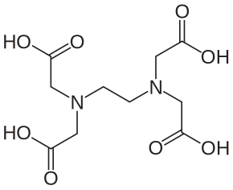

# 分子的结构

## 共价键模型

### 分子轨道理论

根据已学的知识，氧分子的结构是 $\ce{O \bond{2} O}$，因此，氧分子中的电子已经完全配对，氧分子应该是逆磁性分子。但事实上，将液态氧倒入配有磁铁的仪器中时，氧分子被磁场吸引而悬浮在磁场中，这说明氧分子是顺磁性分子，即分子中存在未成对电子。

利用分子轨道理论能够很好地解释氧分子是顺磁性分子这一事实。

- 分子轨道理论认为，分子中的每个电子都是在整个分子中运动的，分子中的单电子运动状态可以用分子轨道来描述。分子轨道可以用能级相近的原子轨道线性组合来表示。

- 光电子能谱为分子轨道理论提供了实验基础，若入射光的能量超过一定值，就能够将电子击出，由此产生的电子称为光电子。通过光电子能谱可以了解分子轨道能级的信息。

### 共价键及其性质

定义：

- 共价键：原子间通过共用电子对形成的相互作用。

- 共价化合物：只有共价键的化合物称为共价化合物。

- 根据共用电子对数，可以分为单键、双键、三键。

注意区分：

- 含有离子键即为离子化合物，只有共价键才为共价化合物。

- 离子化合物中可能含有共价键，共价化合物中不可能有离子键。

稳定条件：

- 电子配对原理：两原子各自提供一个能量相同或相近的、自旋相反的单电子配对。

- 最大重叠原理：重叠部分越大，核间电子的概率密度越大，形成的共价键越牢固，分子越稳定。

共价键类型：

- $\sigma$ 键：原子轨道以「头碰头」方式相互重叠导致电子在核间出现的概率增大而形成的共价键。

- $\pi$ 键：原子轨道以「肩并肩」方式相互重叠导致电子在核间出现的概率增大而形成的共价键。

注意：

- 通常来说，只有第二周期元素之间才能生成经典的 $\pi$ 键，例如硫酸中氧硫键为反馈 $\pi$ 键。

    上面这条规律在早期被称为**双键规则**（Double Bond Rule），其本质原因是原子轨道的尺寸差异。第二周期元素（$\ce{C}$、$\ce{N}$、$\ce{O}$ 等）的 $2p$ 轨道尺寸小、方向性强，两个原子核距离近时，$p$ 轨道能实现高效的「肩并肩」重叠，形成稳定的 $p\pi$-$p\pi$ 键。而第三周期元素（$\ce{Si}$、$\ce{P}$、$\ce{S}$ 等）的原子半径大，$\sigma$ 键的键长较长，导致 $3p$ 轨道横向重叠面积很小，经典的 $p\pi$-$p\pi$ 键极其脆弱，难以稳定存在。

    那么第三周期及以后的元素如何形成多重键？它们会借助其他轨道来实现：

    - **$d\pi$-$p\pi$ 键**：第三周期元素拥有空的 $3d$ 轨道，配位原子（如氧）的 $p$ 轨道孤对电子可以填入中心原子的空 $d$ 轨道，形成配位性质的 $\pi$ 键。例如硫酸根 $\ce{SO4^2-}$ 中的 $\ce{S=O}$ 键，本质是氧的 $p$ 轨道电子向硫的空 $3d$ 轨道配位，而非两个 $p$ 轨道的对称重叠。

    - **反馈 $\pi$ 键**：过渡金属将 $d$ 轨道中的电子反向注入配体的空 $\pi^*$ 反键轨道，形成 $d\pi$-$p\pi^*$ 键。例如一氧化碳与金属配位时，$\ce{C -> M}$ 的 $\sigma$ 配位键之外，还有 $\ce{M -> CO}$ 的反馈 $\pi$ 键，使金属与碳之间的键级大于 $1$。

    - **$\delta$ 键**：过渡金属之间（如 $\ce{Re-Re}$、$\ce{Cr-Cr}$）可以用四瓣形的 $d$ 轨道（如 $d_{xy}$）进行「面对面」重叠，形成电子云分布在四个区域的 $\delta$ 键。$\delta$ 键是比 $\pi$ 键更高一阶的键型，几乎只存在于过渡金属—金属键中。两个过渡金属原子之间可同时形成 $1$ 个 $\sigma$ 键、$2$ 个 $d\pi$-$d\pi$ 键和 $1$ 个 $\delta$ 键，构成罕见的**四重键**，例如 $\ce{[Re2Cl8]^2-}$ 中的 $\ce{Re \bond{4} Re}$。

    - **反式弯曲多重键**：现代化学家通过引入大位阻基团，合成了含有 $\ce{Si=Si}$、$\ce{Ge=Ge}$ 等键的化合物。这些双键并不像 $\ce{C=C}$ 那样呈平面结构，而是呈反式折叠状，说明其成键轨道已经掺杂了 $s$ 轨道成分，不再是纯粹的 $p\pi$-$p\pi$ 键。

- 在没有数据的情况下，$\sigma$ 键比 $\pi$ 键更稳定，例如 $\ce{N # N}$ 中 $\sigma$ 键就不如 $\pi$ 键稳定。

- 受到电场或电磁场的影响，$\sigma$ 键受到的影响比 $\pi$ 键小，继父原则，

- 环与 $\pi$ 键均限制旋转，因此决定了顺式与逆式的差别。

{ width="70%" }

| 共价键类型 | $\sigma$ 键 | $\pi$ 键 |
| :-: | :-: | :-: |
| 电子云重叠方式 | 沿键轴方向相对重叠 | 沿键轴方向平行重叠 |
| 电子云重叠程度 | 大，因此键的强度大 | 小，因此键的强度小 |
| 化学活泼性 | 不活泼 | 活泼 |

成键规律：

- 共价单键是 $\sigma$ 键。

- 共价双键中一个是 $\sigma$ 键，一个是 $\pi$ 键。

- 共价三键中一个是 $\sigma$ 键，两个是 $\pi$ 键。

- 两个原子形成共价键时先形成 $\sigma$ 键，后形成 $\pi$ 键。

### 键参数——键能

化学键的断裂需要吸收能量，常用键能来表示化学键的强弱程度。

在常温差压下（$\pu{1\times10^5 Pa, 298 K}$），断开 $\pu{1 mol} \ce{AB(g)}$ 分子中的化学键，使其分别生成气态 $\ce A$ 原子和气态 $\ce B$ 原子所吸收的能量称为 $\ce{A-B}$ 键的键能，常用 $E_{\ce{A-B}}$ 表示。

{ width="100%" }

表中的键能数据是对大量分子进行统计得到的平均值。

### 键参数——键长

两个成键原子的原子核间的距离（简称核间距）叫作该化学键的键长。

{ width="100%" }

键长是影响分子空间结构的因素之一。键长的数值可以通过晶体 X 射线衍射实验进行测定，也可以通过理论计算求得。

### 键参数——键角

在多原子分子中，两个化学键的夹角叫作键角。

键角可通过晶体 X 射线衍射实验测定，常用于描述多原子分子的空间结构。

### 共价键强弱判断

对于键能和键长：

- 键能的大小可以定量地表示化学键的强弱。

- 一般而言，化学键的键长愈短，化学键就愈强，键就愈牢固。

总的来说：

- 键长越短，键能愈大，断开时需要的能量就愈多，这个化学键就愈牢固。

- 键长越长，键能愈小，断开时需要的能量就愈少，这个化学键就愈不牢固。

- 原子半径越小、共用电子对越多、元素电负性越大，一般越牢固，键长越小。

分子的性质由：

- 键能、键长，决定分子的稳定性。

- 键长、键角，决定分子的空间结构。

### 配位键与配合物

定义：

- 配位键：一个原子通过孤电子对，另一个原子提供空轨道的特殊的共价键。

- 配合物（配位化合物）：含有「由**提供孤电子对的配体**与**接受孤电子对的中心原子**以**配位键**形成的组分」的化合物，注意一定是中心原子提供空轨道。

形式：

- 以四氨合硫酸铜为例：

    $$
    \ce{[Cu(NH3)4]SO4}
    $$

    内界：$\ce{Cu}$ 为中心原子，$\ce{NH3}$ 中的氮为配位原子，$\ce{NH3}$ 为配位体（配体），其角标 $4$ 为配体数。

    外界：$\ce{SO4^2-}$ 离子。

- 配位数：围着中心原子，与其直接成键（不一定为配位键）的**原子数目**；配位数不一定等于配体数（当且仅当为单齿配体时相等）。

    例如 $\ce{BF4-, [Al(OH)4]-}$ 的配位数都为 $4$，但是其配位键数与起始点相关。

    注意双齿配体不能跨轴。

- 螯合物：螯合物是具有环状结构的配合物，是通过两个或多个配位体与同一金属离子形成螯合环的螯合作用而得到。

    { width="60%"}
    /// caption
    乙二胺四乙酸 EDTA，六齿配体，可以螯著多种金属离子
    ///

性质：

- 溶解性改变，注意配体的竞争（一般电负性越强配位键越强）。

- 颜色改变：一般来说，过渡元素可以提供空轨道（一般来说是 d 轨道），而 d 轨道有但是并非全满的电子，通常使其不同程度水解后显示特殊的颜色。

- 稳定性增强（例如血红蛋白与一氧化氮、一氧化碳、氧气、二氧化碳结合力依次减弱）。

经典的配合反应：

配合物的形成通常会导致三种"反常"结果：**沉淀意外溶解**、**颜色发生突变**、**离子被掩蔽无法反应**。

### 醋酸铅溶解硫酸铅

硫酸铅 $\ce{PbSO4}$ 是不溶于水、不溶于酸的白色沉淀（性质类似 $\ce{BaSO4}$）。但如果加入高浓度的醋酸铵（$\ce{CH3COONH4}$）或醋酸钠溶液，$\ce{PbSO4}$ 竟然溶解了。

这是因为 $\ce{Pb^{2+}}$ 会与 $\ce{CH3COO^-}$ 形成难电离的络离子（如 $\ce{[Pb(CH3COO)4]^{2-}}$），大大降低了溶液中游离 $\ce{Pb^{2+}}$ 的浓度，使沉淀溶解平衡右移。

工业流程中，常利用这一性质将 $\ce{PbSO4}$ 与 $\ce{BaSO4}$、$\ce{SiO2}$ 等不溶物分离开来。需要注意的是，$\ce{Ca^{2+}}$ 在高中化学范畴内不与醋酸根形成稳定配合物，醋酸钙就是一种易溶于水的强电解质，无需考虑配位。

### 干燥剂失效的配位解释

无水氯化钙（$\ce{CaCl2}$）不能用来干燥氨气和乙醇：

- 与氨气：$\ce{Ca^{2+}}$ 与 $\ce{NH3}$ 分子配位，生成八氨合氯化钙络合物 $\ce{CaCl2 \cdot 8NH3}$。

- 与乙醇：$\ce{Ca^{2+}}$ 与乙醇分子配位，形成微溶的络合物 $\ce{CaCl2 \cdot 4C2H5OH}$。

类似地，无水 $\ce{CuSO4}$ 也不能干燥氨气，会生成 $\ce{[Cu(NH3)4]SO4}$。

### 沉淀的溶解（加过量试剂）

这是高中化学中最为经典的配位现象——往沉淀中继续加入配体溶液，沉淀重新溶解。

- **银氨溶液**：往 $\ce{AgNO3}$ 里加氨水，先生成 $\ce{AgOH}$（迅速变为棕黑色 $\ce{Ag2O}$ 沉淀），氨水过量后沉淀溶解，生成无色的 $\ce{[Ag(NH3)2]+}$。这是银镜反应的基础。

- **铜氨络合物**：往 $\ce{CuSO4}$ 中滴加氨水，先生成蓝色沉淀 $\ce{Cu(OH)2}$，氨水过量后沉淀溶解，变成**深蓝色**溶液 $\ce{[Cu(NH3)4]^{2+}}$。

- **锌氨络合物**：往锌盐中加过量氨水，沉淀溶解生成 $\ce{[Zn(NH3)4]^{2+}}$。工业上常用这个原理分离锌和铁（铁不能与氨配位，仍以 $\ce{Fe(OH)3}$ 沉淀形式存在）。

- **两性氢氧化物**：$\ce{Al(OH)3}$ 溶于强碱生成四羟基合铝酸根 $\ce{[Al(OH)4]-}$；$\ce{Zn(OH)2}$ 同理生成 $\ce{[Zn(OH)4]^{2-}}$。

### 卤化银的选择性溶解

$\ce{AgCl}$ 溶于氨水，但 $\ce{AgBr}$ 微溶，$\ce{AgI}$ 完全不溶于氨水。原因在于配合物的稳定性不足以打破 $\ce{AgI}$ 极小的 $K_{sp}$。

在摄影定影工艺中，氨水溶不掉的 $\ce{AgBr}$ 可以用海波溶液（硫代硫酸钠 $\ce{Na2S2O3}$）洗去，因为 $\ce{S2O3^{2-}}$ 与 $\ce{Ag^+}$ 的配位能力极强，生成极稳定的 $\ce{[Ag(S2O3)2]^{3-}}$。

### 颜色的特征变化

- **氯化铜稀释变色**：浓 $\ce{CuCl2}$ 溶液呈**黄绿色**，加水稀释后变**蓝色**。浓溶液中 $\ce{Cl^-}$ 浓度高，形成黄色的 $\ce{[CuCl4]^{2-}}$；稀释后水分子取代氯离子，形成蓝色的 $\ce{[Cu(H2O)4]^{2+}}$，两者混合显绿色。

- **铁离子与硫氰酸根**：

    $$
    \ce{Fe^{3+} + 3SCN^- <=> Fe(SCN)3}
    $$

    实际为一系列络合物 $\ce{[Fe(SCN)_n]^{3-n}}$，呈**血红色**，是检验 $\ce{Fe^{3+}}$ 最灵敏的方法。

### 掩蔽剂

在工艺流程中，有时为防止某个离子沉淀或发生氧化还原反应，会加入一种配体将其"藏起来"，这叫掩蔽。

- **$\ce{F^-}$ 掩蔽 $\ce{Fe^{3+}}$**：加入 $\ce{NaF}$ 或 $\ce{HF}$，$\ce{F^-}$ 与 $\ce{Fe^{3+}}$ 形成极稳定的无色络离子 $\ce{[FeF6]^{3-}}$。$\ce{Fe^{3+}}$ 被牢牢锁住，加碱不沉淀、不显黄色，彻底失去反应活性。

- **$\ce{CN^-}$ 提取金**：这是经典的氰化法冶金工艺。单质金非常惰性，但在氧气和 $\ce{CN^-}$ 的共同作用下，由于生成极稳定的 $\ce{[Au(CN)2]-}$，大幅降低了金的电极电势，使氧气能氧化并溶解黄金：

    $$
    \ce{4Au + 8NaCN + O2 + 2H2O -> 4Na[Au(CN)2] + 4NaOH}
    $$

- **$\ce{NH3}$ 分离锌与铁**：在锌、铁混合液中加入过量氨水，$\ce{Zn^{2+}}$ 形成可溶的 $\ce{[Zn(NH3)4]^{2+}}$，而 $\ce{Fe^{3+}}$ 仍以 $\ce{Fe(OH)3}$ 沉淀形式存在，从而实现分离。

### 做题识别要点

分析工艺流程题时，如果看到以下线索，应立刻考虑配位：

- 加入"过量"氨水、氰化物、硫代硫酸盐——考虑 $\ce{Ag^+}$、$\ce{Cu^{2+}}$、$\ce{Zn^{2+}}$ 沉淀重新溶解。

- 加入氟化物——考虑 $\ce{Fe^{3+}}$、$\ce{Al^{3+}}$ 被掩蔽。

- 难溶物遇到特定盐溶液竟然溶解——如 $\ce{PbSO4}$ 遇醋酸根，$\ce{AgCl}$ 遇氨水。

- 颜色发生特征性突变——无色变深蓝（铜氨络合）、黄绿变蓝（氯化铜稀释）、出现血红色（硫氰酸铁）。

- 题目给出了未知的 $K_稳$（稳定常数）数据——必定考查配位平衡，处理方法与 $K_{sp}$ 或酸的 $K_a$ 类似。

### 配位键的拓展形式

前面介绍的配位键以「孤对电子提供给空轨道」为基本模式。在现代配位化学中，配位键的概念已经大大扩展，不再局限于这一模型。

#### $\pi$ 电子配位

配体中没有孤对电子，而是用 $\pi$ 键中的电子对来配位：

- **蔡斯盐**（Zeise's salt，$\ce{K[PtCl3(C2H4)]}$）：乙烯分子（$\ce{C2H4}$）没有孤对电子，它通过碳碳双键上的 $\pi$ 电子云作为一个整体填入铂的空轨道中形成配位键。

- **二茂铁**（ferrocene，$\ce{Fe(C5H5)2}$）：两个环戊二烯基负离子的离域 $\pi$ 电子与铁配位，铁原子被夹在两个环之间，形成「三明治」结构。

#### $\sigma$ 电子配位

更极端的情况是，连单键（$\sigma$ 键）里的电子对也可以直接参与配位：

- **库巴斯配合物**（Kubas complex）：氢气分子（$\ce{H-H}$）通过其唯一的 $\sigma$ 成键电子对与过渡金属配位，形成 $\ce{M-\eta^2-H2}$ 结构。这一发现为金属催化活化 $\ce{H-H}$ 键提供了关键的结构模型。

- **抓氢键**（Agostic interaction）：碳氢键（$\ce{C-H}$）的 $\sigma$ 电子与金属中心相互作用，形成一种 $\ce{C-H -> M}$ 的弱配位。抓氢键在催化反应的过渡态中广泛存在，是理解催化机理的重要概念。

#### 单电子配位键

经典配位键需要一对电子，但量子化学允许**单电子-双中心键**（$1$e-$2$c 键）的存在：

- 如果一个自由基（含未成对的单电子）将其单电子提供给另一个具有空轨道的原子或离子，它们之间可以形成键级为 $0.5$ 的配位键。

- **氢分子离子**（$\ce{H2+}$）是最简单的单电子键：一个氢原子（有一个电子）与一个氢离子（$\ce{H+}$，只有空轨道）共用这 $1$ 个电子。

- **一氧化氮**（$\ce{NO}$）是一个非常特殊的配体。它本身是自由基（有 $1$ 个单电子），在弯曲型配位（$\ce{M-N-O}$ 有角度）时，可作为**三电子给体**（一对孤对电子加一个单电子）参与配位。

单电子配位键与经典双电子键在物理本质上的区别：

| 特征 | 经典配位键（$2$e-$2$c） | 单电子配位键（$1$e-$2$c） |
| :-: | :-: | :-: |
| 键中电子数 | $2$ 个 | $1$ 个 |
| 键级 | $1$ | $0.5$ |
| 磁性 | 通常抗磁性 | 顺磁性（有未成对电子） |
| 键能 | 较强 | 较弱 |
| 实验检测 | 常规光谱 | 电子顺磁共振（EPR） |

#### 电子计数方法

在配合物化学中，常需要计算中心金属的价电子总数，以判断其稳定性。常用的电子计数规则以 $16$ 电子或 $18$ 电子为稳定构型（类似于主族元素的八隅体规则），主要有两种计数方法：

**离子法**（Ionic method）：将金属视为带正电的离子，配体视为带负电的离子或中性分子。

- 金属贡献其价层 $d$ 电子数。
- 配体贡献其孤对电子数或负电荷对应的电子数。
- 例如 $\ce{[Fe(CO)5]}$：$\ce{Fe(0)}$ 贡献 $8$ 个电子，每个 $\ce{CO}$ 贡献 $2$ 个，共 $8+5\times2=18$ 电子。

**中性法**（Neutral / Radical method）：将所有组分视为中性原子或自由基。

- 金属贡献其价层电子数（不考虑氧化态）。
- 配体被视为中性自由基，贡献其形式上的电子数。
- 例如 $\ce{[Fe(CO)5]}$：$\ce{Fe}$ 原子贡献 $8$ 个电子，每个 $\ce{CO}$ 贡献 $2$ 个，共 $18$ 电子。

两种方法对**总电子数的计算结果一致**，差异仅在于对金属氧化态的分配。对于有机金属化合物和含 $\sigma$ 键配体（如烷基、芳基）的配合物，中性法通常更方便——例如苯基（$\ce{-C6H5}$）在中性法中被视为 $1$ 电子给体（自由基），而在离子法中被视为 $2$ 电子给体（$\ce{C6H5-}$）。

## 分子的表示方法

### 电子式的书写

### 结构式的书写

### 八电子规则

八隅体规则（或称八电子规则）：

- 化学中一个简单的规则，主族元素，如碳氮氧、卤族元素、碱金属、碱土金属都依从这个规则。

- 简单的说，当一个元素的最外的电子壳层拥有八个电子时（第一周期的氢、氦价壳层只有 $2$ 个，故称二隅体，广义是为八隅体），它们便会趋向稳定，这也是惰性气体不活跃的原因。

- 根据八隅体规则，原子一般会通过得到、失去或分享电子以达成八隅体，即原子间的组合趋向令各原子的价层都拥有与惰性气体相同的电子排列。

例外：

- 第一电子层的二隅体：氦气的最外层只有 $2$ 个电子，十分稳定；氢可获得额外电子、锂可失去电子而变成这种稳定排列。

- 一些少于 $8$ 个电子的原子组成缺电子化合物，因为不足孤偶电子形成键，这在硼的化合物中常见，其价层通常只有 $6$ 个电子，如在 $\ce{BF3}$ 中。

- 多于 $3$ 个电子层的原子能容纳多于 $8$ 个电子在其最外层，因为超过原子序 $11$ 时，第三层电子层出现 d 亚层，可以超越八隅体。例如五氯化磷中的磷、六氟化硫中的硫。

- 在过渡金属中，十八电子规则取代了八隅体规则。

总结如下：

- 富原子分子：

    又称超价分子，是指由一种或多种主族元素形成，而且中心原子价层电子数超过 $8$ 的一类分子。

    例如五氯化磷、六氟化硫、磷酸根离子、三氟化氯以及三碘阴离子都是典型的富原子分子。

- 缺电子分子：

    指分子中的价电子数少于其形成正常共价键所需电子数的化合物。

    例如三氯化铝、三氟化硼等。

    缺电子分子通常会形成多聚体或二聚体（$\ce{Al2Cl6}$），或将电子反馈给配体形成离域 $\pi$ 键（三氟化硼）。

- 奇原子分子：

    指中心原子价层电子数为奇数的分子，它们通常用两种方式来使自身稳定。

    首先是成键轨道或非键轨道未填满，它们可以得电子、失电子或双聚形成较稳定的分子，其次是反键轨道上电子不成对。

### 多中心多电子键

经典的共价键模型认为，化学键是两个原子之间共享一对电子，即**两中心两电子键**（$2$c-$2$e 键）。但化学世界远比这复杂——有些分子中电子数不足以用经典的 $2$c-$2$e 键描述所有化学键（缺电子化合物），有些分子的中心原子似乎突破了八隅体（超价分子）。多中心多电子键理论为这些「反常」现象提供了统一的解释框架。

#### $2$c-$2$e 键：经典共价键

两个原子核（$2$ 个中心）之间共享一对电子（$2$ 个电子），这是我们最熟悉的成键模式。例如 $\ce{H-H}$、$\ce{C-C}$、$\ce{C-H}$ 等均为 $2$c-$2$e 键。

#### $3$c-$2$e 键：三中心两电子键

三个原子共享仅有的 $2$ 个电子，电子不再定域在某两个原子之间，而是在三个原子之间离域。这种键的电子云形状弯曲如香蕉，又被称为**香蕉键**。

最经典的例子是**乙硼烷**（$\ce{B2H6}$）：

- 硼只有 $3$ 个价电子，$\ce{B2H6}$ 仅有 $12$ 个价电子，不足以用 $7$ 根 $2$c-$2$e 键连结所有原子（需要 $14$ 个电子）。

- 其结构中，两个硼原子之间通过两个「桥氢」相连。每个 $\ce{B-H-B}$ 桥键是一个 $3$c-$2$e 键——两个硼原子和一个氢原子（共 $3$ 个中心）共享一对电子（$2$ 个电子），电子云离域在三个原子之间。

$3$c-$2$e 键的其他常见实例：

- **抓氢键**（Agostic interaction）：$\ce{C-H -> M}$，碳氢键的 $\sigma$ 电子与金属中心形成 $3$c-$2$e 相互作用。

- **碳正离子的桥连结构**：某些反应中间体中，正电荷通过 $\ce{C-C-C}$ 的 $3$c-$2$e 相互作用离域分散。

#### $3$c-$4$e 键：三中心四电子键

某些中心原子的价层电子数似乎超过了 $8$ 个（超价分子），如 $\ce{SF6}$、$\ce{PCl5}$、$\ce{I3-}$、$\ce{XeF2}$ 等。传统解释认为中心原子动用了空的 $d$ 轨道，但现代量子化学计算表明 $d$ 轨道的参与非常有限。**Pimentel-Rundle 模型**提供了更准确的解释。

以 $\ce{XeF2}$（直线型分子）为例：

1. 中心原子氙拿出一个充满 $2$ 个电子的 $p$ 轨道。

2. 两侧的氟各拿出一个含有 $1$ 个电子的 $p$ 轨道。

3. $3$ 个轨道线性重叠，按照量子力学规律生成 $3$ 个分子轨道：成键轨道、非键轨道、反键轨道。

4. 共 $4$ 个电子（氙出 $2$ 个，两个氟各出 $1$ 个）填入：$2$ 个电子填入成键轨道（把三个原子拉紧），$2$ 个电子填入非键轨道（主要分布在两端的氟原子上，对成键无贡献但也不破坏键）。

5. 结果：$4$ 个电子维系 $3$ 个原子的连接，每侧键级为 $0.5$。

$\ce{I3-}$ 也可用同样的模型解释：中心碘与两端碘各有一个键级为 $0.5$ 的键，两端碘之间无直接键合，整个离子呈直线型。

$3$c-$4$e 键的本质是**非键轨道上的电子对主要定域在两端原子上**，导致两端原子之间存在排斥，从而削弱了端基原子间的直接键合。这一模型告诉我们：超价分子并没有打破八隅体规则，也没有大量借用 $d$ 轨道，它们只是巧妙地形成了 $3$c-$4$e 键。

#### $6$c-$6$e 键：芳香体系

**苯**（$\ce{C6H6}$）的离域 $\pi$ 体系可以视为一个 $6$ 中心 $6$ 电子的 $\pi$ 键（$\Pi_6^6$）：$6$ 个碳原子的 $p$ 轨道肩并肩成环重叠，$6$ 个 $\pi$ 电子在环形轨道中高度离域。这正是芳香性的本质——环状、连续、共面的多中心 $\pi$ 键，满足 Hückel 规则（$4n+2$，$n=1$），赋予苯异常的化学稳定性。

从这一视角出发，石墨烯、导电聚合物、胡萝卜素等共轭体系中的特殊性质（导电性、颜色等），均可归因于跨越多个原子的大 $\pi$ 键——电子在宏观尺度上离域运动的结果。

#### 小结

| 键型 | 例子 | 核心特征 |
| :-: | - | - |
| $2$c-$2$e | $\ce{H2}$、$\ce{CH4}$ | 经典共价键，电子定域在两原子之间 |
| $3$c-$2$e | $\ce{B2H6}$ 的 $\ce{B-H-B}$ 桥键 | 缺电子化合物的核心，电子离域在三原子间 |
| $3$c-$4$e | $\ce{I3-}$、$\ce{XeF2}$ | 超价分子的核心，非键电子对排斥端基原子 |
| $6$c-$6$e | $\ce{C6H6}$ 的 $\pi$ 体系 | 芳香性的本质，环状离域带来特殊稳定性 |

### 经典的电子式

## 分子空间结构理论

### 空间结构概述

分子空间结构的测量：

- 红外光谱：测定分子中哪些化学键。

- 质谱仪：测量分子的相对分子质量。

常见的分子结构：

- 三原子分子通常为一个平面图形。

- 大多数四原子分子为三角形或三角锥形。

- 五原子分子常见为四面体形。

一点声明：

- 理论上，「孤对电子」与「孤电子对」意思几乎相同，可以互换。

- 本文的使用原则为，一般情况下使用「孤对电子」表示这一意思。

- 仅当与成键电子对对比，或指出孤对电子的对数时，使用「孤电子对」。

等电子原理：

- 化学通式相同且**价电子总数**相等的分子或离子具有相同的空间结构和相同的化学键类型等结构特征，这是等电子原理的基本观点。

    | 类型 | 实例 | 空间结构 |
    | :-: | - | - |
    | 双原子（$10$ 电子）微粒 | $\ce{N2}$、$\ce{CO}$、$\ce{NO+}$、$\ce{C2^2-}$、$\ce{CN^-}$ | 直线形 |
    | 三原子（$16$ 电子）微粒 | $\ce{CO2}$、$\ce{CS2}$、$\ce{N2O}$、$\ce{NO2+}$、$\ce{N3^-}$、$\ce{NCS^-}$、$\ce{BeCl2}$ | 直线形 |
    | 三原子（$18$ 电子）微粒 | $\ce{NO2^-}$、$\ce{O3}$、$\ce{SO2}$ | 角形 |
    | 四原子（$24$ 电子）微粒 | $\ce{NO3^-}$、$\ce{CO3^2-}$、$\ce{BF3}$、$\ce{SO3}$ | 平面三角形 |
    | 五原子（$32$ 电子）微粒 | $\ce{SiF4}$、$\ce{CCl4}$、$\ce{SO4^2-}$、$\ce{PO4^3-}$ | 正四面体形 |
    | 七原子（$48$ 电子）微粒 | $\ce{SF6}$、$\ce{PF6^-}$、$\ce{SiF6^2-}$、$\ce{AlF6^3-}$ | 正八面体形 |

- 利用该原理可以判断一些简单分子或原子团的空间结构。

| 方法 | 内容 | 举例 |
| :-: | - | - |
| 左右移位法 | 将微粒中的两个原子换成原子序数分别增加 $n$ 和减少 $n$（$n=1,2$ 等）的原子 | $\ce{N2}$ 与 $\ce{CO}$、$\ce{N2O}$ 与 $\ce{CO2}$ 分别互为等电子体 |
| 左右移位法 | 将微粒中的一个或几个原子换成原子序数增加（或减少） $n$ 各单位电荷的阳离子（或阴离子） | $\ce{CO}$ 与 $\ce{CN^-}$、$\ce{N2O}$ 与 $\ce{N3^-}$ 分别互为等电子体 |
| 叠加法 | 互为等电子体的微粒分别再增加一个相同的原子或同主族元素的原子 | $\ce{N2O}$ 与 $\ce{CO2}$ 互为等电子体 |
| 同主族替换法 | 将一个微粒中的一个或几个原子替换成同主族的其它原子 | $\ce{CO2}$ 与 $\ce{CS2}$、$\ce{SO2}$ 与 $\ce{O3}$ 互为等电子体 |

### 价层电子对互斥

价层电子对互斥（VSEPR）理论能比较简便地定性预测分子的空间结构，其基本观点是：

- 排斥力最小原则：分子中的中心原子的价电子对——成键电子对（bp）和孤电子对（lp）由于相互排斥作用，处于不同的空间取向且尽可能趋向于彼此远离。

- 空间取向原则：两个原子间的成键电子不论是单键还是多重键，都看作一个空间取向；一对孤对电子可看作一个空间取向。

因此，我们可以先分析分子中的中心原子的价电子对存在几个空间取向，再让这几个空间取向尽量彼此远离，就可以推测出分子的空间结构。

有公式：

中心原子价电子对数 $=\dfrac12($ 自己的 $+$ 其他原子给的 $)$

另外，对于复杂离子，我们将其电荷算到中心原子上：

自己的价电子数 $=$ 中心原子价电子数 $-$ 离子价态

其中，其他原子给的电子由配位原子决定：

- 氢、卤素作为配位原子给 $1$ 个。

- 氧、硫配位因为共用两对算作给 $0$ 个（不给）。

- 碳、氮、磷等元素配位时不方便计算，用下面的等式计算。

另外存在三个等式：

杂化数 $=$ 中心原子价电子对数

杂化数 $=\sigma$ 键数 $+$ 中心原子孤电子对数

杂化数 $=$ 中心原子价电子在空间上的方向数

价层电子对互斥理论预测分子构型的四个修正：

1. 孤对电子不占质点、占位置。

2. 孤对电子有较大斥力，含孤对电子的分子实测键角几乎都小于 VSEPR 模型的预测值。

    通常，多重键、成键电子对与孤对电子的斥力大小顺序可定性地表示为：

    $$
    \text{lp}-\text{lp} \gg \text{lp}-\text{bp} > \text{bp}-\text{bp}
    $$

    

    三键—三键 $>$ 三键—双键 $>$ 双键—双键 $>$ 双键—单键 $>$ 单键—单键
    

3. 配位原子不对称时，应对键角进行调整。

    例如：一氯甲烷、二氯甲烷、三氯甲烷键角的变化。

4. 孤对电子排斥，拉大键长。

    例如：$\ce{H3C \bond{1} CH3}$，$\ce{H2N \bond{1} NH2}$，$\ce{HO \bond{1} OH}$ 键长依次增大。

价层电子对互斥理论一定程度上存在局限性：

- 价层电子对互斥理论能较便捷地预测分子的空间结构，但是价层电子对互斥理论一般不适用于推测过渡金属化合物分子的空间结构。

- 不能预测：较重碱土金属的三原子卤化物、AX_2_E_0_、AX_2_E_2_（$\ce{LiO2,Cl2O}$），和一些 AX_6_E_1_ 型的分子。

### 杂化轨道理论

在外界条件影响下，原子内部能量相近的原子轨道重新组合形成新的原子轨道的过程叫作原子轨道的杂化，组合后形成的一组新的原子轨道叫作杂化原子轨道，简称**杂化轨道**。数值上，有几个原子轨道参与杂化，杂化后就生成几个杂化轨道，优先杂化 $\rm s$ 轨道。

高中阶段，杂化轨道通常仅对于主族元素。杂化的根本目的是，用大头成键，提升成键能力（本质是小头向内，大头向外相对，增大电子云的重叠）。

原子参与反应时，通常价电子会激发，倾向于占据更多的轨道、形成更多的单电子；如果激发后价电子均匀排布在轨道中，称为等性杂化；否则如果有空轨道剩余或有电子对，称为不等性杂化（在中学阶段常见分析中，常为 $\rm 2p$ 轨道电子分散，如果其有空轨道，则从 $\rm 2s$ 轨道去取一个放入），激发态有几个单电子，就倾向于生成几条键。

从分子结构来看，杂化的轨道只能参与生成 $\sigma$ 键，不能生成 $\pi$ 键，而只有未参与杂化的轨道才能生成 $\pi$ 键。在高中阶段只学习三种杂化：$\mathrm{sp^3,sp^2,sp}$，分别对应四杂化、三杂化和二杂化，其他的杂化形式一般不考虑（我们将在空间构型的预测中详细解释）。

- 四杂化 $\mathrm{sp^3}$：以甲烷 $\ce{CH4}$ 为例，碳原子的价电子排布为 $\el2s2\el2p2$，在反应中，碳原子的一个 $\rm2s$ 电子受外界条件影响跃迁到 $\rm2p$ 空轨道，使碳原子具有四个未成对电子，在甲烷分子的形成过程中，碳原子中原来能量相近的 $\rm2s$ 轨道与三个 $\rm2p$ 轨道将重新组合形成新的、能量相同的原子轨道。甲烷分子中碳原子的杂化轨道是由一个 $\rm2s$ 轨道和三个 $\rm2p$ 轨道重新组合而成的。一个 $\rm s$ 轨道与三个 $\rm p$ 轨道的杂化称为 $\mathrm{sp^3}$ 杂化，所形成的四个杂化轨道称为 $\mathrm{sp^3}$ 杂化轨道。$\rm s$ 轨道和 $\rm p$ 轨道杂化后，杂化轨道不仅改变了原有 $\rm s$ 和 $\rm p$ 轨道的空间取向，而且使它在与其他原子的原子轨道成键时重叠的程度更大，形成的共价键更牢固。

    鲍林还根据精确计算得知每两个 $\mathrm{sp^3}$ 杂化轨道的夹角为 $\pu{109^o 28'}$。由于这四个杂化轨道的能量相同，根据洪特规则，碳原子的价电子以自旋状态相同的方式分占各个轨道。因此，当碳原子与氢原子成键时，碳原子中每个杂化轨道分别与一个氢原子的 $\rm 1s$ 道重叠形成一个共价键，这样所形成的四个共价键是等同的，从而使甲烷分子具有正四面体形结构。

    { width="100%" }

- 三杂化 $\mathrm{sp^2}$：一个 $\rm s$ 轨道和两个 $\rm p$ 轨道杂化可形成三个 $\mathrm{sp^2}$ 杂化轨道。形成乙烯分子时碳原子采用 $\mathrm{sp^2}$ 杂化，三个 $\mathrm{sp^2}$ 杂化轨道和一个未参与杂化的 $\rm p$ 轨道中各有一个未成对电子。两个碳原子各以一个 $\mathrm{sp^2}$ 杂化轨道重叠形成一个 $\sigma$ 键，同时以 $\rm p$ 轨道重叠形成一个 $\pi$ 键；每个碳原子都以另外两个 $\mathrm{sp^2}$ 杂化轨道分别与两个氢原子的 $\rm1s$ 轨道重叠形成两个 $\sigma$ 键。这样，在乙烯分子中的碳原子之间，存在着一个 $\sigma$ 键和一个 $\pi$ 键。

- 二杂化 $\rm sp$：一个 $\rm s$ 轨道和一个 $\rm p$ 轨道杂化可形成两个 $\rm sp$ 杂化轨道。乙炔分子中的碳原子采用 $\rm sp$ 杂化，两个碳原子之间存在着一个 $\sigma$ 键和两个 $\pi$ 键。

下面是一些常见的杂化类型：

{ width="100%" }

| | $\mathrm{sp^x}$ 杂化 | $\mathrm{sd^x}$ 杂化 | $\mathrm{sp^xd^y}$ 杂化 |
| :-: | :-: | :-: | :-: |
|  $\ce{AX2}$ | $\rm sp$ 杂化 直线型（$\pu{180^o}$） $\ce{C2H2,CO2}$ |  （仅过度元素） |  （仅过度元素） |
|  $\ce{AX3}$ | $\mathrm{sp^2}$ 杂化 平面正三角形（$\pu{120^o}$） $\ce{C2H4,BF3}$ | $\mathrm{sd^2}$ 杂化 三角锥形（$\pu{90^o}$） $\ce{CrO3}$ |  / |
|  $\ce{AX4}$ | $\mathrm{sp^3}$ 杂化 正四面体（$\pu{109^o 28'}$） $\ce{CH4}$ | $\mathrm{sd^3}$ 杂化 正四面体 $\ce{MnO4-}$ | $\mathrm{sp^2d}$ 杂化 平面正方形 $\ce{PtCl4^2-}$ |
|  $\ce{AX6}$ |  / | $\mathrm{sd^5}$ 杂化 三棱柱 $\ce{W(CH3)6}$ | $\mathrm{sp^3d^2}$ 杂化 正八面体 $\ce{Mo(CO)6}$ |

- **苯的结构**：形成苯分子时，每个碳原子均采用 $\mathrm{sp^2}$ 杂化。三个 $\mathrm{sp^2}$ 杂化轨道在同一平面内，其中两个用于与相邻碳原子形成 $\sigma$ 键，构成正六边形碳环，另一个与氢原子的 $\rm 1s$ 轨道形成 $\sigma$ 键。此外，每个碳原子还有一个垂直于平面的未参与杂化的 $\rm 2p$ 轨道，六个 $\rm 2p$ 轨道以“肩并肩”的方式形成离域大 $\pi$ 键。因此，苯分子为平面正六边形结构，键角均为 $\pu{120^o}$，且具有特殊的稳定性。

- **氨的结构**：形成 $\ce{NH3}$ 分子时，氮原子采用 $\mathrm{sp^3}$ 杂化。在四个 $\mathrm{sp^3}$ 杂化轨道中，有三个各含一个未成对电子，分别与氢原子的 $\rm 1s$ 轨道形成 $\sigma$ 键；第四个杂化轨道则由一对孤电子对占据。受孤电子对的影响，$\ce{NH3}$ 分子的空间结构呈**三角锥形**。

### AXE 法预测构型

| 物质名称 | 化学式 | 结构模型 | 键角 |
| :-: | :-: | :-: | :-: |
| 二氧化碳 | $\ce{CO2}$ | 直线型 | $\pu{180^o}$ |
| 水 | $\ce{H2O}$ | 角形或 V 形 | $\pu{104.5^o}$ |
| 甲醛 | $\ce{CH2O}$ | 三角形 | 约 $\pu{120^o}$ |
| 氨气 | $\ce{NH3}$ | 三角锥形 | $\pu{107.3^o}$ |
| 白磷 | $\ce{P4}$ | 正四面体形 | $\pu{60^o}$ |
| 甲烷 | $\ce{CH4}$ | 四面体形 | $\pu{109^o 28'}$ |
| 六氟化硫 | $\ce{SF6}$ | 正八面体 | |

AXE 法，又称 ABE 法：用 $\ce{AX_nE_m}$ 其中 $\ce A$ 代表中心原子，$\ce X$ 或 $\ce B$ 代表配位原子，$\ce E$ 代表孤电子对。

- 下图表示的分别是二氯化汞 $\ce{HgCl2}$、三氟化硼 $\ce{BF3}$、四氯化碳 $\ce{CCl4}$、五氯化磷 $\ce{PCl5}$ 和六氟化硫 $\ce{SF6}$ 的分子空间结构。

{ width="90%" }

### 分子极性和手性

共价键分为极性键和非极性键：

- 极性键：不同元素两个原子，共用电子偏向电负性强的原子，显示负电性，另一原子显示正电性。

- 非极性键：相同元素两个原子，对称，两原子均不显电性，例如在形成氯化氢分子时，氯原子吸引电子的能力比氢原子强，使氯原子带部分负电荷（$\delta^-$）、氢原子带部分正电荷（$\delta^+$），所形成的共价键是极性键。

类似的，分子也有极性和非极性之分。

- 在极性分子中，正电中心和负电中心不重合，分子一端呈负电性（$\delta^-$）另一端呈负电性（$\delta^+$）；非极性分子反之。

- 只含非极性键的分子一定是非极性分子，而含有极性键的分子的极性可以根据分子中化学键的极性的矢量和，只有矢量和为零才为非极性分子。

- 通常的，$\ce{AA}$ 通常为非极性分子，$\ce{AB}$ 通常为极性分子，$\ce{ABn}$ 型通常需要根据 $\ce A$ 的孤电子对有无比较，无则为非极性。

注意：臭氧 $\ce{O3}$ 是含有极性键的极性分子，因为中心氧原子与端基氧原子的电负性不同。

分子的手性：具有完全相同的组成和原子排列的一对分子，互为镜像且在三维空间里不能重合，称为手性异构体，有手性的异构体称为手性分子。

手性分子在制药中有广泛的应用，药物中一对手性异构体可能只有一个有效，另一个可能无效甚至是有害的。2001 年诺贝尔化学奖授予三位用手性催化剂生成手性药物的化学家，可以得到或主要得到一种手性分子，称为手性合成。

手性在数学中也是可以被严格定义的，在三维空间 $\R^3$ 中，任何刚体运动都可以用矩阵 $M$ 表示，其中保持手性不变的称为真旋转，其行列式满足 $\det M=+1$，例如绕轴转动；改变手性的称为非真旋转，$\det M=-1$，例如镜像反射。

镜像操作记为 $\sigma$，如果不存在任何真旋转矩阵 $R$ 即 $\det R=+1$，使得分子结构 $K$ 满足 $K=R\cdot\sigma\cdot K$，则 $K$ 是手性的。

根据线性代数相关知识，我们只需要判断，如果一个分子能通过一个行列式为 $-1$ 的操作 $O$ 变回自己，即 $K=O\cdot K$，那么它就能和镜像重合，它就是非手性的。

在晶体学和分子结构中，行列式为 $-1$ 的操作统称为非真旋转轴，更深层次的线性代数，甚至是群论知识，感兴趣可以自行查询。因此分子具有手性的充要条件是，该分子不含有任何 $S_n$ 轴（$n\ge 1$）。

通常来说，我们只需要判断一个分子是否有对称中心（$S_2$）或对称面（$S_1$）即可，更严谨的我们还需要判断 $S_4$，例如丙二烯（如图所示）：

理论上，我们仅仅通过 $S_1,S_2,S_4$ 几乎可以确定一个分子是否是手性分子了。但是，还存在最后一种特殊的情况，$S_8$，其存在于极少数的分子中，而且更少数的分子只能由 $S_8$ 确定。例如皇冠硫（很有趣这个分子也写作 $\ce{S8}$ 硫8），但是它也有对称中心，导致它不是“仅靠 $S_8$ 维持非手性”的特例。

严格属于 $S_8$ 点群的分子，仅仅是理论上存在，只有在特定情况下，才能形成，极其少见，一般就不会考虑了。

### 范德华力与氢键

范德华力：

- 定义：一种很弱的（比化学键普遍小 $1\sim2$ 个数量级）的分子间作用力。

- 特性：无方向性、无饱和性，分子间广泛存在。

- 大小：结构相似，相对质量越大，范德华力越大；相对质量接近，分子极性越大，范德华力越大。

    特殊的，同分异构体，支链越多，范德华力越小，熔沸点越低，例如正、异、新戊烷。

- 意义：通常来说，范德华力越大，熔沸点越高（首先考虑氢键）、水溶性越好。

氢键：

- 定义：与电负性大（一般来说为 $\ce{N,O,F}$）的原子连接的氢，与较强的孤电子对（一般来说为 $\ce{N,O,F}$）形成的电性作用。

    也就是说，一般来说可以表示为 $\ce{N/O/F \bond{1} H \cdots N/O/F}$ 的分子间作用力。

- 意义：氢键对物质的熔沸点等影响较大，例如在接近沸点的水蒸气，水分子间因氢键相互缔合，形成缔合分子。

- 特性：有方向性（当 $\ce{X \bond{1} H \cdots Y}$ 为一条直线时键能最大）、有饱和性（一般来说一个 $\ce H$ 只能形成一个氢键）。

- 注意：氢键不是化学键，但是也讨论键长、键能等。

- 强度：与 $\ce{H}$ 相连的原子电负性越大，氢键越强，例如氨气中 $\ce{H3N \cdots H - OH}$ 氢键多于 $\ce{H2O \cdots H - NH2}$。

    | | $\ce{NH3}$ | $\ce{N2H4}$ | $\ce{H2O}$ | $\ce{HF}$ |
    | :-: | :-: | :-: | :-: | :-: |
    | 孤电子对数 | $1$ | $2$ | $2$ | $3$ |
    | 氢原子数 | $3$ | $4$ | $2$ | $1$ |
    | 氢键数 | $1$ | $2$ | $2$ | $1$ |

    一般来说，氢键强度的主要影响因素就是氢键数量，此外还与半径（负相关）、电负性（正相关）有关。

### 超分子与多聚体

超分子是由两种或两种以上的分子，通过分子间相互作用形成的分子聚合体。

例如 $\ce{C60}$ 和 $\ce{(HF)n}$（通过氢键）就是经典的超分子。

笼形水合物：笼形水合物又称气体水合物，是一类水性固态晶体，其物理性质类似于冰，其中体积较小的气体疏水分子被水分子组成的笼形结构包围，通过氢键连接。

笼形水合物属于笼形化合物，其中主体分子为水分子，客体分子一般为气体。若没有客体分子的支撑作用，这类化合物的晶体结构便会坍塌为冰或水的结构。绝大多数相对分子质量较低的气体都能形成笼形水合物，比如 $\ce{O2, H2, N2, CO2, CH4, H2S}$ 等，其中甲烷水合物成为可燃冰。
