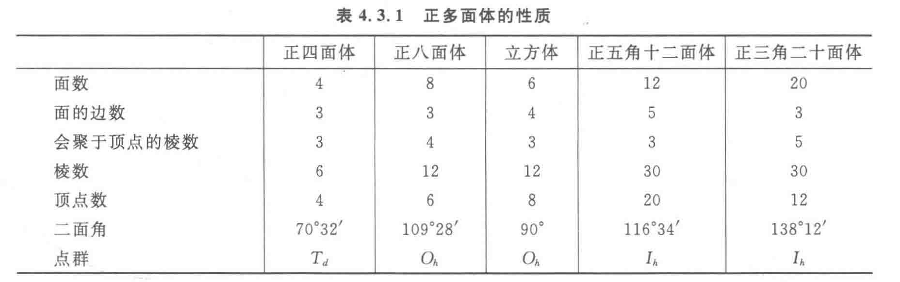

# 晶体及其计算

## 晶体概述

### 晶体与晶胞

晶胞：描述晶体结构的最小单元。

原子在晶胞中的占有率：$n$ 个晶胞完全包含该原子，则该原子对每个晶胞有 $1/n$。

| 原子位置 | $n$ 个包含 | 占有率 |
| :-: | :-: | :-: |
| 体内 | $1$ | $1/1$ |
| 面上 | $2$ | $1/2$ |
| 棱上 | $4$ | $1/4$ |
| 顶点 | $8$ | $1/8$ |

### 熔沸点比较

## 金属材料

1、常见的一些合金的硬度比其成分金属大，是因为加入其他元素的原子后，改变了金属原子有规则的层状排列，使原子层之间的相对滑动变得困难，导致合金的硬度变大。

教材拓展：人教版高中化学必修一

2、碳素钢的分类：

（1）低碳钢（含碳量少于0.3%）：韧性好，焊接性好，强度低。用于制造钢丝、钢管、钢板等。

（2）中碳钢（含碳量在0.3%-0.6%）：强度高，韧性和加工性好。用于制造钢轨、车轮和建材等。

（3）高碳钢（含碳量大于0.6%）：硬而脆。用于制造器械、弹簧和刀具等。

3、不锈钢的合金元素主要是铬（Cr）和镍（Ni）。

4、铝是地壳中含量最多的金属元素。铝是一种活泼金属，在常温下就能与空气中的氧气发生反应，表面生成一层致密的氧化铝薄膜，这层膜起着保护内部金属的作用。化学氧化（用铬酸作氧化剂）可以使氧化膜产生美丽的颜色等。

5、铝制餐具不宜用来蒸煮或长时间存放酸性或碱性食物。

6、纯铝的硬度和强度较小，不适合制造机器零件等。向铝中加入少量合金元素，可制成铝合金。铝合金是目前用途广泛的合金之一。硬铝中含Cu4%、Mg0.5%、Mn0.5%、Si0.7%，它的密度小、强度高，具有较强的抗腐蚀能力，是制造飞机和宇宙飞船的理想材料。

7、新型合金：储氢合金（如Ti-Fe合金、La-Ni合金等）、钛合金、耐热合金、形状记忆合金等。

8、稀土元素（“冶金工业的维生素”）：元素周期表中原子序数从57-71（从镧至镥，称为镧系元素）的15种元素以及钪和钇，共17种元素。  

稀土金属广泛应用在冶金、石油化工、材料工业（电子材料、荧光材料、发光材料、永磁材料、超导材料、染色材料、纳米材料、引火合金和催化剂等）、医药及农业等领域。

我国的稀土储量、稀土产量、稀土用量和稀土出口量均居世界第一位。我国化学家徐光宪院士与其研究团队在稀土元素的分离及应用中作出了重要贡献。

9、脱氧剂

（1）铁粉。氯化钠等作为催化剂。

（2）亚硫酸盐系脱氧剂。

（3）抗坏血酸。铜离子做催化剂。

（4）葡萄糖氧化酶，利用葡萄糖氧化成葡萄糖酸时脱氧。
