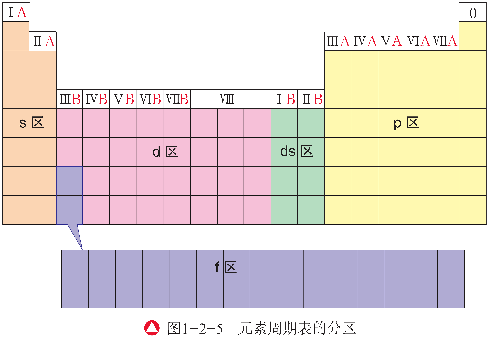
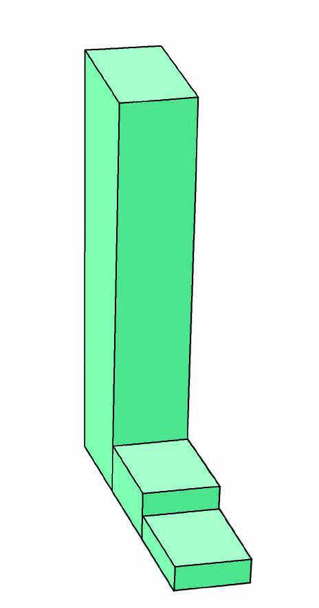
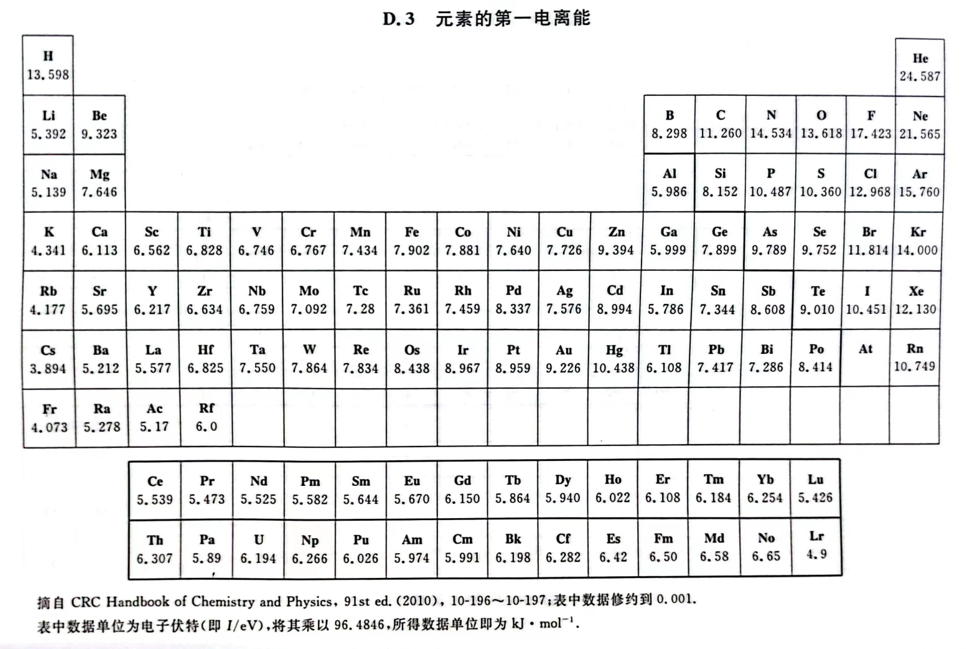
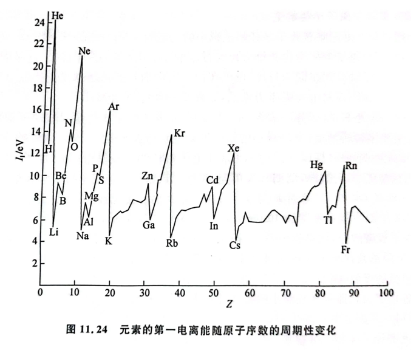
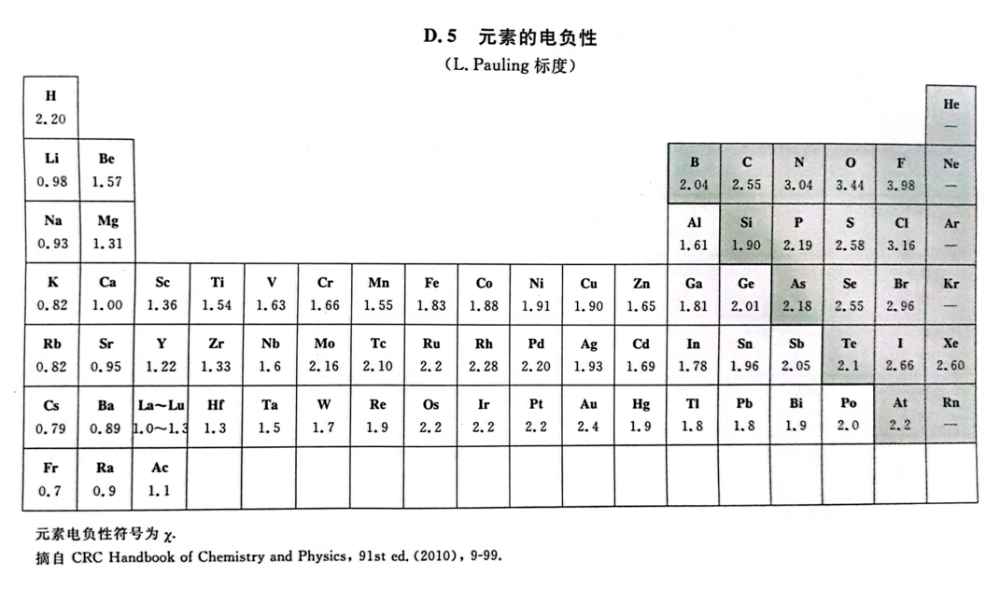
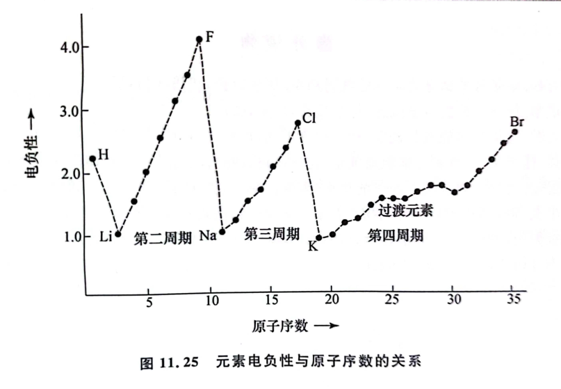

# 元素周期律

## 元素周期表

### 周期表的概述

元素周期表的历史：

- 1869 年，门捷列夫按照相对原子质量从小到大的顺序将元素排列起来，……元素性质随着原子序数递增发生周期性的重复。称为元素周期律、

- 1913 年英国物理学家莫塞莱正面原子序数及原子核外电荷数，元素周期律表述为元素的性质随元素原子的核电荷数递增发生周期性变化，这个序列称为元素周期系。

元素周期表的排布：

- 一个能级组最多能容纳的电子数等于对应的周期包含的元素种数。

- 周期与量子数 $n$（电子层数）相关。最外层电子所在轨道处于第 $n$ 电子层时，该原子所属元素通常属于第 $n$ 周期。

地壳元素丰度：

| 原子序数 | 元素 | 化学符号 | 丰度      |
|---------:|:----:|:--------:|:--------:|
|        $8$ | 氧   |    $\ce{O}$     | $46.00\%$ |
|       $14$ | 硅   |    $\ce{Si}$    | $27.00\%$ |
|       $13$ | 铝   |    $\ce{Al}$    |  $8.00\%$ |
|       $26$ | 铁   |    $\ce{Fe}$    |  $5.00\%$ |
|       $20$ | 钙   |    $\ce{Ca}$    |  $4.00\%$ |
|       $11$ | 钠   |    $\ce{Na}$    |  $2.70\%$ |
|       $19$ | 钾   |    $\ce{K}$     |  $2.50\%$ |
|       $12$ | 镁   |    $\ce{Mg}$    |  $2.20\%$ |
|       $22$ | 钛   |    $\ce{Ti}$    |  $0.50\%$ |
|        $1$ | 氢   |    $\ce{H}$     |  $0.10\%$ |

### 周期表的周期和族

- 元素周期表一共有七个周期，其中 $3$ 个短周期，$4$ 个长周期。

- 元素周期表一共有 $18$ 列 $16$ 个族，其中主族 $7$ 个，副族 $7$ 个，第八族和零族。

| 周期 | IA | 〇 | 元素种类数 |
| :-: | :-: | :-: | :-: |
| 一 | $\el1s1$ | $\el1s2$ | $2$ |
| 二 | $\el2s1$ | $\el2s2\el2p6$ | $8$ |
| 三 | $\el3s1$ | $\el3s2\el3p6$ | $8$ |
| 四 | $\el4s1$ | $\el4s2\el4p6$ | $8$ |
| 五 | $\el5s1$ | $\el5s2\el5p6$ | $8$ |
| 六 | $\el6s1$ | $\el6s2\el6p6$ | $8$ |
| 七 | $\el7s1$ | $\el7s2\el7p6$ | $8$ |

- 一般来说，第八族不属于副族，但是也可以属于副族。

- 镧系锕系各 $15$ 个元素，IIIV 共 $32$ 个元素，过渡元素共 $68$ 个。

- 碱金属 IA，碱土金属 IIA，IIIA ~ VIA 以第一个元素称族，卤族元素 VIIA。

- 半导体 Ge Si，稀有金属 Sc Y 镧系，国防金属 Mg，耐腐蚀 Ti Mo W Cr，农药 F Al P S。

{ width="90%" }

- 元素的化合价与原子的核外电子排布尤其是价电子排布有着密切的关系，族的划分与原子的价电子数目和价电子排布密切相关。

- 主族元素所在族的序数等于该元素原子的价电子数，其价电子全部排布在最外层的 $n\rm s$ 或 $n\rm s$、$n\rm p$ 轨道上。

- 尽管同族元素原子的电子层数从上到下逐渐增加，但价电子排布基本相同、原子的价电子数目一般相同。

- 第八族的化学性质和物理性质都很接近（镧系收缩）。

### 周期表的分区

最后一个电子排到 $\mathrm{s,p}$ 能级为主族、排到 $\rm d$ 的为过渡元素、排到 $\rm f$ 的为镧系锕系。

根据这些将元素周期表划分为 $5$ 个区：

{ width="90%" }

- $\rm s$ 区元素：

    - 主要包括元素周期表中的 IA 族碱金属元素和 IIA 族碱土金属元素。
    
    - 其原子的价电子分布在 $\rm s$ 轨道上，价电子排布为 $\el ns{1\sim2}$。
    
    - 这些元素的原子分别容易失去 $1$ 个或 $2$ 个电子，形成 $+1$ 价或 $+2$ 价阳离子。
    
    - 除氢外，这些元素都是活泼金属元素。

    - 其原子的价电子都排布在最外电子层上，因此，$\rm s$ 区元素的原子以最外层电子参与化学反应。

- $\rm p$ 区元素：

    - 包括元素周期表中 IIIA 族、IVA 族、VA 族、VIA 族、VIIA 族和 $0$ 族共 $6$ 族元素。

    - 其原子的价电子排布为 $\el ns2\el np{1\sim6}$（氦除外）。
    
    - 除 $0$ 族外，随着最外层电子数目的增加，原子越来越难失电子、越来越容易得电子。

    - 其原子的价电子都排布在最外电子层上，因此，$\rm s$ 区元素的原子以最外层电子参与化学反应。

- $\rm d$ 区元素：

    - 包括除镧系、锕系外的从 IIIB 族到 VIII 族的元素。
    
    - 该区元素原子的价电子排布为 $\el{(n-1)}d{1\sim9}\el ns{1\sim2}$（钯除外）。
    
    - 一般来说，最外层有 $1\sim2$ 个电子，元素原子的核外电子排布的差别主要在 $(n-1)\rm d$ 轨道上。
    
    - 因为 $\rm d$ 轨道多数未充满电子，所以 $d$ 轨道可以不同程度地参与化学键的形成。

    - 参与反应时，优先失去 $n\rm s$ 能级的电子，再失去 $(n-1)\rm d$ 能级的电子。

- $\rm ds$ 区元素：

    - 包括 IB 族、IIB 族元素。
    
    - 其原子的 $(n-1)\rm d$ 轨道为充满电子的轨道，价电子排布为 $\el{(n-1)}d{10}\el ns{1\sim2}$。

- $\rm f$ 区元素：

    - 包括镧系元素和锕系元素。
    
    - 其原子的价电子排布为 $\el{(n-2)}f{0\sim14}\el{(n-1)}d{0\sim2}\el ns2$，电子可填入 $(n-2)\rm f$ 原子轨道。
    
    - 因为最外层的电子数基本相同，$(n-1)\rm d$ 的电子数也基本相同，所以镧系元素的化学性质非常相近，锕系元素的化学性质也非常相近。

### 三素与四个质量

同位素的概念就形象的对于了元素周期表中同一位置。

- 元素：质子数相同的一类原子的总称。

- 核素：质子数相同，中子数相同的一类原子的总称。

- 同位素：质子数相同、中子数不同的一类原子的总称。

常见的核素：

- 氢元素：

    | 名称 | 符号 | 俗称 | 对于的水 |
    | :-: | :-: | :-: | :-: |
    | 氕 | $\ce{_1^1H}$（$\ce{H}$） | 氢 | 水 |
    | 氘 | $\ce{_1^2H}$（$\ce{D}$） | 重氢 | 重水 |
    | 氚 | $\ce{_1^3H}$（$\ce{T}$） | 超重氢 | 超重水 |

- 碳元素：

    $$
    \ce{^12C}\quad\ce{^13C}\quad\boxed{\ce{^14C}}
    $$

    其中「碳-14」常用于考古断代。

- 铀元素：

    $$
    \ce{^234U}\quad\boxed{\ce{^235U}}\quad\ce{^238U}
    $$

    其中「铀-235」常用于核反应堆的原料。

四个质量：

- 原子的相对原子质量：与 $\ce{^12C}$ 质量的 $1/12$ 比较。

- 原子的近似原子质量：质量数 $A$。

- 元素的相对原子质量：与 $\ce{^12C}$ 质量的 $1/12$ 比较。

- 元素的近似原子质量：丰度与平均摩尔质量。

    $$
    M=\sum M_i a_i\%
    $$

    其中 $a_i\%$ 表示该元素第 $i$ 中同位素的丰度。

    以氯元素为例：

    | | 相对原子质量 | 丰度 |
    | :-: | :-: | :-: |
    | $\ce{^35Cl}$ | $34.97$ | $75.77\%$ |
    | $\ce{^37Cl}$ | $36.97$ | $24.23\%$ |

    计算得出 $\ce{Cl}$ 的相对（近似）原子质量为 $35.5$。

- 十字交叉法求丰度：

    { width="50%" }

## 元素周期律

### 元素周期律概述

元素周期律，位置、结构、性质，三位一体。

{ width="90%" }

过渡元素因为屏蔽钻穿等，通常不符合这些周期性变化。

### 化合价变化规律

- 最高正价，等于主族序数，等于最外层电子数。

- 最低负价，缺几个达到稳定结构，就是负几价。

- 特殊的，氟没有正价，氧唯一 $-2$ 价于 $\ce{OF2}$ 二氟化氧中。

具体的：

- 除 VIII 族、IB 族的某些元素和 $0$ 族元素外，元素的最高化合价等于它所在族的序数。

- 一般来说，非金属元素的最高正化合价和它的最低负化合价的绝对值之和等于 $8$。

- 稀有气体元素原子的电子层结构是稳定结构，其原子既不易失去电子也不易获得电子，因此稀有气体元素的化合价在通常情况下为 $0$。

- 过渡元素的价电子较多且所在轨道的能量相差不大，因此过渡元素具有多种价态。

- 注意 $\ce{H-,Li+}$ 电子结构相同的特例。

### 原子与离子半径

原子半径的大小取决于两个相反的因素：能层数、核电荷数。通常能层数越多，半径越大；核电荷数越大，原子半径越小。

- 对于主族元素：同一周期从左到右原子半径减小，同一族从上到下原子半径增大。

- 对于稀有气体：符合范德华半径，与共价半径相比，原子半径反常大。

- 对于过渡元素：因为具有屏蔽和钻穿，通常不具有明显的周期性。

判断原子半径的规则，依次判断：

1. 电子层数。

2. 核电荷数。

3. 核外电子数。

特殊的：

- 同一元素，阳离子半径小于原子半径小于阴离子半径。

- 同一元素，价态越高，半径越小。

- 电子结构相同，价态越高，原子序数越大，简单例子半径越小。

- 电子层数多，不一定半径大，例如 At 与 K 元素。

{ width="70%" }

- 共价半径，由共价分子或共价晶体中原子的核间距计算得出。

- 范德华半径，由分子晶体中共价分子之间的最短距离计算得出。

- 金属半径，由金属晶体中原子之间的最短距离计算得出。

对角线原则：某些主族元素与其右下方的主族元素有些性质是相似的，可以理解为原子半径越相近，性质越相似。

例如 $\ce{Be,Al}$，有 $\ce{Na[Al(OH)4]},\ce{Na2[Be(OH)]4}$。

### 金属活动性顺序

金属活动性是指金属在溶液或化学反应中的实际活泼程度，最初由化学家根据真实化学反应中的金属间的置换反应，还有金属跟水和各种酸、碱反应总结而成。

- 排在前边的金属，可将排在后边的金属，从其盐溶液中置换出来。

- 排在前边的金属，可将排在后边的金属，从其氧化物中置换出来。

- 理论上讲，排在氢元素前的金属才能和酸反应，置换出氢。

常见**金属活性顺序**通常是这样排列：

$$
\begin{aligned}
&\ce{Cs -> K -> Na -> Li -> Ba -> Ca ->}\\
&\ce{Mg -> Al -> Mn -> Zn -> Fe -> Sn -> Pb -> H}\\
&\ce{Bi -> Cu -> W -> Hg -> Ag -> Pt -> Au}
\end{aligned}
$$

注意：**金属活动性顺序**，和**金属活动顺序**略有差别，例如锂和钠活动性顺序相反，钠和钙顺序相反。

金属性：

- 反应失电子能力，单质还原性。

- 同主族向下金属性增强，同周期向左金属性增强。

- 金属性最强的元素是钫 Fr，自然界中为铯 Cs（现在认为自然界中也存在钫，但是存在量极少）。

非金属性：

- 反应得电子能力，单质氧化性。

- 同主族向上非金属性增强，同周期向右非金属性增强。

- 非金属性最强的元素是氟 F。

普遍规律：

- 原子半径越大，原子核对电子的控制力越弱，最外层电子越易失去。

- 半导体（类金属、半金属），金属性、非金属性均有且均不强。

第三周期非金属的比较：

| | $\ce{Si}$ | $\ce{P}$ | $\ce{S}$ | $\ce{Cl}$ |
| :-: | :-: | :-: | :-: | :-: |
| 与氢气反应条件 | 高温可逆，生成硅烷 | 高温可逆 | 点燃 | 光照或加热 |
| 氢化物分解条件 | 可逆 | 约 $\pu{600^oC}$ | 约 $\pu{800^oC}$ | 约 $\pu{1000^oC}$ |
| 对应酸的强度 | 弱酸 | 中强酸 | 强酸 | 最强含氧酸 |

简记为：

- 置氢剧烈最高碱。

- 氢化稳定最高酸。

- 单强离弱性相反。

经典碳与硅的非金属性比较：

- 错误比较：碳还原硅。

- 正确比较：碳酸强于硅酸。

补充：

- 在 $\ce{M(OH)m}$ 中，若 M 为金属则为碱，为非金属则为酸。

- 例如高氯酸可以表示为 $\ce{Cl(OH)7}$，脱水后表示为 $\ce{HClO4}$。

### 电离能与电负性

{ width="20%" align=right }

电离能：

- 气态基态，失一个电子，变为气态阳离子，所需要的最低能量 $I$ 为电离能。

- $\ce{M -> M+}$ 为第一电离能 $I_1$，$\ce{M+ -> M2+}$ 为第二电离能 $I_2$，$\dots$，$\ce{M(n-1)+ -> Mn+}$ 为第 $n$ 电离能 $I_n$。

- 破坏大稳定结构（能层）电离能突跃，通常于主要化合价有关。

- 同一周期小稳定结构（洪特规则特例）电离能反常大，例如镁大于铝。

- 通常电离能越小，活动性越强，但不一定一一对应（与环境有关），例如锌大于铜。

{ width="90%" }

{ width="90%" }

电负性：

- 在化合物中，吸引电子能力越强，电负性越大，用符号 $\chi$ 表示。

- 电负性氟最大，定义为 $4.0$，则 $\chi$ 大于 $1.8$ 的通常为非金属，小于 $1.8$ 的通常为金属。

- 在化合物 $\ce{AB}$ 中，若电负性 $\ce{B}>\ce{A}$ 则 $\ce{B}$ 通常显示负价，$\ce{A}$ 通常显示正价。

- 若化学键电负性差值 $|\Delta\chi|$ 小于 $1.7$ 通常为共价键，大于 $1.7$ 通常为离子键（反例 $\ce{HF}$ 为 $1.9$ 的共价键）。

- 常见电负性顺序：$\ce{F,O,Cl,N,Br,I,S,P,C,H,B}$，通常 $\ce{Cl,N}$ 电负性相差不大。

- 与电离能不同，金属元素的电负性通常与其活动性呈正相关。

{ width="90%" }

{ width="90%" }

电子亲和能：

- 反映的是元素的气态原子结合电子的难易程度。

- 电子亲和能的大小反映了气态原子获得电子成为气态阴离子的难易程度。

- 元素的气态原子（或离子）获得一个电子所放出的能量称为电子亲和能，单位为 $\pu{kJ\cdot mol^-1}$。

- 习惯上规定，体系放出能量时电子亲和能为正，体系吸收能量时电子亲和能为负。

元素的电子亲和能的应用远不如电离能广泛。

- 无论在同一周期中还是在同一族中，元素的电子亲和能没有表现出简单的变化规律。

- 电子亲和能的数据不易测定，准确性较差，来自不同文献的数据往往不同。
