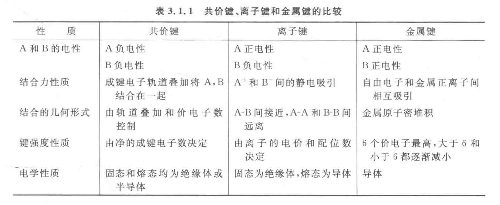

# 晶体晶胞计算

## 化学键与晶体

### 化学键

化学键：**分子内部**相邻原子间**强烈**的**相互作用**，称为化学键，主要决定了物质的化学性质。

化学反应的过程实质是，旧化学键的断裂（吸收热量），和新化学键的生成（放出热量）。

化学键分为**离子键**、**共价键**、**金属键**，其中有**配位键**作为一个特殊的共价键。

| 四大晶体类型 | 作用力 | 常见类型 | 常见物质 | 方向性 | 饱和性 |
| :-: | :-: | :-: | :-: | :-: | :-: |
| 离子晶体 | 离子键 | 碱、盐、金属氧化物 | $\ce{NaH,NH5([NH4]+[H]^-)}$ | ✓ | 相对 |
| 共价晶体 | 共价键 | | $\ce{AlCl3,C(金刚石),SiC}$ | ✓ | ✓ |
| 金属晶体 | 金属键 | 金属单质 | $\ce{K,Na,Cu}$ | × | × |
| 分子晶体 | 分子间作用力 | 气体、酸、有机物 | | | |
| 混合晶体 | | | $\ce{C(石墨)}$ | | |

### 离子晶体

离子键：阴阳离子之间强烈的静电作用（吸引和排斥），称为离子键，活泼金属（或铵根）与非金属之间易形成离子键。

离子化合物：含有离子键的化合物称为离子化合物，绝大多数盐（$\ce{AlCl3}$ 为特例）、强碱、活泼金属氧化物、硫化物为离子化合物。

粒子晶体：离子再空间上周期性重复排列。

离子键性质：

- 无饱和性：在离子化合物中，每个离子周围最邻近的带异性电荷离子数目的多少，取决于阴、阳离子的**相对**大小。

    只要空间条件允许，阳离子将吸引尽可能多的阴离子排列在其周围，阴离子也将吸引尽可能多的阳离子排列在其周围，以达到降低体系能量的目的。

- 无方向性：离子键的实质是静电作用，离子的电荷分布通常被看成是球形对称的，因此一种离子可以对不同方向的带异性电荷的离子产生吸引作用。

离子键的极化：

- 基本上呈球对称的离子本身所带有的电荷会形成一个电场，阴、阳离子在相互的电场作用下，会使离子内的电子分布发生相对偏移，这种在电场的作用下产生的离子中的电子分布发生偏移的现象称为离子极化。

- 离子极化可能导致阴、阳离子的外层轨道发生重叠，从而使得许多离子键不同程度地带有一些共价性，继而导致键长缩短、键能增加，甚至出现结构变异。

- 例如：从 $\ce{AgF}$ 到 $\ce{AgI}$，离子键愈来愈倾向于共价形式，$\ce{AgF}$ 的键长几乎等于半径之和，但是半径之和增大，键长的增大却跟不上半径之和，到 $\ce{AgI}$ 中半径之和已经明显大于键长，导致其成为以共价键为主的结构，卤化银溶解度自上到下减小。

离子键强度：

- 离子键强度越大，键能越大，熔沸点越高。

    $$
    F=k\dfrac{Q_1Q_2}{d^2}
    $$

- 离子键的破坏：发生化学变化、电离（溶于水或熔融）。

- 晶格能是指 $\pu{1mol}$ 离子晶体气态完全解离为正负离子所吸收的能量，或反之释放的能量。

    $$
    \thermo{M+(g) + X-(g) -> MX(s)}U
    $$

- 玻恩-哈伯循环是一种利用盖斯定律间接计算离子化合物晶格能的方法。由于晶格能不能直接测量，玻恩-哈伯循环通过分解反应路径，将复杂的能量变化拆解为多个可实验测量的步骤，最终通过能量守恒计算晶格能。

玻恩-哈伯循环将一个简单的化学反应拆分为若干步，根据盖斯定律他们的焓变相等，而整个形成的循环中只有晶格能未知，可以达到测量晶格能的效果，整个过程如下所示：

| | 化学反应 | 焓变 |
| :-: | :-: | :-: |
| 升华能 | $\ce{Na(s) -> Na(g)}$ | $\Delta H_{\text{sub}}$ |
| 电离能 | $\ce{Na(g) -> Na+(g) + e-}$ | $E_I$ |
| 解离能（键能） | $\ce{1/2 Cl2(g) -> Cl(g)}$ | $\frac{1}{2}D_{\ce{Cl - Cl}}$ |
| 电子亲和能 | $\ce{Cl(g) + e- -> Cl-(g)}$ | $E_A$ |
| 晶格能 | $\ce{Na+(g) + Cl-(g) -> NaCl(s)}$ | $U$ |

根据盖斯定律，上述所有焓变加起来就是 $\ce{NaCl}$ 的标准摩尔生成焓 $\Delta H_f$，列出式子：

$$
\Delta H_f=\Delta H_{\text{sub}}+E_I+\frac{1}{2}D_{\ce{Cl - Cl}}+E_A+U
$$

拓展到多价离子：

- 电离能拓展为第一 $I_1$、第二 $I_2$ 两级电离。

- 电子亲和能拓展为第一 $A_1$、第二 $A_2$ 两级亲和。

- 注意电子亲和能有可能为正值，取决于产物稳定性。

晶格能的影响因素：

- 离子电荷 ：电荷越大，晶格能越大（如 $\ce{MgO} > \ce{NaCl}$）。
- 离子半径 ：半径越小，晶格能越大（如 $\ce{LiF} > \ce{KBr}$）。
- 离子排列方式 ：紧密堆积结构，晶格能更高。

### 金属晶体

定义：

- 金属原子的电离能低，容易失去电子而形成阳离子和自由电子，阳离子整体共同吸引自由电子而结合在一起。

- 这种金属阳离子和自由电子之间强烈的相互作用就是金属键，是一种遍布整个晶体的离域化学键。

- 金属键可看成是由许多原子共用许多电子的一种特殊形式的共价键，但与共价键有着明显不同。

- 金属键既没有方向性也没有饱和性，成键电子可以在金属中自由运动，使得金属呈现出特有的属性。

成键微粒：

- 金属阳离子和自由电子（金属晶体中，金属失去电子形成金属阳离子和电子，没有阴离子）。

- 通过金属键延伸形成的晶体为金属晶体，其中不存在单个分子，金属阳离子被自由电子所包围。

金属键的强弱：

- 金属阳离子半径：半径越小，键越强。

- 离子带电荷数（单位体积内的自由电子数）：带电荷数越多，键越强。

- 金属阳离子半径越小、所带电荷越多、自由电子越多、**金属键越强**、熔点越高，硬度越大。

金属键的递变规律：

- **同主族元素**：从上到下原子半径依次增大，金属键依次减弱。

- **同周期元素**：从左到右价电子数增大，原子半径依次减小，金属键依次增强。

金属键对金属的影响：

1. 金属不透明，具有金属光泽：当可见光照射到金属表面上时，固态金属中的“自由电子”能够吸收所有频率的光并很快放出，使得金属不透明并具有金属光泽。

2. 金属具有良好的导电性：金属内部自由电子的运动不具有方向性，在外加电场的作用下，金属晶体中的“自由电子”沿着导线由电源的负极向电源正极发生定向移动而形成电流。温度越高，金属的导电性能越差。

3. 金属具有良好的导热性：当金属中有温度差时，通过不停运动着的“自由电子”通过自身与金属阳离子间的碰撞，把能量由高温处传向低温处。

4. 金属具有良好的延展性：当金属受到外力作用时，晶体中的各原子层就会发生相对滑动，但排列方式不变，金属晶体中的化学键没有被破坏。

| 属性               | 金属 | 属性               | 金属 |
|--------------------|------|--------------------|------|
| 熔点最低的金属是   | 汞   | 熔点最高的金属是   | 钨   |
| 密度最小的金属是   | 锂   | 密度最大的金属是   | 锇   |
| 硬度最小的金属是   | 铯   | 硬度最大的金属是   | 铬   |
| 延性最好的金属是   | 铂   | 展性最好的金属是   | 金   |
| 最活泼的金属是     | 铯   | 最稳定的金属是     | 金   |

### 共价晶体

共价晶体通常是立体网状结构，在空间上无限延伸，没有分子式。

计算共价键数量：

- 无机物：相同看一半，不同都要看（详见晶胞部分）

- 有机物：碳四、氢一、氧二，成键加和减半，例如 $\ce{C2H5OH}$ 有 $\dfrac{8+6+2}{2}=8$，对于 $\ce{C5H12}$ 有 $\dfrac{4\times5+12}{2}=16$。

共价晶体更多详情见共价键模型，这里给出一部分。

- 半径越小、键长越短，键能越大，共价键越强，熔沸点越高，硬度通常越大。

- 例如 $\ce{C-C} > \ce{C-Si} > \ce{Si-Si}$，就是由分子半径决定的。

### 熔沸点比较

金属的熔沸点：

- 金属熔沸点整体来说没有一般规律。

- 最低的是铯单质，最高的是钨单质。

- 碱金属金属从上到下熔沸点递减。

熔沸点比较：

- 一般来说，熔沸点规律为共价晶体 $>$ 离子晶体 $\gg$ 分子晶体（氢键 $>$ 范德华力）。

- 同时，如果相对分子量足够大，范德华力也可以大于氢键的影响。

- 都是 XX 晶体，$\ce{A}$ 半径更小，$\ce{A-A}$ 键更短，共价键更强，熔沸点更高。

- 都是离子晶体，半径（谁小），电荷（谁大），（谁的）晶格能大，离子键更强，熔沸点更高。

注意：只写支持观点的原因。

## 晶体概述

### 立体结构图

金刚石：

二氧化硅：

石墨：

### 七大晶胞

晶胞：描述晶体结构的最小单元。

### 晶胞计算

原子坐标：

- 以晶胞参数为单位长度。

- 原子坐标 $(x,y,z)$ 满足 $0\le x,y,z\le 1$。

均摊法数个数：

- 原子在晶胞中的占有率：$n$ 个晶胞完全包含该原子，则该原子对每个晶胞有 $1/n$。

	| 原子位置 | $n$ 个包含 | 占有率 |
	| :-: | :-: | :-: |
	| 体内 | $1$ | $1/1$ |
	| 面上 | $2$ | $1/2$ |
	| 棱上 | $4$ | $1/4$ |
	| 顶点 | $8$ | $1/8$ |

- 配位数：与一原子距离最近且相同的粒子个数。

	满足配位数之比与原子个数之比成反比。

- 空间利用率 $=\dfrac{V_{球}}{V_{晶胞}}\times100\%$

- 晶胞密度：

	$$
	\rho=\dfrac{n}{V}=\dfrac{nM}{V}=\dfrac{M_总}{N_AV}=\dfrac{\sum MN}{N_AV}
	$$

## 结构推断问题

### 微粒的电子总数

[TODO]

十电子微粒：

十八电子微粒：

### 常见配位数配合物

六配位：

| 名称 | 化学式 | 名称 | 化学式 |
| :-: | :-: | :-: | :-: |
| 亚铁(II)氰酸根 | $\ce{[Fe(CN)6]^4-}$ | 铁(III)氰酸根 | $\ce{[Fe(CN)6]^3-}$ |
| 六氟合钴(III)酸根 | $\ce{[CoF6]^3-}$ | 六氟合铬(III)酸根 | $\ce{[CrF6]^3-}$ |
| 六氟合锰(IV)酸根 | $\ce{[MnF6]^2-}$ | 六氟合铂(IV)酸根 | $\ce{[PtF6]^2-}$ |
| 六氟合锰(IV)酸根 | $\ce{[MnF6]^2-}$ | 六氟合铂(IV)酸根 | $\ce{[PtF6]^2-}$ |
| 六氟合磷(VI)酸根 | $\ce{[PF6]^-}$ | 六氟合砷(VI)酸根 | $\ce{[AsF6]^-}$ |

### 核反应方程式

根据反应前后质子、中子（及电子）守恒，即质量数（左上角）、质子数（左下角）加和相等，判断元素序数。

人们常采用较短小精简的符号描述核反应，许多质量轻的粒子常缩写，例如 p 代表质子，n 代表中子，d 代表氘（$\ce{^2H}$ 核，一个中子一个质子），$\alpha$ 代表 $\alpha$ 粒子（$\ce{^4He}$ 核，两个中子两个质子），$\beta$ 代表 $\beta$ 粒子（电子），$\gamma$ 代表 $\gamma$ 光子。

### 未成对电子个数

有 $1$ 个未成对电子：

| 未成对轨道 | 价电子通式 | 对应元素 |
| :-: | :-: | :-: |
| $\rm{s}$ | $\el ns1$ | $\ce{H,Li,Na,K}$ |
| $\rm{p}$ | $\el ns2\el np1$ | $\ce{B,Al,Ga}$ |
| | $\el ns2\el np5$ | $\ce{F,Cl,Br}$ |
| $\rm{d}$ | $\el{(n-1)}d1\el ns2$ | $\ce{Sc}$ |
| | $\el{(n-1)}d{10}\el ns1$ | $\ce{Cu}$ |

有 $2$ 个未成对电子：

| 未成对轨道 | 价电子通式 | 对应元素 |
| :-: | :-: | :-: |
| $\rm{p}$ | $\el ns2\el np2$ | $\ce{C,Si,Ge}$ |
| | $\el ns2\el np4$ | $\ce{O,S,Se}$ |
| $\rm{d}$ | $\el{(n-1)}d2\el ns2$ | $\ce{Ti}$ |
| | $\el{(n-1)}d8\el ns2$ | $\ce{Ni}$ |

有 $3$ 个未成对电子：

| 未成对轨道 | 价电子通式 | 对应元素 |
| :-: | :-: | :-: |
| $\rm{p}$ | $\el ns2\el np3$ | $\ce{N,P,As}$ |
| $\rm{d}$ | $\el{(n-1)}d3\el ns2$ | $\ce{V}$ |
| | $\el{(n-1)}d7\el ns2$ | $\ce{Co}$ |

有 $4\sim6$ 个未成对电子：

- 有 $4$ 个未成对电子：$\ce{Fe}$。

- 有 $5$ 个未成对电子：$\ce{Mn}$。

- 有 $6$ 个未成对电子：$\ce{Cr}$（最多）。

有 $0$ 个未成对电子：

- $\rm s$ 区：IIA。

- $\rm ds$ 区：IIB。

- $\rm p$ 区：〇族。
