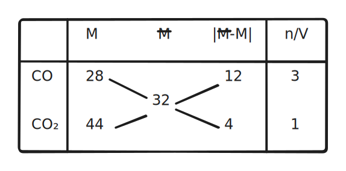

# 物质的计量

$$
\gdef\ceq{\xlongequal{\quad}}
\gdef\val#1#2{\overset{#2}{\ce{#1}}}
\textrm{This page intentionally left blank.}
$$

## 物质的量计算

### 物质的量相关定义

#### 物质的量

反映粒子数目：符号 $n$，单位 $\pu{mol}$。

重点：指明具体的**微观**物质粒子（原子、离子、分子、质子、电子、种子）。

#### 阿伏伽德罗常数

数值上：

$$
\begin{aligned}
N_A&=6.022\ 140\ 76\times10^{23}\pu{mol^-1}
\end{aligned}
$$

一般取约数为 $6.02$，注意：

- 早期的阿伏伽德罗常数定义为 $\pu{12g}$ 的 $\ce{^12C}$ 中所含的原子个数。
- 现代的定义是一个固定的值（上），由阿伏伽德罗常数和质量定义物质的量。

$$
n=\dfrac N{N_A}
$$

其中 $N$ 表示微粒个数。

#### 摩尔质量

单位物质的量的物质所具有的质量：

$$
M=\dfrac{m}{n}
$$

标准单位为 $\pu{g/mol}$，此时摩尔质量数值上等于粒子的相对质量。

#### 摩尔体积

单位物质的量的物质所具有的体积：

$$
V_m=\dfrac{V}{n}
$$

标准单位为 $\pu{L/mol}$，具体的数值与：

- 微粒种类（直径、间距）和个数。
- 温度和压强（一般对于气体）。

有关。

特殊的，在 $\pu{0^oC,101kPa}$（标准状况，STP 标况），任何气体的摩尔体积都等于 $\pu{22.4L/mol}$。

注意：标况下 $\ce{H2O,SO3,CCl4}$ 以及酒精不是气体。

#### 物质的量浓度

质量分数定义式：

$$
\omega(B)=\dfrac{m(B)}{m}
$$

物质的量浓度定义式：

$$
c(B)=\dfrac{n(B)}{V}
$$

需要注意：

- 溶液的体积不等于溶剂的体积与溶质体积简单相加，除非题目特殊说明。
- 特殊的，$\ce{CO2,NH3}$ 溶于水，当做 $\ce{H2CO3,NH3*H2O}$ 处理。

离子浓度与离子化合物浓度、原子个数成正比。

### 物质的量相关方法

#### 溶液的稀释

根据：

$$
c_1V_1=c_2V_2
$$

直接计算即可。

#### 浓度公式推导

两个推导公式：

$$
c=\dfrac{1000\rho\omega}M
$$

$$
n=\dfrac{V\rho\omega}M
$$

注意单位换算即可。

#### 基本方法

三步法：

$$
n=\dfrac{N}{N_A}=\dfrac{m}{M}=\dfrac{V}{V_m}=cV
$$

1. 求物质的量。
2. 根据计量数换离子。
3. 求对应的量。

#### 平均摩尔质量

$$
\bar M=\dfrac{\sum m_i}{\sum n_i}=\sum M_ic_i
$$

十字交叉法：

{ width="70%" }
