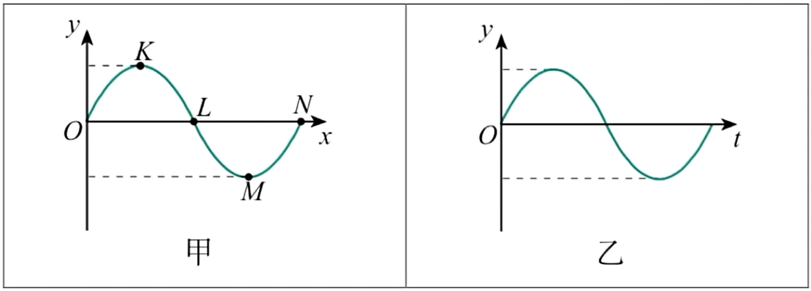
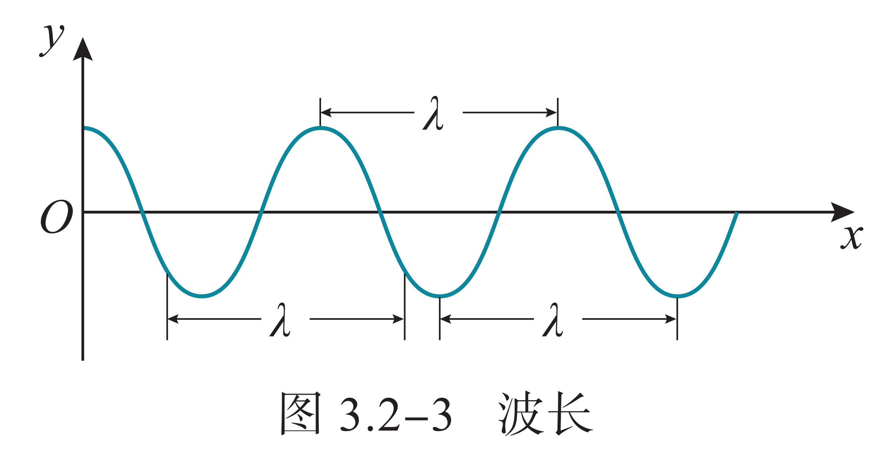

# 机械波与声和光

## 机械波

### 波的定义

> 水波离开了它产生的地方，而那里的水并不离开，就像风在田野里掀起的麦浪。我们看到，麦浪滚滚地在田野里奔去，但是麦子却仍旧留在原来的地方。——达·芬奇

机械波（又称为力学波）是物质的机械振动在空间中的传播现象，是波的一种，特点：

- 机械波的特点是必须透过介质才能传播，机械波只能在具有弹性和惯性的介质中产生，但介质本身不会随着机械波一起传播。

    另外有一些波，比如电磁波、引力波就不需要介质，在真空中也可传播（严格地讲，是通过场传播），这些则不是机械波。与所有波一样，机械波也传递能量，传播方向与波的方向相同。

- 机械波能传递能量和信息：波需要初始能量输入，一旦输入了，就会在介质中传播，直到能量全部传播完毕。

机械波的分类：

- 横波（例如光波）：质点上下振动，波向右传播，二者的方向相互垂直。质点的振动方向与波的传播方向相互垂直的波，叫作横波。在横波中，凸起的最高处叫作波峰，凹下的最低处叫作波谷。

    取一条较长的软绳，用手握住一端拉平后向上抖动一次，可以看到绳上形成一个凸起部分，这个凸起部分向另一端传去。向下抖动一次，可以看到绳上形成一个凹下部分，这个凹下部分也向另一端传去。连续向上、向下抖动长绳，可以看到一列波产生和传播的情形。

- 纵波（例如声波）：质点左右振动，波向右传播，二者的方向在同一直线上。质点的振动方向与波的传播方向在同一直线上的波，叫作纵波。在纵波中，质点分布最密的位置叫作密部，质点分布最疏的位置叫作疏部。

    发声体振动时在空气中产生的声波是纵波。例如振动的音叉，它的叉股向一侧振动时，压缩邻近的空气，使这部分空气变密，叉股向另一侧振动时，又使这部分空气变得稀疏。这种疏密相间的状态向外传播就形成声波。声波传入人耳，使鼓膜振动，就引起声音的感觉。声波不仅能在空气中传播，也能在液体、固体中传播。

- 面波（例如水波）：沿两种不同密度的介质的界面传播，面波可分为瑞利波和勒夫波，其内容较为复杂，高中课内不涉及。

简谐波：如果波的图像是正弦曲线，这样的波叫作正弦波，也叫简谐波。介质中有正弦波传播时，介质的质点在做简谐运动。

{ width="80%" }

简谐波的波形图与质点的振动图像都是正弦曲线，但它们的意义是不同的。**波形图**（如图甲）表示介质中的“各个质点”在某“一时刻”的位移（$y-x$），**振动图像**（如图乙）则表示介质中“某一质点”在“各个时刻”的位移（$y-t$）。

同侧法：在振动图像上某一点波的传播方向一定与此处振动方向在同一侧，即同在曲线上或下区域内。

### 波的要素

在波的传播方向上，振动相位总是相同的两个相邻质点间的距离，叫作波长，通常用 $\lambda$ 表示。

{ width="60%" }

在横波中，两个相邻波峰或两个相邻波谷之间的距离等于波长。在纵波中，两个相邻密部或两个相邻疏部之间的距离等于波长，或者说波在一个周期内所传播的距离即为波长。

波速：波速指的是波在空间中传递的速度，波速有不同的特征定义，在高中常见的简谐波中其几乎没有区别。

- 相速度（相速）：波的相位在空间中传递的速度，换句话说，波的任一频率成分所具有的相位即以此速度传递。

- 群速度（群速）：波振幅外形上的变化（波的波包）在空间中所传递的速度，大多数情况下群速度远小于相速度，甚至群速度也可能与相速度相反。

有自然定义频率 $f=\dfrac{1}{T}$，则波速的定义式：

$$
v=\dfrac{\lambda}{T}=f\lambda
$$

机械波在介质中的传播速度由介质本身的性质决定，同一种机械波在不同的介质中传播时，频率通常是相同的，但波速通常是不同的。

声速还与温度有关，在 $\pu{0^oC}$ 的空气中约为 $\pu{330m/s}$，常温下的空气中约为 $\pu{340m/s}$，在水中约为 $\pu{1500m/s}$，在钢铁铝铜玻璃等固体中通常能达到 $\pu{5000m/s}$ 甚至更高。

### 波的规律

### 波的干涉

### 多普勒效应

## 几何光学
