# 振动与机械波

## 机械振动

### 基本概念

我们把物体或物体的一部分在一个位置附近的往复运动称为**机械振动**，简称**振动**。

振动不仅存在于机械运动中，在其他多种多样的运动变化中，也存在着与机械振动特征相类似的现象。例如，交流电路中的电压和电流，交变电磁场中的电场强度和磁场强度等，它们也是随着时间在一定量值附近反复变化着。因此，在物理学中，人们将振动的概念予以推广，把一个物理量在某一数值附近的反复变化都叫做振动。上述交变电磁场中的振动就称为电磁振动或电磁振荡。除此之外，还有高温下分子的振动，固体晶格上原子的振动等等。

我们将一个小球连在一个理想弹簧上，放在光滑平面上，我们称小球在运动方向上合力为零的位置称为**平衡位置**（通常是弹簧原长），把小球和弹簧所组成的系统称为**弹簧振子**，也可以简称为振子。

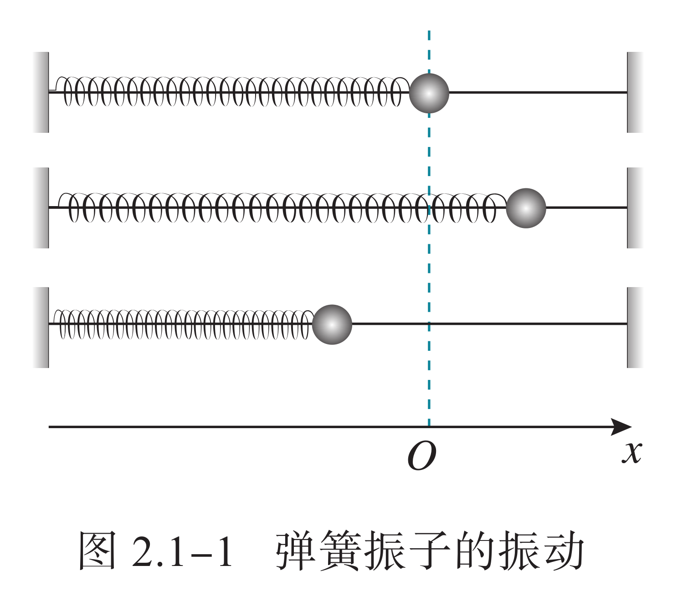{ width="40%" }

一般来说，默认称位移即为从平衡位置的距离，位移的正负通常需要规定正方向。

- 在平衡位置，速度最大，弹性势能最小。

- 在两段位移的绝对值最大处，速度最小（通常为零），弹性势能最大。

对于更一般的情况，例如考虑竖直放置的弹簧以及小球受到的与弹簧方向共线的重力，我们一般取受力平衡点进行分段讨论，此时也有更一般的结论：

- 加速度与位移方向一定相反。

- 加速度与位移的变化趋势一定相同。

我们主要探讨机械振动中一个较为特殊的运动：简谐运动。

### 振动合成

在实际问题中，常常会遇到一个物体同时参与几个振动的情况。例如，两个声音同时传入我们的耳朵，耳朵中鼓膜的振动就是这两个声音引起的振动的合振动；一间机房内有两台电动机同时运转，地基的振动就是它们分别引起的振动的合振动，等等。

在学习运动的合成与分解时，我们知道，一个质点同时发生两个位移时，合位移等于那两个分位移的矢量和。如果这两个分位移在同一直线上，合位移就等于两个分位移的代数和。我们就根据这个道理来研究在同一直线上两个简谐振动的合成问题。

简单来说，我们讨论的振动合成即为合成两个位移表达式：

$$
\begin{cases}
x_1&=A_1\cos(\omega_1t+\varphi_1)\\
x_2&=A_2\cos(\omega_2t+\varphi_2)
\end{cases}
$$

我们只需要求 $x=x_1+x_2$ 的表达式即可，但是这通常是个相当复杂的问题，其中最简单的是在同一直线上两个相同频率的简谐振动的合成（$\omega_1=\omega_2$）。

此时我们发现两个式子都是关于 $\omega t$ 的，我们不妨先将 $\cos$ 的括号展开，然后直接对 $\cos\omega t$ 和 $\sin\omega t$ 合并同类项，然后应用辅助角公式即可得到 $x=A\cos(\omega t+\varphi)$，其中

$$
A=\sqrt{A_1^2+A_2^2+2A_1A_2\cos(\varphi_2-\varphi_1)}
$$

$$
\tan\varphi=\dfrac{A_1\sin\varphi_1+A_2\sin\varphi_2}{A_1\cos\varphi_1+A_2\cos\varphi_2}
$$

容易发现，在一般情况下，有

$$
|A_1-A_2|\le A\le A_1+A_2
$$

对于更一般的情况，合振动不再是简谐振动，但容易知道其仍然是周期性的，只需要取原周期点最小公倍数即可。

我们把同一直线上频率相近的两个简谐振动合成时，所产生的合振幅时而加强时而减弱的周期性现象，叫做**拍**。单位时间内合振幅加强或减弱的次数叫做**拍频**。

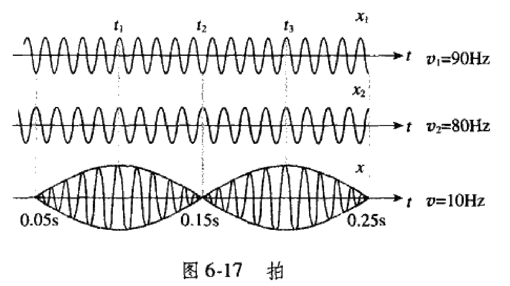{ width="60%" }

拍现象的规律常被用来校正乐器，如当钢琴的钢丝发出来的声音的频率与标准音叉的频率略有差异时，便出现“拍”现象。这时调整钢丝的松紧，直到拍音消失，钢琴就告调好。在吹奏双簧管时，因管内的双簧片的频率略有差异，从而可听到悦耳的有节奏的拍音。

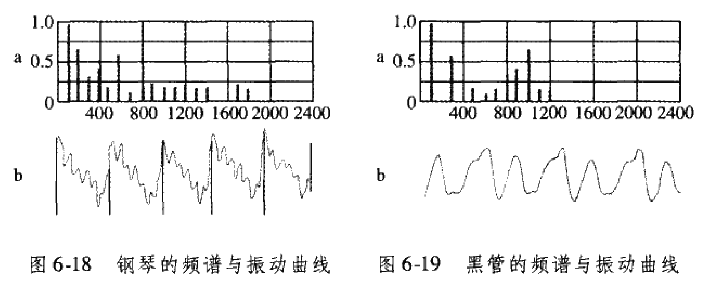{ width="80%" }

实验表明，任何复杂的周期性运动，都可以看作频率成整数倍的简谐振动的合振动。频率最低的叫做基因，其余的叫做泛音。音色是由泛音的多少、频率和振幅决定的。

### 受迫振动

弹簧振子与单摆在没有外力干预的情况下做简谐运动，周期或频率与振幅无关，仅由系统自身的性质决定。我们把这种振动称为固有振动，其振动频率称为固有频率。

由于实际的振动系统都会受到摩擦力、黏滞力等阻碍作用，振幅必然逐渐减小。这种振幅随时间逐渐减小的振动称为阻尼振动。

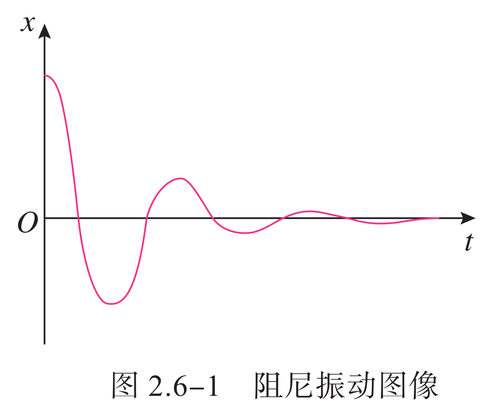{ width="40%" }

振动系统能量衰减的方式通常有两种。

- 一种是由于振动系统受到摩擦阻力的作用，使振动系统的机械能逐渐转化为内能。例如单摆运动时受到空气的阻力。

- 另一种是由于振动系统引起邻近介质中各质点的振动，使能量向四周辐射出去，从而自身机械能减少。例如音叉发声时，一部分机械能随声波辐射到周围空间，导致音叉振幅减小。

阻尼振动最终要停下来，那么怎样才能产生持续的振动呢？最简单的办法是使周期性的外力作用于振动系统，外力对系统做功，补偿系统的能量损耗，使系统的振动维持下去。这种周期性的外力叫作驱动力，系统在驱动力作用下的振动叫作受迫振动。机器运转时底座发生的振动、扬声器纸盆的振动，都是受迫振动。

- 物体做受迫振动达到稳定后，物体振动的频率等于驱动力的频率，与物体的固有频率无关。

- 物体在做受迫振动时，驱动力的频率与物体的固有频率相差越小，受迫振动的振幅越大；当驱动力的频率与物体的固有频率相等时，受迫振动的振幅达到最大。

当驱动力的频率等于固有频率时，物体做受迫振动的振幅达到最大值，这种现象称为共振。把一些不同长度的钢片安装在同一个支架上，可以制作转速计。把这样的转速计与开动着的机器紧密接触，机器的振动引起转速计的轻微振动，这时固有频率与机器转速一致的那个钢片发生共振，振幅最大。读出这个钢片的固有频率，就可以知道机器的转速。

共振是十分普遍的现象，在工程技术的许多领域都可以观察到它，都要应用到它。有的情况下需要避免共振。例如，在桥梁、码头等各种建筑的设计施工中，以及飞机、汽车、轮船的发动机等机器设备的设计、制造、安装中，都必须考虑防止共振产生的危害，以保证建筑和设备的安全。

振动控制技术：有一种工程减振装置叫作调谐质量阻尼器，是目前大跨度、大悬挑与高耸结构振动控制中应用最广泛的结构被动控制装置之一。这种装置是一个由弹簧、阻尼器和质量块组成的振动控制系统，附加在需要振动控制的主结构上。主结构在外界驱动力的作用下产生振动时，会带动减振装置一起振动。当满足一定条件时，减振装置的弹性力与外来驱动力的方向相反，抵消了一部分驱动力，从而最大限度地降低主结构的振动，达到减振的效果。

## 简谐运动

### 运动定义

简谐运动是最基本的振动，我们先对简谐运动下一个定义：如果物体的位移与时间的关系遵从正弦函数的规律，即它的振动图像（$x-t$ 图像）是一条正弦曲线，这样的振动是一种简谐运动（**运动学定义**）。

在定义中已经描述了简谐运动的一个重要性质 $x-t$ 图像，我们知道对正弦曲线求导还是正弦曲线，因此 $v-t$ 图像、$a-t$ 图像的性质很容易得出。

$$
\begin{aligned}
x&=A\sin(\omega t+\varphi)\\
v=\dot x&=A\omega\cos(\omega t+\varphi)\\
a=\ddot x&=-A\omega^2\sin(\omega t+\varphi)
\end{aligned}
$$

也就是说有 $a-x,v-x$ 关系：

$$
a=-\omega^2x
$$

$$
v^2=\omega^2(A^2-x^2)
$$

我们对课本上一些经典的物理意义进行总结：

- $A$ 是振幅，即最大位移。

- $\omega$ 是角速度，代表振动的快慢，而完成一次全振动所需要的时间称为周期。

    $$
    T=\dfrac{2\pi}{\omega}
    $$

    我们称物体完成全振动的次数与所用时间之比叫做振动的频率

    $$
    f=\dfrac{1}{T}=\dfrac{\omega}{2\pi}
    $$

    对于仅受到劲度系数为 $k$ 的理想弹簧的弹力的简谐运动，容易推导

    $$
    \omega=\sqrt{\dfrac{k}{m}}
    $$

- $\omega t+\varphi$ 是相位，反应了 $t$ 时刻的空间状态，若 $t=0$ 则为初始状态，称为初相位。

    我们称一对频率相同的简谐运动的相位差为其相位之差的绝对值 $\Delta\varphi=|\varphi_1-\varphi_2|$。

由于我们似乎在数学的三角函数中进行了充分的研究，我们只是提供一种定义方式。

### 力学意义

在一个力的作用下，物体在平衡位置附近做往复运动，我们把这样的力称为**回复力**。

根据胡克定理，弹簧的弹力在简谐运动中就提供了这个回复力：

$$
F=kx
$$

我们发现，物体所受的弹簧弹力始终指向平衡位置，也就是说有向量式

$$
\bm F=-k\bm x
$$

也就是说：如果物体在运动方向上所受的力与它偏离平衡位置位移的大小成正比，并且总是指向平衡位置，物体的运动就是简谐运动（**力学定义**）。

通常来说，如果要求我们证明一个运动是简谐运动，通常来说只需要证明 $F$ 与到某一点位移成正比即可，这个点即为平衡点，例如在天体中我们常常探讨的一个问题。

在地球一条直径处建立一条穿过地心的长直隧道，忽略一切阻力，从一端静止放入一个小球，容易知道万有引力提供回复力

$$
F=G\dfrac{Mm}{r^3}\cdot x
$$

因此这个运动即为一个简谐运动。对于一个一般的证明，例如有多个力的合力提供回复力，可以先列出平衡点方程，然后通过带入这个式子，尝试证明在任意一点的合外力与其位移成正比，然后说明力的方向与位移相反。

### 等效圆周

我们可以认为，简谐运动可以表示为匀速圆周运动在一个方向上的投影，而 $\omega$ 正好对应圆周运动的角速度，我们似乎在数学中讨论了这个问题。

容易证明，简谐运动中的 $F=kx$ 与圆周运动的关系式

$$
k=m\dfrac{v^2}{r^2}
$$

### 简单问题

我们知道，根据正弦函数可以非常方便得到很多性质，但是实际上，我们很难在一道实际的题中求出函数方程，所以，我们通常直接应用物理意义，或者**对称性**进行求解。

振幅的求法：找平衡位置、找速度为零的点，他们之间的距离即为振幅。

对称性：若两点关于平衡位置对称，则合外力（加速度）关于平衡位置对称。

多物体临界问题：通常来说，最大振幅 $x_{\max}$ 正比于最大拉力

$$
x_{\max}=\dfrac{F_{\max}}{k}
$$

也就是 $F(x_{\max})=F_{\max}$。

能量守恒：容易发现，简谐运动一定是能量守恒的，具体的

$$
F=kx=ma
$$

根据圆的思想，有 $a=\omega^2r$，其中 $r=x$，因此

$$
\omega=\sqrt{\dfrac{k}{m}}
$$

因此

$$
E=\dfrac{1}{2}mv^2+\dfrac{1}{2}kx^2=\operatorname{Const.}
$$

具体的，我们带入 $v=0,x=A$，因此

$$
E=\dfrac{1}{2}kA^2=\dfrac{1}{2}m\omega^2A^2
$$

最值位移：在不超过一个的周期内，最值位移一定发生在关于上升零点对称的两侧。

### 单摆运动

不考虑一切**阻力**，一个**刚性轻绳**拴着一个**小球**做**角度很小**（一般来说小于 $5^\circ$ 左右，在这个角度内，我们可以取 $\sin x=x$ 的近似）的摆动，这样的装置就叫作单摆。单摆是实际摆的理想化模型。

我们尝试写出单摆的回复力，我们知道在单摆中，回复力就是切线方向上的分力，即

$$
F=mg\sin\theta\approx mg\theta
$$

根据弧度制的定义，$\theta$ 就是弧长除以绳长 $\ell$，而弧长可以近似看作位移，

$$
F\approx\dfrac{mg}{\ell}x
$$

而在方向上，容易知道是相反的，因此这种运动即为一种近似的简谐运动。

根据周期公式

$$
T=2\pi\sqrt{\dfrac{m}{k}}\approx2\pi\sqrt{\dfrac{\ell}{g}}
$$

注意：我们这里称绳长 $\ell$ 是小球直径远小于绳长，因此在近似的情况下，$\ell$ 应当取绳子悬挂点到下面物体的重心的距离，下面漏斗模型是非常经典的问题。

漏斗漏沙子模型：一条细绳拴着一个装满沙子的漏斗，做单摆运动，沙子缓慢均匀漏下，下方垫一块匀速运动的毯子，则沙子在毯子上留下的轨迹近似为一个正弦图像。

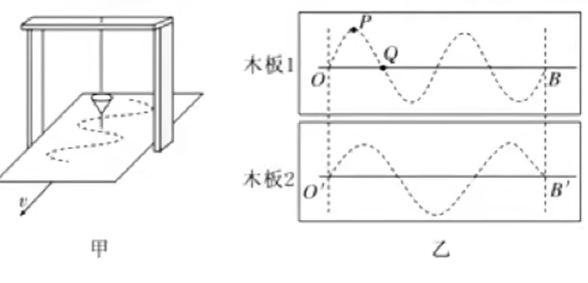{ width="60%" }

一些性质：

- 沙子不断漏下，因此整体的重心先下降再上升，因此 $\ell$ 先增大后减小，周期也同样先增大后减小。

- 漏斗摆动的速度 $Q$ 点大于 $P$ 点，而单位时间内流下的沙子近似相等，因此 $P$ 点积累的沙子的量比 $Q$ 点多。

### 测重力场

单摆测重力加速度：

- 小球穿孔拴在细绳上，用铁夹将细绳夹在铁架台上。

- 测量周期用停表，测量多次摆动总用时，摆动到正中间开始计时。

我们测的了 $T$ 和 $\ell$，则利用公式

$$
g=\dfrac{4\pi^2}{T^2}\cdot\ell
$$

或者多次测量作出 $T^2-\ell$ 图求斜率，因为图像斜率与 $\ell$ 误差关系较小。

而如果电场力类比为重力，则有

$$
g=\dfrac{Eq}{m}
$$

## 机械波

### 波的定义

> 水波离开了它产生的地方，而那里的水并不离开，就像风在田野里掀起的麦浪。我们看到，麦浪滚滚地在田野里奔去，但是麦子却仍旧留在原来的地方。——达·芬奇

机械波（又称为力学波）是物质的机械振动在空间中的传播现象，是波的一种，特点：

- 机械波的特点是必须透过介质才能传播，机械波只能在具有弹性和惯性的介质中产生，但介质本身不会随着机械波一起传播。

    另外有一些波，比如电磁波、引力波就不需要介质，在真空中也可传播（严格地讲，是通过场传播），这些则不是机械波。与所有波一样，机械波也传递能量，传播方向与波的方向相同。

- 机械波能传递能量和信息：波需要初始能量输入，一旦输入了，就会在介质中传播，直到能量全部传播完毕。

机械波的分类：

- 横波（例如光波）：质点上下振动，波向右传播，二者的方向相互垂直。质点的振动方向与波的传播方向相互垂直的波，叫作横波。在横波中，凸起的最高处叫作波峰，凹下的最低处叫作波谷。

    取一条较长的软绳，用手握住一端拉平后向上抖动一次，可以看到绳上形成一个凸起部分，这个凸起部分向另一端传去。向下抖动一次，可以看到绳上形成一个凹下部分，这个凹下部分也向另一端传去。连续向上、向下抖动长绳，可以看到一列波产生和传播的情形。

- 纵波（例如声波）：质点左右振动，波向右传播，二者的方向在同一直线上。质点的振动方向与波的传播方向在同一直线上的波，叫作纵波。在纵波中，质点分布最密的位置叫作密部，质点分布最疏的位置叫作疏部。

    发声体振动时在空气中产生的声波是纵波。例如振动的音叉，它的叉股向一侧振动时，压缩邻近的空气，使这部分空气变密，叉股向另一侧振动时，又使这部分空气变得稀疏。这种疏密相间的状态向外传播就形成声波。声波传入人耳，使鼓膜振动，就引起声音的感觉。声波不仅能在空气中传播，也能在液体、固体中传播。

- 面波（例如水波）：沿两种不同密度的介质的界面传播，面波可分为瑞利波和勒夫波，其内容较为复杂，高中课内不涉及。

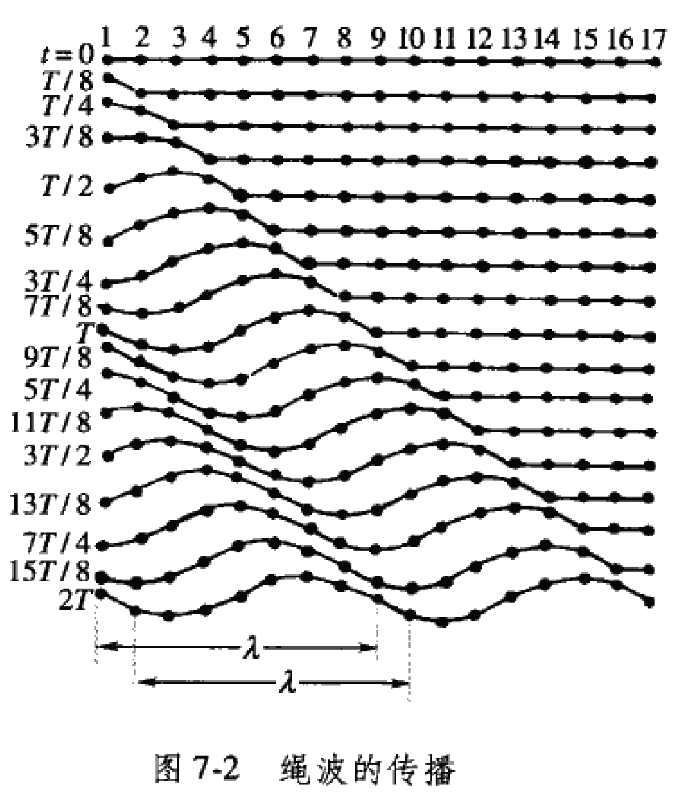

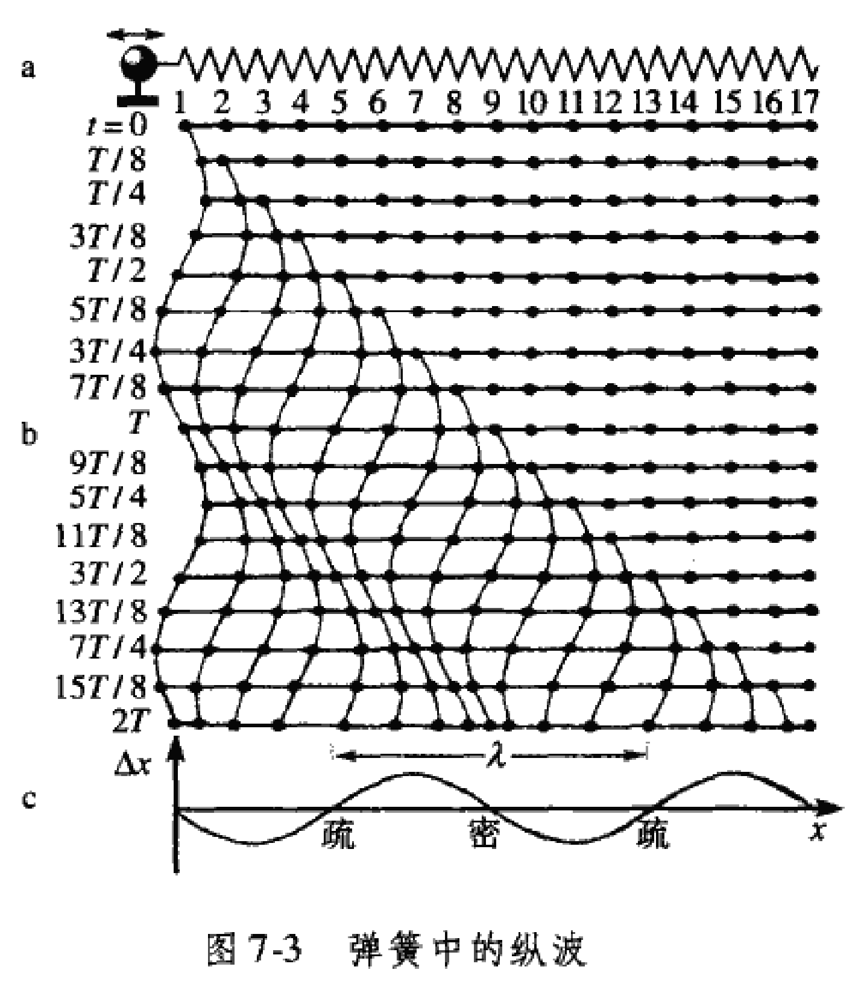

波在绳、杆、弹簧中只能沿绳、杆和弹簧的方向传播，但在气体、液体和固体充满某一部分空间的情况下，波是从波源向所有方向传播的。为了形象地描述波的传播方向，可自波源沿各传播方向画一些带箭头的线，这种表示波的传播方向的线叫做波线。同样，我们也可把在某时刻相位相同（真正的相同，即相位差为零）的点连起来，形成一个曲面或平面，并称之为波面或波阵面。波传播中最前面的波面叫波前，它描述波在该时刻传播到的最远位置。在任何时刻，波前只有一个，但波面却有许许多多。

一个点波源的振动在某种介质中向各个方向传播时，如果沿各方向传播速率相等，在任何时刻波面和波前都是以点波源为中心的球面，这种波称为球面波。具有“波的传播速度与方向无关”这种性质的介质称为各向同性介质。在各向同性介质中波面与波线正交。

如果波源的形状为一平面，它前后振动时将导致与它平行的平面上的介质发生振动，而且在同一平面上，各点的振动相位完全一样，因而波前和波面都为平面。这样的波称为平面波。如果球面波的半径足够大，即远离波源的球面波，而我们所研究的又只是球面波的很小区域时，在这一区域内，波面和波前都近似平面，也可作为平面波对待。

### 波的要素

在波的传播方向上，振动相位总是相同的两个相邻质点间的距离，叫作波长，通常用 $\lambda$ 表示。

{ width="40%" }

在横波中，两个相邻波峰或两个相邻波谷之间的距离等于波长。在纵波中，两个相邻密部或两个相邻疏部之间的距离等于波长，或者说波在一个周期内所传播的距离即为波长。

波速：波速指的是波在空间中传递的速度，波速有不同的特征定义，在高中常见的简谐波中其几乎没有区别。

- 相速度（相速）：波的相位在空间中传递的速度，换句话说，波的任一频率成分所具有的相位即以此速度传递。

- 群速度（群速）：波振幅外形上的变化（波的波包）在空间中所传递的速度，大多数情况下群速度远小于相速度，甚至群速度也可能与相速度相反。

有自然定义频率 $f=\dfrac{1}{T}$，则波速的定义式：

$$
v=\dfrac{\lambda}{T}=f\lambda
$$

机械波在介质中的传播速度由介质本身的性质决定，同一种机械波在不同的介质中传播时，频率通常是相同的，但波速通常是不同的。例如绳子上的波，其波速近似公式为：

$$
v=\sqrt{\dfrac T\rho}
$$

其中 $\rho$ 为单位长度绳的质量，$T$ 为绳中的张力。因此对于一定长度的绳，我们可以通过调节绳的张力，改变声波的速度。

另外，声速还与温度有关，在 $\pu{0^oC}$ 的空气中约为 $\pu{330m/s}$，常温下的空气中约为 $\pu{340m/s}$，在水中约为 $\pu{1500m/s}$，在钢铁铝铜玻璃等固体中通常能达到 $\pu{5000m/s}$ 甚至更高。

### 波的函数

简谐波：如果波的图像是正弦曲线，这样的波叫作正弦波，也叫简谐波。介质中有正弦波传播时，介质的质点在做简谐运动。

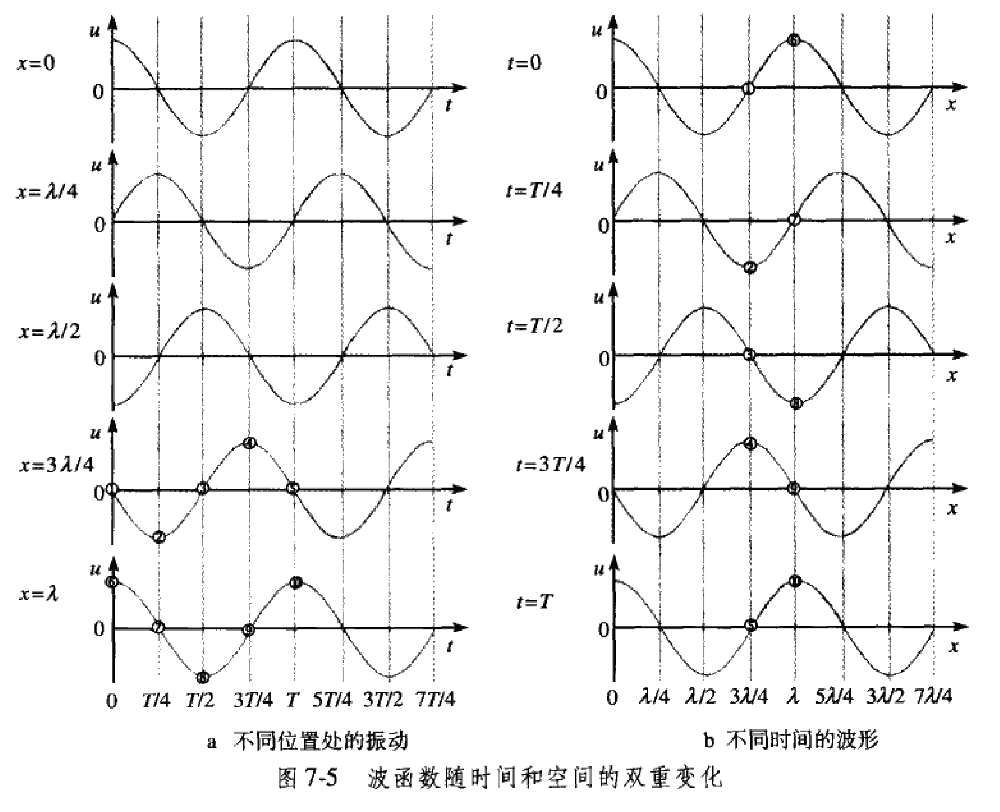{ width="80%" }

简谐波的波形图与质点的振动图像都是正弦曲线，但它们的意义是不同的。

- 如左，**振动图像**表示介质中“某一质点”在“各个时刻”的位移（$u-t$）。

- 如右，**波形图**表示介质中的“各个质点”在某“一时刻”的位移（$u-x$）。

我们做一些公式的推导，考虑以 $O$ 为波源，设该处质点做简谐振动，其位移 $u$ 与世界 $t$ 的关系为：

$$
u=A\cos\omega t
$$

考虑波速 $v$ 传播到与 $O$ 点距离为 $x$ 的 $P$ 点处，此处的相位与 $O$ 相比落后了 $x/v$ 的时间，又假设振幅相同，也就是说在 $P$ 点的质点在 $t$ 时刻位移为：

$$
u'=A\cos\omega\paren{t-\dfrac{x}{v}}
$$

不妨令 $k=\dfrac{2\pi}{\lambda}$，称为角波数（单位为 $\pu{rad/m}$），得到：

$$
u'=A\cos(\omega t-kx)
$$

经过推导，我们还可以得出一个常用的公式：

$$
u'=A\cos2\pi\paren{\dfrac{t}{T}-\dfrac{x}{\lambda}}=A\cos2\pi\paren{ft-\dfrac{x}{\lambda}}
$$

为了更好的比较图像，以及使用平移的思想，我们通常将两个图像叠放在一起，

{ width="80%" }

同侧原理：在振动图像上某一点波的**传播方向**一定与此处**振动方向**在同一侧，即同在曲线上或下区域内。可以将曲线理解为一个卡槽，约束着一个小球在内部滚动。

### 波的衍射

在此处，我们只会进行简单的描述，具体的内容会在光学中详细设计。

- 波的反射：反射线、法线与入射线在同一平面内，反射线与入射线分居法线两侧，反射角等于入射角。

- 波的折射：类似与光的折射，一切波在一种介质进入另一种介质的交界面处都会发生折射。

波可以绕过障碍物继续传播，这种现象叫作波的衍射。

实验表明，只有缝、孔的宽度或障碍物的尺寸跟波长相差不多，或者**比波长更小**时，才能观察到明显的衍射现象。注意，障碍物越小，衍射现象越明显，但是缝、孔的宽度过小，也会阻挡波，因此不能说缝、孔的宽度越小，衍射现象越明显。

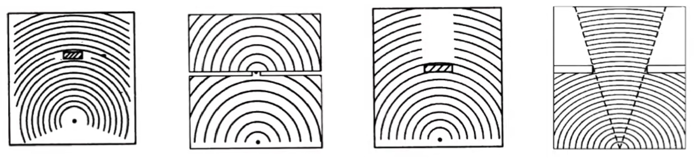{ width="100%" }

一切波都能发生衍射，衍射是波特有的现象，只不过是是否明显的问题。在衍射现象中，波不是沿着直线传播的。

惠更斯原理：

- 惠更斯原理指出：波前的每一点发出次波，这些次波互相干涉，叠加形成新的波前。

- 举一个简单例子来解释这个原理：假设有两个相邻房间 A、B，这两个房间之间有一扇敞开的房门。当声音从房间 A 的角落里发出时，则处于房间 B 的人所听到的这声音有如是位于门口的波源传播而来的。对于房间 B 的人而言，位于门口的空气振动是声音的波源。

- 光波对于狭缝或孔径的衍射也可以用这方式处理，但直观上并不明显，因为可见光的波长很短，因此很难观测到这种效应。

### 波的叠加

几列波相遇时能够保持各自的运动特征，继续传播，在它们重叠的区域里，介质的质点同时参与这几列波引起的振动，质点的位移等于这几列波单独传播时引起的位移的矢量和。

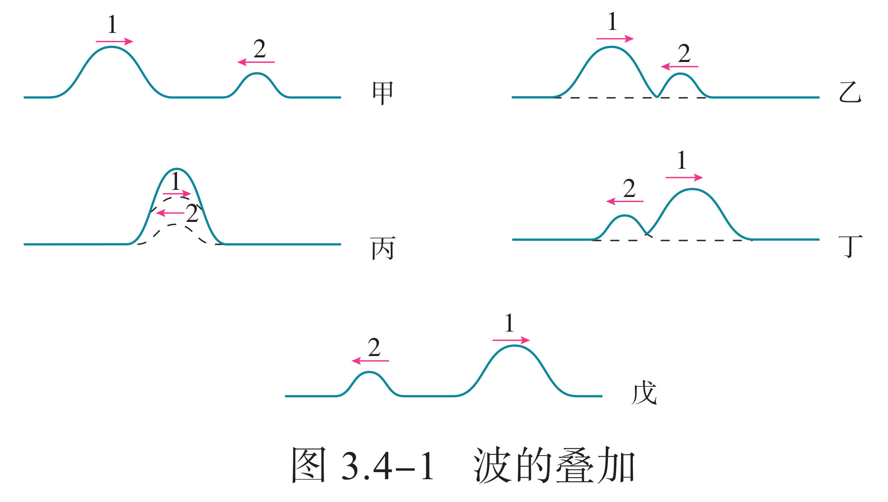{ width="60%" }

- 两列波在彼此相遇并穿过后，波的形状和相遇前一样，传播的情形也和相遇前一样。

- 保持各自的运动特征：指的是各自的波长、频率等保持不变，不因其他波的存在而受影响。

### 波的干涉

频率相同、相位差恒定、振动方向相同的两列波叠加时，某些区域的振动总是加强，某些区域的振动总是减弱，这种现象叫作波的干涉。形成的这种稳定图样叫作干涉图样。

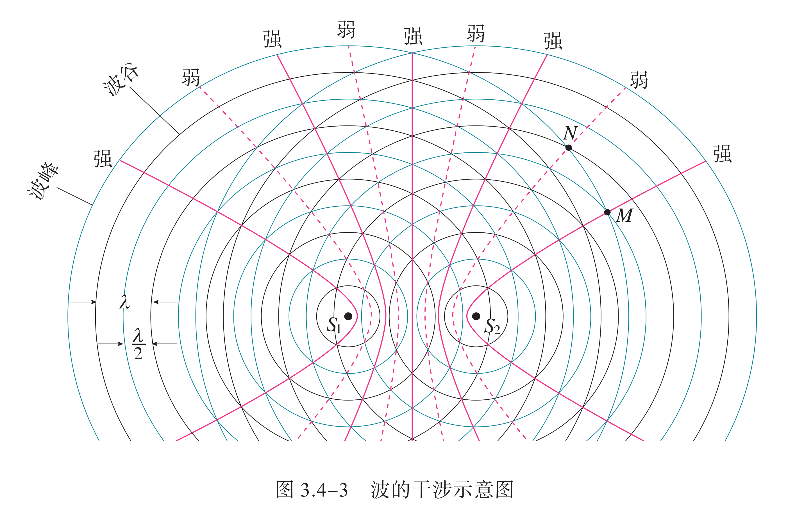{ width="100%" }

用两组同心圆表示从波源发出的两列波，蓝线圆表示波峰，黑线圆表示波谷。在一组同心圆中，相邻的蓝线圆与黑线圆间的距离等于半个波长，蓝线圆与蓝线圆、黑线圆与黑线圆之间的距离等于一个波长。蓝线圆与蓝线圆的交点或者黑线圆与黑线圆的交点，是振动的加强区，它们连成的区域用红实线画出；蓝线圆与黑线圆的交点为振动的减弱区，它们连成的区域用红虚线画出。

如果起振方向相同，对于平面内一点 $P$，则比较 $||PS_1|-|PS_2||$（到两波源的距离之差）是 $\lambda/2$ 的倍数的奇偶性即可，有公式：

- **振动加强点**

    ---

    $$
    ||PS_1|-|PS_2||=2k\cdot\dfrac{\lambda}{2}
    $$

    其中 $k\in\Z$，即
    
    $$
    ||PS_1|-|PS_2||=k\lambda
    $$
    
    则 $P$ 点为振动加强点。

- **振动减弱点**

    ---

    $$
    ||PS_1|-|PS_2||=(2k+1)\cdot\dfrac{\lambda}{2}
    $$
    
    其中 $k\in\Z$，即
    
    $$
    ||PS_1|-|PS_2||=\paren{k+\dfrac{1}{2}}\lambda
    $$
    
    则 $P$ 点为振动减弱点。

也就是说，上图中实、虚线均为双曲线（或退化为直线），因此可以使用一些圆锥曲线的知识或思想解题。

主动降噪技术：声音是一种波，通过波的干涉能够起到消音的作用。这一原理使我们可以主动出击，通过发出与噪声振幅、频率相同，相位相反的声波来抵消噪声。简单来说，在耳机内设有麦克风，用来收集周围环境中的噪声信号，在此基础上，耳机的处理器能够预测下一时刻噪声的情况，并产生相应的抵消声波。

### 多普勒效应

多普勒效应是波源和观察者有相对运动时，观察者接受到波的频率与波源发出的频率并不相同的现象，其特点为若两者相互靠近，则频率变高；若相互远离，则频率变低。

{ width="40%" }

有公式：

$$
f'=\dfrac{v\pm v_{\text{o}}}{v\mp v_{\text{s}}}\cdot f
$$

- $f'$ 为观察者观察到的频率。

- $f$ 为波源于该介质中的原始发射频率。

- $v$ 为波在该介质中的传播速度。

- $v_{\text{o}}$（Observer）为观察者相对于介质的移动速度，若接近发射源则前方运算符号为 $+$ 号，反之则为 $−$ 号；

- $v_{\text{s}}$（Source）为发射源相对于介质的移动速度，若接近观察者则前方运算符号为 $−$ 号，反之则为 $+$ 号。

我们可以这样理解声波的多普勒效应：当波源与观察者相对静止时，单位时间内通过观察者的波峰（或密部）的数目是一定的，观测到的频率等于波源振动的频率；当波源与观察者相互接近时，单位时间内通过观察者的波峰（或密部）的数目增加，观测到的频率增加；反之，当波源与观察者相互远离时，观测到的频率变小。

- 超声波测速：向行进中的车辆发射频率已知的超声波，同时测量反射波的频率，根据反射波频率变化的多少就能知道车辆的速度。

- 彩超：向人体内发射频率已知的超声波，超声波被血管中的血流反射后又被仪器接收。测出反射波的频率变化，就能知道血流的速度。

具有波动性的光也会出现这种效应，光以光速运行，这时需要考虑狭义相对论带来的效应（相对论性多普勒效应）。法国物理学家斐索独立地对来自恒星的波长偏移做了解释，指出了利用这种效应测量恒星相对速度的办法。光波频率的变化使人感觉到是颜色的变化。如果恒星远离我们而去，则光的谱线就向红光方向移动，称为红移；如果恒星朝向我们运动，光的谱线就向紫光方向移动，称为蓝移。
