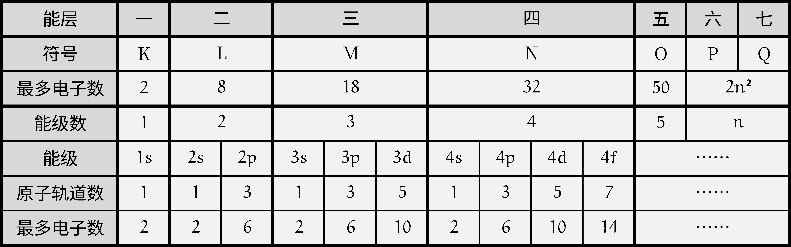
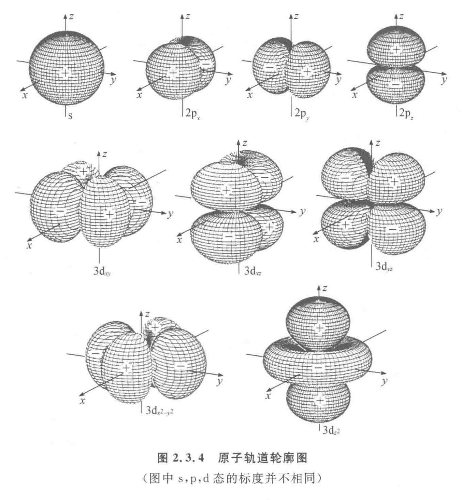

# 近代物理学

## 守恒定律

### 宇称守恒

假若孤立物理系统的某种可观测性质遵守守恒定律，则随着系统的演进，这种性质不会改变。

诺特定理表明，每一种守恒定律，必定有其伴随的物理对称性。即不论在空间的取向为何，物理系统的物理行为一样。

1. 如果任一给定的物理实验的进展过程和该实验开始的时间无关，例如是今天开始做，还是明天开始做，该实验的进展过程完全一样，这就叫做时间平移对称性，也就是时间均匀性。能量守恒定律就是这种对称性的表现。

2. 如果任一给定的物理现象的进程和该现象所发生的空间位置无关，即换一个空间位置，该种物理现象及其进程也一样发生，这就叫做空间平移对称性，也就是空间均匀性。动量守恒定律就是这种对称性的表现。

3. 如果任一给定的物理现象的进展过程与发生这种现象的“装置”在空间的取向无关，即把该“装置”旋转一个方向，这一物理现象的进程完全一样，这就叫空间转动对称性，也就是空间的各向同性。角动量守恒定律就是这种对称性的表现。例如，物体在有心力作用下运动的空间，对力心而言就是各向同性的，所以这种运动对力心的角动量服从守恒定律。

### 绝对定律

绝对定律指，物理学者从未找到任何违背这些定律的证据。

- 质能守恒定律
- 动量守恒定律
- 角动量守恒定律
- 电荷守恒定律
- ……

### 近似定律

在某些特别状况，像低速、短暂时间尺寸、某种相互作用等等，以下这些定律近似于正确。

- 质量守恒定律（适用于非相对论性速度与不存在核反应的状况）
- 能量守恒定律（适用于非相对论性速度与不存在核反应的状况）
- 宇称对称性
- ……

## 狭义相对论

爱因斯坦相对论克服了牛顿力学的局限性，把物理学推进到了一个崭新的阶段。但是我们以上所涉及的只是惯性参考系，1916 年，爱因斯坦又建立了涉及做加速运动的非惯性系，且主要研究强引力情况的相对论理论，他把后者称为广义相对论（general theory of relativity），而把前者称为狭义相对论（special theory of relativity）。广义相对论成为现代引力理论和天体物理学的基础，在今后讨论宇宙的起源与演化时，我们会接触到它的基本原理和观念。

### 核心假设

1. 相对性原则：所有惯性系都是平权的，在他们之中所有的物理规律都具有相同的形式。

2. 光速不变原则：由麦克斯韦电磁理论得出，$c=1/\sqrt{\varepsilon_0\mu_0}$ 其大小与参考系无关。即，在所有的惯性参考系中测量到的真空光速 $c$ 都是一样的。

### 牛顿时空观

牛顿时空观，又称绝对时空观，认为空间与时间与物质及其运动状态无关，他们彼此也不相关，而一切物理过程都用相对于他们的空间坐标和时间坐标 $(x,y,z,t)$ 来描述。

在牛顿时空观下，伽利略变换指出，如果质点在 $K$ 系中沿 $x$ 轴正方向以速度 $v$ 运动，则在相对于 $K$ 以速度 $V$ 运动的另一参考系 $K'$ 中，其速度 $v'=v-V$，这个就是伽利略速度合成关系，又称速度合成律。

### 相对论时空观

爱因斯坦时间延缓：

- 假定 $K'$ 系相对 $K$ 系以 $V$ 匀速运动，两个系中各有一个时钟，在 $K$ 系中钟走过 $\Delta t$，在 $K'$ 系中时钟走过 $\Delta t'$，则，

    $$
    \Delta t=\dfrac{\Delta t'}{\sqrt{1-(V/c)^2}}
    $$

- 因为 $V<c$ 是总是的，那么 $\Delta t>\Delta t'$ 也是显然的，也就是说，在一个参考系中，运动的钟比静止的钟走得慢，称为时间膨胀，也叫钟慢效应。

- 我们称相对于观察者静止的钟所显示的时间间隔称为固有时或原时，用 $\Delta\tau$ 表示，被观察者的时间为 $\Delta t$，则，

    $$
    \Delta t=\gamma\Delta\tau
    $$

- 或者我们与尺缩效应统一表达式：

    $$
    \Delta\tau=\Delta t\sqrt{1-(V/c)^2}
    $$

    即观察者眼中运动参考系的时间（$\Delta\tau$）为观察者参考系中 $\Delta t$ 的减小。

- 因为运动是相对的，假设宇宙飞船以高速运行，那么地面上的人看飞船里的人时钟慢了，而飞船中的人看地面上的时钟也慢了。注意此处的减慢是普遍的，也就是说物理过程、化学过程、生物过程等等都变慢了，而参考系中的人都认为自己是正常的。

- 当 $V\ll c$ 时，$\Delta t\approx\Delta\tau$，同样的两个时间之间的时间间隔在各参考系中测得的结果是相同的，这就是牛顿的绝对时间观念，是相对论时间观念的一种近似。

洛伦兹收缩：

- 物体沿运动方向的长度比起固有长度短，这种效应叫做洛伦兹收缩或尺缩效应。

    $$
    L=L_0\sqrt{1-(V/c)^2}
    $$

    即观察者眼中运动物体的长度（$L$）为其本身长度 $L_0$ 的减小。

- 当 $V\ll c$ 时，$L\approx L_0$，即长度的度量与参考系无关，这就是牛顿的绝对空间观念，是相对论空间观念的一种近似。

洛伦兹变换：

- 是一种考虑到时空相对性的时空变换关系，当 $V\ll c$ 时，洛伦兹变化就过渡到伽利略变换，表明伽利略变换（牛顿绝对时空观）是洛伦兹变换（爱因斯坦相对论时空观）在参考系相对速度很小时的近似。

- 考虑到洛伦兹变换比较复杂，我们这里只介绍两个公式：

    $$
    v'=\dfrac{v-V}{1-vV/c^2}
    $$

    $$
    v=\dfrac{v'+V}{1+v'V/c^2}
    $$

    表明质点在 $K$ 系的速度为 $v$，其在与 $K$ 系相对 $V$ 匀速运动的 $K'$ 系中的速度为 $v'$。

- 同样，我们也可以从洛伦兹变换出发，推出光速不变：

    $$
    c'=\dfrac{c-V}{1-cV/c^2}=c
    $$

- 因为有 $\sqrt{1-(V/c)^2}$，这表明物体的速度不可超越光速。

- 例：宇宙飞船以 $0.9c$ 离开地球，以相对自己 $0.9c$ 的速率向前发射一枚导弹，导弹相对于地球的速率 $v=\dfrac{v'+V}{1+v'V/c^2}=\dfrac{0.9c+0.9c}{1+0.9\times0.9}=0.994c$ 并没有超过光速。

### 相对论质量

在经典力学中，物体的质量是恒定的，那么，只有外力持久的作用，物体的速度就会超过光速，这是与相对论相悖的。

因为空间是各向同性的，我们定义物质的质量是关于速度的函数 $m=m(v)$，而且当 $v/c\to0$ 时 $m$ 趋近于经典力学中的质量 $m_0$（**静质量**）。

$$
m(v)=\dfrac{m_0}{\sqrt{1-(v/c)^2}}
$$

我们称 $m$ 为该物体的**相对论质量**，也成**动质量**。

从而：

$$
\bm p=m\bm v=\dfrac{m_0\bm v}{\sqrt{1-(v/c)^2}}
$$

为物体的**相对论动量**，而动量定理在相对论中也是成立的。

### 质能关系

在相对论中，物体从静止增大到 $v$ 时 $E_k$ 等于外力 $F$ 对物体所做的功，依然是成立的，但是质量却不是定值，根据微积分：

$$
E_k=mc^2-m_0c^2
$$

改写为：

$$
mc^2=E_k+m_0c^2
$$

爱因斯坦提出，$mc^2$ 是物体以速率 $v$ 运动时的总能量，称为物体的相对论能量 $E$；而对应 $m_0c^2$ 是物体静止时的能量，称为**静能量**（静能），用 $E_0$ 表示，因此：

$$
E=E_k+E_0=mc^2
$$

其中 $E=mc^2$ 与 $E_0=m_0c^2$ 称为爱因斯坦**质能关系**，物体的总能量等于它的动能与静能之和。

带入 $p=mv$ 得：

$$
E^2=E_0^2+c^2p^2
$$

称为**相对论的能量动量关系**。

据此，对于静质量 $m_0$，$E_0=0$ 的粒子：

$$
p=\dfrac{E}{c}=\dfrac{mc^2}{c}=mc
$$

因此静质量 $m_0=0$ 的粒子以光速 $c$ 运动。

而相对论动能：

$$
E_k=mc^2-m_0c^2\approx\dfrac{1}{2}m_0v^2
$$

这是经典力学中的动能，表明了经典力学是相对论在低速情况下的近似。

我们知道高能微观粒子在碰撞中，会损失动能，而 $mc^2=E_k+E_0$，物体的静质量不变，动能减小，动质量就会减小，这称为**质量亏损**。

## 原子结构模型

### 模型历史

| 时间 | 科学家 | 模型名称 | 备注 |
| :-: | :-: | :-: | :-: |
| 公元前 400 多年 | （古希腊）德谟克利特 | 原子唯物论 | 构成物质的最小单位 |
| 1803 年 | （英国）道尔顿 | 原子论 | 具有实在意义的微粒的概念 |
| 1904 年 | （英国）汤姆孙 | 葡萄干布丁模型 | 在发现电子的基础上 |
| 1911 年 | （英国）卢瑟福 | 核式模型 | 根据 α 粒子散射实验 |
| 1913 年 | （丹麦）玻尔 | 原子结构模型 | 氢原子光谱 |
| 20 世纪 20 年代中期 | 薛定谔等 | 量子力学模型 | 电子云 |

波尔的原子结构模型：

1. 原子中的电子在具有确定半径的圆周轨道上绕原子核运动，并且不辐射能量。

2. 在不同轨道上运动的电子具有不同的能量（$E$），而且能量值是不连续的，这称为能量“量子化”。轨道能量依 $n$ 值（$1,2,3,\dots$）的增大而升高，$n$ 称为量子数。对氢原子而言，电子处在 $n=1$ 的轨道时能量最低，这种状态称为基态；能量高于基态能量的状态，称为激发态。

3. 只有当电子从一个轨道（能量为 $E_i$）跃迁到另一个轨道（能量为 $E_j$）时，才会辐射或吸收能量。当辐射或吸收的能量以光的形式表现出来并被记录时，就形成了光谱。

4. 玻尔原子结构模型成功地解释了氢原子光谱是线状光谱的实验事实，阐明了原子光谱源自核外电子在能量不同的轨道之间的跃迁，指出了电子所处的轨道的能量是量子化的。但是其局限性在于，复杂的光谱现象无法解释。

原子分为原子核与核外电子，原子核分为质子和中子。

其中，核外电子带负电，中子带正电，原子不带电（电中性），因此：

质子数 $=$ 电子数 $=$ 核电荷数 $=$ 原子序数

对于元素 $_Z^A\ce{X}$ 的表示：质量数（$A$）$=$ 质子数（$Z$）$+$ 中子数（$N$）。

### 原子轨道

- 核外电子按能量不同分成能层，电子的能层从核由内向外排序。

- 能层越高，电子的能量越高，能量的高低顺序为 $E(K)<E(L)<\dots<E(Q)$。

- 记忆方法，起于国王终于皇后（from K king to Q queen）。

/// caption
能层与能级
///

- 任意能层的等级从 s 级开始，每一能层的能级数等于该能层虚数。

- 即第一能层 1s 一个能级，第二能层 2s, 2p 两个能级，第三能层 3s, 3p, 3d 三个能级，第四能层 4s, 4p, 4d 四个能级。

- 能级的字母符号总是按照 s, p, d, f 排序的，记为开始（s start）于 PDF（便携式文档格式），他们可容纳的最多电子数依次为 $1,3,5,7$ 的二倍。

- 同一能层不同能级电子能量接近，故电子先分层后分级。

四个量子数，描述电子运动状态：

| 量子数 | 意义 | 规律 | 取值范围 |
| :-: | :-: | :-: | :-: |
|  主量子数 $n$ |  描述电子离核远近 | 电子离核越远 主量子数越大 能量越大 | 字母与数字对应 $1,2,3,4,5,6,7$ $\mathrm{K,L,M,N,O,P,Q}$ |
|  角量子数 $\ell$ |  描述电子云形状 | $\mathrm{s,p,d,f,g}$ 角量子数越大 能量越大 | $[0,n)$ $0$ 为 $s$ 球形，$1$ 为 $p$ 纺锤形或哑铃型 $d$ 以花瓣形为主，更大为复杂形状 |
|  磁量子数 $m$ |  描述电子云伸展方向 |  与能量无关 | $[-\ell,+\ell]$ $\mathrm{p_x,p_y,p_z}$ $\mathrm{d_{xy},d_{xz},d_{yz}}$ 等 |
| 自旋量子数 $m_s$ | 描述电子自旋方向 | 与能量无关 | $\pm\dfrac{1}{2}$ |

- 其中，$n,\ell,m$ 决定原子轨道 $n^2$ 个（空间运动状态），最大总电子数 $2n^2$ 个。

- 一个原子核外不可能有两个运动状态完全相等（四个量子数都相等）的电子。

- 一般 $n,\ell$ 决定能量，$m,m_s$ 几乎不影响能量，故 $n,\ell$ 相等成为简并轨道。

### 原子光谱

光谱：

- 光谱的定义：利用仪器将物质吸收的光或发射的光的波长和强度分别记录下来，就得到光谱。

- 连续光谱：若光谱是由各种波长的光所组成，且相近的波长差别极小而不能分辨，则这种光谱为连续光谱，例如阳光的光谱即为连续光谱。

- 线性光谱：若光谱是由具有特定波长、彼此分立的谱线组成，则所得的光谱为线性光谱。

- 原子光谱通常是线性光谱，原子光谱源自核外电子在能量不同的轨道之间的跃迁，而电子所处的轨道的能量是量子化的，电子从一个轨道跃迁到另一个轨道时，辐射或吸收的能量是不连续的，以光的形式表现出来的光的波长是不连续的。

不同元素的电子发生跃迁会释放或吸收不同的光，可以用光谱仪摄取各种原子的「吸收光谱」（从低能量到高能量）或「发生光谱」（从高能量到低能量），总称为原子光谱。

{ align=right width="35%" }

如右图，

- 电子从能量较高的轨道跃迁到 $n=1$ 的轨道所形成的谱线在紫外光区。
- 电子从能量较高的轨道跃迁到 $n=2$ 的轨道所形成的谱线在可见光区，可见光区的四条谱线分别为一条红色的、一条蓝色的和两条紫色的。
- 电子从能量较高的轨道跃迁到 $n=3$ 的轨道所形成的谱线在红外光区。

在现代化学中，常利用原子光谱上的特征谱线来鉴定元素，称为光谱分析。

### 电子云模型

概率密度：

- 用 $P$ 表示电子在某处出现的概率，$V$ 表示该处的体积，则 $\rho=P/V$ 称为概率密度。

- 意义：点密集的地方，表示电子在此处单位体积内出现的概率大；点稀疏的地方，表示电子在此处单位体积内出现的概率小。

电子云：

- 核外电子的概率密度分布看起来像一片云雾，故称为电子云。

- 电子云是处于一定空间运动状态的电子在原子核外空间的概率密度分布的形象化描述。

- 电子云轮廓图是表示电子云轮廓的形状，以对核外电子的空间状态有一个形象化的简便描述。

不同能级的电子云轮廓：

- 任意能层 s 能级的电子云轮廓是球形，只有一种空间延伸方向，故只有一个原子轨道。

- 任意能层 p 能级的电子云轮廓是哑铃形（纺锤形），有三种空间延伸方向，称为 $\mathrm{p}_x,\mathrm{p}_y,\mathrm{p}_z$，故有三个原子轨道。

- 当有磁场时，同能级上电子能量不同，说明电子云在合外空间伸展方向不同。

{ width="90%" }

屏蔽和钻穿：

- 屏蔽效应：多电子原子中核电荷对某一电子的吸引作用，部分地被其他电子对该电子的排斥作用相抵消的效应。

- 钻穿效应：多电子原子中每个电子为避开其他电子的屏蔽，其电子云钻到进核区而感受到更大核电荷作用的效应。

屏蔽效应和钻穿效应强调的重点不同：

- 屏蔽效应强调客观事实，也就是说一个电子因为其他电子的客观存在，它状态发生了改变。

- 钻穿效应强调主观能动性，也就是说一个电子通过一定手段阻止这种改变的发生。
