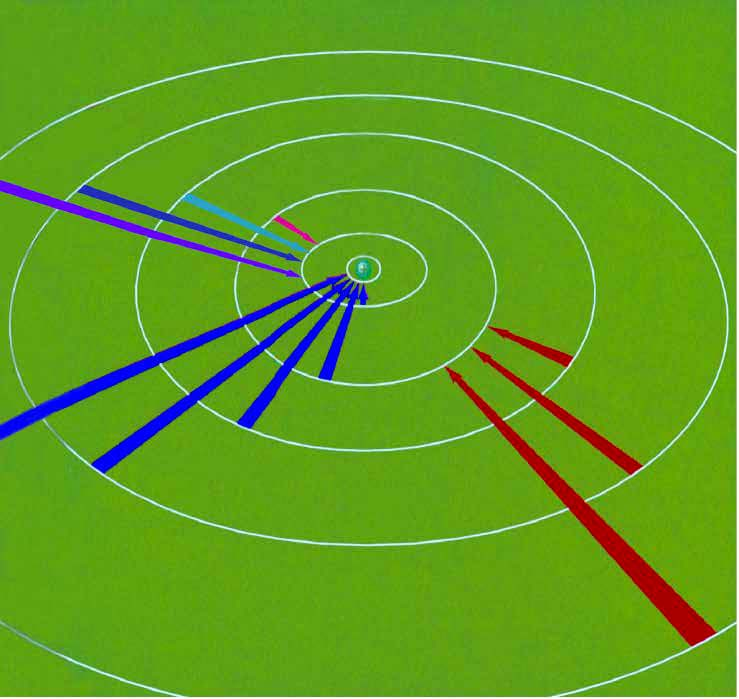

# 原子与分子理论

## 守恒定律

### 宇称守恒

假若孤立物理系统的某种可观测性质遵守守恒定律，则随着系统的演进，这种性质不会改变。

诺特定理表明，每一种守恒定律，必定有其伴随的物理对称性。即不论在空间的取向为何，物理系统的物理行为一样。

1. 如果任一给定的物理实验的进展过程和该实验开始的时间无关，例如是今天开始做，还是明天开始做，该实验的进展过程完全一样，这就叫做时间平移对称性，也就是时间均匀性。能量守恒定律就是这种对称性的表现。

2. 如果任一给定的物理现象的进程和该现象所发生的空间位置无关，即换一个空间位置，该种物理现象及其进程也一样发生，这就叫做空间平移对称性，也就是空间均匀性。动量守恒定律就是这种对称性的表现。

3. 如果任一给定的物理现象的进展过程与发生这种现象的“装置”在空间的取向无关，即把该“装置”旋转一个方向，这一物理现象的进程完全一样，这就叫空间转动对称性，也就是空间的各向同性。角动量守恒定律就是这种对称性的表现。例如，物体在有心力作用下运动的空间，对力心而言就是各向同性的，所以这种运动对力心的角动量服从守恒定律。

### 绝对定律

绝对定律指，物理学者从未找到任何违背这些定律的证据。

- 质能守恒定律
- 动量守恒定律
- 角动量守恒定律
- 电荷守恒定律
- ……

### 近似定律

在某些特别状况，像低速、短暂时间尺寸、某种相互作用等等，以下这些定律近似于正确。

- 质量守恒定律（适用于非相对论性速度与不存在核反应的状况）
- 能量守恒定律（适用于非相对论性速度与不存在核反应的状况）
- 宇称对称性
- ……

## 原子结构模型

### 模型历史

| 时间 | 科学家 | 模型名称 | 备注 |
| :-: | :-: | :-: | :-: |
| 公元前 400 多年 | （古希腊）德谟克利特 | 原子唯物论 | 构成物质的最小单位 |
| 1803 年 | （英国）道尔顿 | 原子论 | 具有实在意义的微粒的概念 |
| 1904 年 | （英国）汤姆孙 | 葡萄干布丁模型 | 在发现电子的基础上 |
| 1911 年 | （英国）卢瑟福 | 核式模型 | 根据 α 粒子散射实验 |
| 1913 年 | （丹麦）玻尔 | 原子结构模型 | 氢原子光谱 |
| 20 世纪 20 年代中期 | 薛定谔等 | 量子力学模型 | 电子云 |

波尔的原子结构模型：

1. 原子中的电子在具有确定半径的圆周轨道上绕原子核运动，并且不辐射能量。

2. 在不同轨道上运动的电子具有不同的能量（$E$），而且能量值是不连续的，这称为能量“量子化”。轨道能量依 $n$ 值（$1,2,3,\dots$）的增大而升高，$n$ 称为量子数。对氢原子而言，电子处在 $n=1$ 的轨道时能量最低，这种状态称为基态；能量高于基态能量的状态，称为激发态。

3. 只有当电子从一个轨道（能量为 $E_i$）跃迁到另一个轨道（能量为 $E_j$）时，才会辐射或吸收能量。当辐射或吸收的能量以光的形式表现出来并被记录时，就形成了光谱。

4. 玻尔原子结构模型成功地解释了氢原子光谱是线状光谱的实验事实，阐明了原子光谱源自核外电子在能量不同的轨道之间的跃迁，指出了电子所处的轨道的能量是量子化的。但是其局限性在于，复杂的光谱现象无法解释。

原子分为原子核与核外电子，原子核分为质子和中子。

其中，核外电子带负电，中子带正电，原子不带电（电中性），因此：

质子数 $=$ 电子数 $=$ 核电荷数 $=$ 原子序数

对于元素 $_Z^A\ce{X}$ 的表示：质量数（$A$）$=$ 质子数（$Z$）$+$ 中子数（$N$）。

### 基态与激发态

处于最低能量状态的原子叫做基态，基态原子吸收能量，它的原子灰跃迁到较高能级变为激发态原子。

{ width="60%" }

- 电子从较高的激发态跃迁到较低的激发态，甚至基态时会释放能量。

- 易错：不一定跃迁到基态，有可能跃迁到较低的激发态。

- 光（辐射）是电子跃迁释放能量的重要形式，……都与原子核外电子跃迁释放能量有关。

光谱：

- 光谱的定义：利用仪器将物质吸收的光或发射的光的波长和强度分别记录下来，就得到光谱。

- 连续光谱：若光谱是由各种波长的光所组成，且相近的波长差别极小而不能分辨，则这种光谱为连续光谱，例如阳光的光谱即为连续光谱。

- 线性光谱：若光谱是由具有特定波长、彼此分立的谱线组成，则所得的光谱为线性光谱。

- 原子光谱通常是线性光谱，原子光谱源自核外电子在能量不同的轨道之间的跃迁，而电子所处的轨道的能量是量子化的，电子从一个轨道跃迁到另一个轨道时，辐射或吸收的能量是不连续的，以光的形式表现出来的光的波长是不连续的。

{ width="80%" }

不同元素的电子发生跃迁会释放或吸收不同的光，可以用光谱仪摄取各种原子的「吸收光谱」（从低能量到高能量）或「发生光谱」（从高能量到低能量），总称为原子光谱。

{ align=right width="35%" }

如右图，

- 电子从能量较高的轨道跃迁到 $n=1$ 的轨道所形成的谱线在紫外光区。
- 电子从能量较高的轨道跃迁到 $n=2$ 的轨道所形成的谱线在可见光区，可见光区的四条谱线分别为一条红色的、一条蓝色的和两条紫色的。
- 电子从能量较高的轨道跃迁到 $n=3$ 的轨道所形成的谱线在红外光区。

在现代化学中，常利用原子光谱上的特征谱线来鉴定元素，称为光谱分析。

## 衰变

以下内容由 Grok3 生成，详细请见[百科文档](https://chem.libretexts.org/Courses/University_of_British_Columbia/CHEM_100:_Foundations_of_Chemistry/17:_Radioactivity_and_Nuclear_Chemistry/17.03:_Types_of_Radioactivity:_Alpha_Beta_and_Gamma_Decay)。

### 衰变概述

这是因为某些原子核中的质子和中子数量不平衡，导致不稳定；为了变得更稳定，这些原子核会发生衰变，转变为不同的元素或同位素。

研究表明，放射性衰变是随机过程，但可以通过半衰期等指标量化，半衰期是样品中一半放射性原子衰变所需的时间，每个放射性同位素有独特半衰期，从几分之一秒到数十亿年不等。例如，C-14 的半衰期约为 5730 年，这使其在考古学中用于测定古代有机物的年代。

举例：如果有 $100$ 个半衰期为 $10$ 年的放射性物质原子，$10$ 年后，$50$ 个原子衰变，剩下 $50$ 个；再过 $10$ 年，又有 $25$ 个衰变，剩下 $25$ 个，依此类推。

放射性衰变的理解在医学（如影像和治疗）、地质年代测定和核能领域有重要应用。

其中 α 衰变、β 衰变和 γ 衰变是最常见的类型。

| 衰变类型 | 发射粒子          | 原子序数变化 | 质量数变化 | 穿透力         |
|----------|-------------------|--------------|------------|----------------|
| α 衰变    | α 粒子   | 减少 2        | 减少 4      | 弱（纸张或空气阻挡） |
| β^-^ 衰变   | 电子 + 反中微子   | 增加 1        | 不变       | 中等（铝阻挡）  |
| β^+^ 衰变   | 正电子 + 中微子   | 减少 1        | 不变       | 中等（铝阻挡）  |
| γ 衰变    | γ 射线（高能光子） | 不变         | 不变       | 强（铅或混凝土阻挡） |

除了上述三种，还有其他较少见的衰变类型：

- 电子捕获：原子核中的质子捕获内层电子，转变为中子并发射中微子，原子序数减少 1，这就是中子星的形成过程。

- 自发裂变：重原子核分裂成两个较轻的核，释放大量能量，通常见于非常重的元素，如铀或钚。

### α 衰变

在 α 衰变中，原子核发射一个 α 粒子，α 粒子本质上是氦原子的核，由 $2$ 个质子和 $2$ 个中子组成。

过程由强相互作用和量子隧穿效应主导，常见于原子序数 $\ge52$ 的重元素（如铀、镭），但铍-8 是个例外。

- 当发生 α 衰变时，原子核失去这两个质子和两个中子，因此原子序数减少 $2$，质量数减少 $4$。

- 例如，铀-238（U-238）衰变成钍-234（Th-234）并发射 α 粒子：

其中 α 粒子质量较大、速度较慢（约为光速的十分之一），带有正电荷，与物质相互作用强烈，穿透力弱，通常一张纸或几厘米的空气即可阻挡。

### β 衰变

形式上，β 衰变有两种，β^-^ 衰变和 β^+^ 衰变，均由弱相互作用介导，涉及夸克的转变。

- β^-^ 衰变：原子核中的一个中子转变为质子，并发射一个电子和一个反中微子。这使得原子序数增加 $1$，质量数保持不变。例如，碳-14 衰变成氮-14。

- β^+^ 衰变：原子核中的一个质子转变为中子，并发射一个正电子（电子的反粒子）和一个中微子。这使得原子序数减少 $1$，质量数保持不变。例如，氟-18 衰变成氧-18。

其中 β 粒子比 α 粒子轻，穿透力较强，通常需要几毫米的铝来阻挡。

β 衰变在所有元素中均可观察，人工放射性常涉及 β^+^ 衰变和电子捕获。

### γ 衰变

形式上，γ 衰通常在 α 或 β 衰变后发生，子核可能处于激发态，随后发射 γ 射线（原子核从激发态释放高能光子）以降低能量至更稳定状态（甚至达到基态）。

γ 衰变不改变原子核的原子序数或质量数，仅降低能级。

其中 γ 射线是电磁辐射，没有质量或电荷，穿透力极强，需要厚铅或混凝土阻挡。

## 分子动理论

### 分子光谱

分子光谱和分子内部的运动密切相关，涉及的分子运动方式主要为：

1. 分子的转动，吸收或发射的光处在远红外区或微波区，称为远红外光谱或微波谱。

2. 分子中原子间的振动，通常振动光谱在近红外区和中红外区，一般称为红外光谱。

3. 分子中电子在不同能级的分子轨道间跃迁，得到紫外 $\sim$ 可见光谱。

因此：

- 键长缩短、键能加强，化学键的伸缩振动频率升高，在红外光谱中对应吸收峰值的频率依次增加。

- 基于红外光谱中吸收峰值的频率可以推测分子中存在的官能团，进而为推测分子结构提供证据。

- 物质的浓度越高，其吸收峰的强度则越大，因此分子光谱还被广泛用于测定物质浓度。
