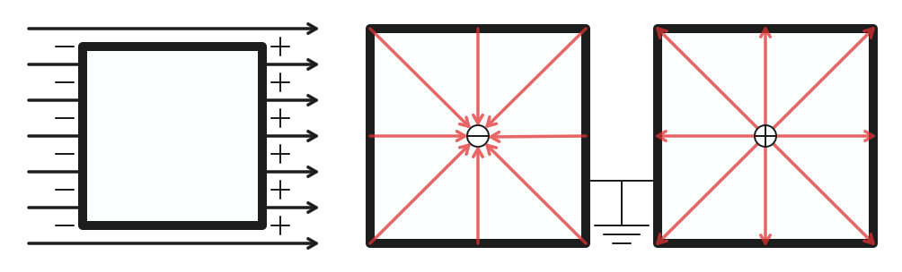

# 静电力学 {#_1}

## 电荷 {#_2}

### 电荷 {#_3}

电荷是构成物质的基本粒子的一种物理性质，原子中的质子和电子分别带有正电荷和负电荷，而中子不带电荷。

质子与电子这种携带电荷的粒子称作**载流子**，电荷作为一种假想物质，无法脱离载流子单独存在。

- 丝绸摩擦的玻璃棒带正电荷，毛皮摩擦的橡胶棒带负电荷。

- 带有电荷的物质称为**带电物质**，带有电荷的粒子称为**带电粒子**。

电荷量的国际单位是库仑（$\text C$），通常用符号 $Q$ 表示。

**元电荷**（也成基本电荷）：基本电荷 $e$ 是一个质子所带的**电荷量**，或一个电子所带的负**电荷量**。其中 $e\approx 1.602\times 10^{-19}\text C$，一个电子携带的电荷量为 $-e$。

为什么是小数？历史上，安培（电流强度）是先于库仑定义的，最初的库伦定义就是**安培秒**，即 $1$ 库仑是 $1$ 安培电流在 $1$ 秒钟内传递的电荷，表示为 $1\text C=1\mathrm{A\cdot s}$ 或 $1\text C=1\text{A}\times1\text{s}$，而旧的安培定义为「在相距 $1$ 米的两条平行导线间，产生每米 $0.2$ 微牛顿的磁力所需的电流」。

比荷、比电荷（又称荷质比）：即带电物体所带电荷比上其质量，电子比荷约为 $1.758820024(11)\times 10^{11}\mathrm{C/kg}$，质子的比荷约为 $9.578309\times 10^7\mathrm{C/kg}$。

:::note

电荷的总量和电量（电荷量）

正电荷的电量为正值，负电荷的电量为负值，一个物体的电量就是其内部所有载流子（质子和电子）的电量的**代数和**，我们称一个物体的电性就是它电量的正负性。

与电量不同，**电荷的总量**计算时会忽略负电荷所带符号，即电荷的总量表示的是所有电荷的**绝对值**之和。

:::

注意到物体不带电不等价于物体中没有正电荷和负电荷，只是说正电荷的电量和负电荷的电量正好可以抵消。

在题目中，有时会将电量的绝对值表达为「电量」，因此我们经常在阐述正电量时在值的前面加一个正号，代表电性为正。

### 电荷守恒 {#_4}

电荷守恒定律是一种关于电荷的**守恒定律**。

电荷守恒定律有两种版本，**弱版电荷守恒定律**（又称为**全域电荷守恒定律**）与**强版电荷守恒定律**（又称为**局域电荷守恒定律**）。

**弱版电荷守恒定律**表明，整个宇宙的总电荷量保持不变，不会随着时间的演进而改变。注意到这定律并没有禁止，在宇宙这端的某电荷突然不见，而在宇宙那端突然出现。

**强版电荷守恒定律**明确地禁止这种可能。强版电荷守恒定律表明，在任意空间区域内电荷量的变化，等于流入这区域的电荷量减去流出这区域的电荷量。对于在区域内部的电荷与流入流出这区域的电荷，这些电荷的会计关系就是电荷守恒。

:::note

补充

近代物理实验发现，带电粒子也可以产生或湮没。如一个高能光子在一定条件下可以产生一个正电子（反物质中的内容）和负电子；一对正、负电子可以同时湮没，转化为光子。

因此全电荷守恒定律有更普遍的表述：一个与外界没有电荷交换的系统，电荷的代数和保持不变（即电量保持不变）。

全电荷守恒定律的第一种表述已经适用于经典物理，在经典物理中是应当被肯定的。在高中阶段，电荷守恒定律
指的是全电荷守恒定律。

:::

### 电荷量子化 {#_5}

电荷必须依赖载流子存在，一个载流子的电量绝对值为 $e$，因此任何物体（夸克的分数电荷作为例外）的电量都是 $e$ 的整数倍。

也就是说，物体所带电荷量不可能连续地取任意量值，而只能取电子或质子电荷量的整数倍值。电荷量的这种只能取分立的、不连续量值的性质，称为电荷的量子化。

这种量子化并不会影响电动力学中的任何结论。

## 电导体 {#_6}

### 电导体 {#_7}

- 电导体为能够让电流通过的材料，依其导电性（导电能力），能够细分为超导体、**导体**、半导体及**绝缘体**。其本质为：内部自由移动的电荷（只考虑负电荷，即电子）。

- 金属总是导体，因为金属原子最外层电子容易解离出来，形成自由电子；酸碱盐水溶液是导体，因为水溶液中有可以自由移动的离子；气体通常不是导体，除非，详见模型电浆部分。

### 电介质 {#_8}

- 电介质由分子组成，每个分子都是电中性的，在电介质中可以自由移动的电荷极少，但是有的分子是有极性的（例如水分子）。

- 当一个带电体靠近电介质时，极性分子中带有异种电荷的一端受到吸引力的作用，带有同种电荷的一端受到排斥力的作用，分子在力偶的作用下发生转动，其结果是使带异种电荷的一端朝向带电体。这样，在电介质靠近带电体的表面上呈现出异种电荷，远离带电体的表现上呈现出同种电荷。这个现象叫作电介质的极化。

- 带电体对极化后的电介质的吸引力大于排斥力，如果电介质只是一片轻小物体，它将被吸引过去，这就是最古老的电现象，摩擦过的琥珀能吸引轻小物体的道理。非极性分子在受到带电体的作用时，两种电荷的中心往往会发生极微小的分离，因而产生和极性分子类似的效果，只不过较弱罢了。

### 半导体 {#_9}

- 半导体的典型代表是四价元素硅和锗。硅原子有序地排列在晶格上，每个原子的四个价电子分别和周围四个原子的一个价电子组成共价键，共价键的两个电子是互相约束的，一般不能自由移动。

- 由于原子的热振动，有少数价电子可以脱离共价键而成为自由电子。这时，在它原来的位置上就留下一个空位，叫作空穴。有空穴的硅原子变成了带正电的离子，空穴附近的某个价电子在热运动中很可能移过来填补它，这个空穴虽然消失了，但是在另一个位置上又出现了新的空穴。这种填补空穴的运动，在效果上相当于一个正电荷沿反向的运动。因此，半导体是依靠自由电子和空穴导电的。

- 半导体中的自由电子和空穴是成对产生的，在同一时间内，既有产生自由电子和空穴的过程，又有自由电子回到空穴的复合过程。当这两个过程达到动态平衡时，半导体中单位体积内的自由电子数目和空穴数目（称为自由电子的数密度和空穴的数密度）具有一定的数量，在通常条件下，这个数量是很小的，所以半导体的导电能力不强。

## 库仑定律概述 {#_10}

### 库仑定律 {#_11}

库仑定律表明，在真空中两个静止点电荷之间的相互作用力，与两电荷间距离的平方成反比，且与两电荷电量的乘积成正比，作用力方向在它们的连线上，同号电荷相斥，异号电荷相吸。

库仑证明两带电体间有相互作用力，且其定量关系可以方程表示。库仑定律的标量形式可以表示为：

$$
F_{库}=k\dfrac{Q_1Q_2}{r^2}
$$

理论上 $Q$ 应该带正负号，但是如果列标量方程，一般不带入正负号，表示库仑力的大小。

$$
\bm F=k\dfrac{Q_1Q_2}{r_2}\hat{\bm r}
$$

库仑定律适用范围：场源电荷静止​、点电荷；库仑力是可以叠加的，但是我们会在电场叠加处再讲。

库仑定律不适用于场源电荷相对观测者运动的情形，对试探电荷运动或静止的情形没有要求。

当两带电体之间的距离相对于两带电体的半径（考虑近似成球体）很大时，我们才能将两带电体看作点电荷：设两带电体距离为 $r$，两带电体半径分别为 $R$，必须有 $r\gg R$。

一般情况下微观粒子的大小都远远小于彼此之间的距离，因此微观粒子在计算静电力时一般都可以看做点电荷。

正因如此，$r\to0$ 时静电力趋于无穷大这种说法是错误的，两带电体不能看成点电荷（两球体之间相距过近时，两球内部的电量分布会影响静电力的大小），此时库仑定律已不再适用。

### 介电常数 {#_12}

在真空中，有公式：

$$
k_e=\dfrac{1}{4\pi\varepsilon_0}=\dfrac{c_0^2\mu_0}{4\pi}=c_0^2\times10^{-7}\mathrm{H/m}
$$

其中 $c_0$ 表示光速，$\varepsilon_0$ 为介电常数，因此：

$$
k_e\approx9\times10^9\ \mathrm{Nm^2C^{-2}}
$$

这个数是很大的。

介质极化后，束缚电荷也要产生电场，该电场与外电场的方向相反，两电场叠加的结果是介质内部的电场减弱。在真空中场强为 $E_0$ 的区域内充满电介质后，场强会减小到 $E$，其比值就叫这种电介质的介电常数（亦称相对介电常数），用 $\varepsilon$ 表示：

$$
\varepsilon=\dfrac{E_0}{E}
$$

显然，真空的介电常数 $\varepsilon_0=1$，而空气的非常接近 $1$（可以看做真空），而水中可以达到约 $80$。

因此，电介质中的库仑定律及点电荷的场强公式和电势的公式分别为：

$$
F=k\dfrac{q_1q_2}{\varepsilon r^2}
$$

$$
E=k\dfrac{Q}{\varepsilon r^2}
$$

$$
U=k\dfrac{Q}{\varepsilon r}
$$

### 带电金属球 {#_13}

带电小球动态平衡：根据库仑定律得出库仑力，然后根据动态平衡解题。

两个不可以忽略大小的带电金属球靠近，因为感应起电，电荷在球内的分布不均，因此实际作用力与库仑定律不同，但是存在大小结论：

- 设 $F_0$ 表示球心等价点电荷的库仑力。
- 若两球电性相同，则 $F<F_0$；
- 若两球电性不同，则 $F>F_0$。

理解方式，本来提供库仑力的电荷因为感应，存在有相互远离或靠近的趋势。不考虑球内电荷的相互作用力变化，根据库仑力与 $r$ 的平方成反比，可以得出上述结论。

### 三点一线平衡 {#_14}

题目描述：三个带电小球在一条直线上，处于平衡状态。我们进行讨论，容易发现

- 可以平衡的电荷正负只有「正负正」「负正负」两种。

- 带电正负为两同夹异，带电量为两大夹小、近小远大。

公式表达：一条直线上一次有电荷量为 $q_1,q_2,q_3$ 的点电荷，其间距分别为 $\ell_1,\ell_2$，若三点电荷平衡：

$$
\dfrac{1}{\sqrt{q_2}}=\dfrac{1}{\sqrt{q_1}}+\dfrac{1}{\sqrt{q_3}}
$$

$$
q_1:q_2:q_3=\ell_1^2:\dfrac{\ell_1^2\ell_2^2}{\ell_1^2+\ell_2^2}:\ell_2^2
$$

其中上面的式子可以化为

$$
\sqrt{q_1q_3}=\sqrt{q_1q_2}+\sqrt{q_2q_3}
$$

的形式。

### 等边三角平衡 {#_15}

如图：

形成等边三角形后，按照 $1:1:2$ 的关系，库仑力等大同向，此时给一个匀强电场即可平衡。

证明：暴力展开。

### 原子核问题 {#_16}

已知氢核（质子）的质量为 $1.67\times10^{-27}\pu{kg}$，电子的质量为 $9.1\times10^{-31}\pu{kg}$，在氢原子内它们之间的最短距离为 $5.3\times10^{-11}\pu{m}$。试比较氢核和核外电子之间的库仑力和万有引力。

氢核和电子所带的电量都是 $1.6\times10^{-19}\pu{C}$。

$$
F_{\text{库}} = k \frac{q_1 q_2}{r^2} = 8.2 \times 10^{-8}(\pu{N})
$$

$$
F_{\text{引}} = G \frac{m_1 m_2}{r^2} = 3.6 \times 10^{-47}(\pu{N})
$$

与量子物理部分不同，高中常常以原子核内中子、质子为多个点电荷（称为夸克）叠加为命题点，了解即可。

## 起电方式 {#_17}

### 摩擦起电 {#_18}

摩擦起电：不同物体对电子的束缚能力不同，电子从一个物体转移到另一个物体。

摩擦起电的第一步即是将两种不同的物体相互摩擦，使它们最外层的电子得到足够的能量，摆脱原子核的束缚，在两个物体之间相互转移。

电子转移的原因是不同原子核对电子的吸引力会有差别，同时摩擦起电只会发生在绝缘体中，导体中的电荷转移形式为接触起电。

典型摩擦起电序列表：

- 正电：兔毛、玻璃、云母、人发、尼龙、羊毛、毛皮、铅、丝绸、铝、纸、棉花、钢铁、木。
- 负电：琥珀、封蜡、镍、铜、黄铜、银、黄金、铂金、硫、醋酸人造丝、聚酯纤维、赛璐珞、硅、铁氟龙。

关于电荷：同种电荷相互排斥，异种电荷相互吸引，带电荷物体可以吸附轻小物体。

常见错误：产生了电荷。摩擦起电后两个物体必带等量异性电荷，且**电荷是守恒的**，只会发生转移而不会凭空产生。

### 接触起电 {#_19}

接触起电：发生在导体中，形如电荷量中和和平分，应用验电器。

即 $q_1+q_2\to(q_1+q_2)/2+(q_1+q_2)/2$ 的公式表达。

注意到这是符合电荷守恒定律的。

### 感应起电 {#_20}

感应起电：发生于导体中，不接触，形式为导体中的自由电荷重新分布。

**静电平衡**是指导体中的自由电荷（通常为带负电荷电的电子）所受到的力达到平衡而不再做定向运动的状态。

处在静电平衡下的导体，有性质如下：

- 感应电荷分布在导体的外表面，各处电荷的面密度与该处表面的曲率半径成反比。
- 导体内部场强处处为零。外部电荷产生的电场与感应电荷在导体内部产生的电场叠加，使得导体内部的合场强处处为零。
- 导体表面必为等势面，整个导体亦为等势体。导体外表面极近任一点处的场强必垂直于该表面。

推导结论：用导线连接处于静电平衡状态下的导体任意两个位置，没有电流流过，原因为等势体无电势差，即无电流。

微观实质：自由电荷重新分布，电场叠加抵消，从而达到静电平衡的条件。

- 自由电荷的重新分布：当导体置于外电场中时，导体内的自由电子会迅速移动，形成与外部电场方向相反的感应电场。

- 电场叠加抵消：自由电子的移动导致导体表面出现极化电荷（一端积累负电荷，另一端积累正电荷），这些极化电荷产生的电场与外电场在导体内部完全抵消。

- 静电平衡条件：当导体内部分子的库仑力与外部电场力达到平衡时，自由电荷停止定向移动，此时导体内总电场强度为零。

### 接地加感应起电 {#_21}

感应起电接地模型：基础模型题目描述形如，带电物体 $\text C$ 靠近枕形导体 $\text{AB}$ 的 $\text A$ 端，将导体 $\mathrm{A/B}$ 端接地（或者用手触碰一下），然后拿开或不拿开 $\text{C}$，问导体 $\mathrm{A},\text{B}$ 两端分别带什么电荷。

性质：导体任意一端接地，效果相同。  
解释：因为是导体，所以电荷自由移动，完全不需要考虑导体的两端的差异。

性质：如果拿开 $\text{C}$，则导体两端电荷相同。  
解释：显然。

<figure>
<table>
<thead>
<tr>
<th style="text-align: center;"></th>
<th style="text-align: center;">导体  端</th>
<th style="text-align: center;">导体  端</th>
</tr>
</thead>
<tbody>
<tr>
<td style="text-align: center;">移开  物体</td>
<td style="text-align: center;">负电荷</td>
<td style="text-align: center;">负电荷</td>
</tr>
<tr>
<td style="text-align: center;">不移开  物体</td>
<td style="text-align: center;">负电荷</td>
<td style="text-align: center;">不带电</td>
</tr>
</tbody>
</table>
<figcaption>
假设  带正点，且移开物体  前已经停止接地
</figcaption>
</figure>

性质：靠近电荷的一段感应起电，远离电荷的一端不带电。  
解释：显然。

性质：感应起电后接地，电流移动方向与电荷有关。  
解释：因为是等势体，所以导体电势等于电荷在此处的电势，靠近正电荷为正，靠近负电荷为负，而大地电势为零，电流从高电势流到低电势，电子流动方向与电流相反。

### 感应起电空球壳模型 {#_22}

如图：

- 如果球壳内没有电荷，则球壳电荷一定集中在球壳外表面（图左下）。
- 如果球壳内有电荷，则球壳内一定感应起电（图右上）。
- 如果球壳接地，则球壳外一定没有电荷（图右下）。

电场强度、电势做题方法：

- 根据电荷（上图）画出电场线，电场线由正电荷发出。
- 根据顺着电场线，电势逐渐降低；靠着电荷越近，电场强度越大。
- 导体始终是等势体，如果外表面没有电荷，则球壳内及外电势均为零。

### 静电屏蔽和法拉第笼 {#_23}

在静电平衡状态下，空腔内部没有电场。不管导体本身带电还是处于外界电场中这一结论始终成立。这样，导体壳的表面就保护了它的内部区域，使之不受导体壳外表面上的电荷或外界电场的影响，这种现象称为静电屏蔽。

- 一个空腔导体，外接电场既不会影响腔内的物体。
- 一个**接地的**空腔导体，腔内带电体的电场不会影响腔外的物体。

静电屏蔽的应用很广泛，例如电子仪器外的**金属网罩**、电缆外层包裹的**金属皮**用于防止外部电场对内部的影响。

**法拉第笼**，又称法拉第屏蔽罩，是一个由金属或者良导体形成的笼子。

- 法拉第遮罩无论被加上多高的电压内部也不存在电场。
- 而且由于金属的导电性，即使笼子通过很大的电流，内部的物体通过的电流也微乎其微。
- 在面对电磁波时，可以有效地阻止电磁波的进入。

由于法拉第遮罩的静电屏蔽原理，在汽车、飞机等交通工具中的人是不会被雷击的。

### 静电除尘 {#_24}

工作原理：利用高压电场使气体中的尘埃带电，并通过电场力吸附尘埃。

具体过程：

1.  电离气体：在高压电极附近，电场强度极高，使空气分子电离，产生大量自由电子和正离子。
2.  尘埃带电：自由电子奔向正极过程中，附着在尘埃颗粒上，使其带负电。
3.  电场吸附：带电尘埃在电场力作用下向集尘极阳极表面移动，最终被吸附沉积。

应用：工业烟囱废气处理、空气净化设备。

## 等离子体 {#_25}

### 等离子体 {#_26}

等离子体（又称电浆、电离浆、等离体），是物质状态之一，是物质的高能状态。通俗的说，等离子体就是电离的气体。比较严格的定义是：等离子体是由电子、阳离子和中性粒子组成的整体上呈电中性的物质集合。等离子体可以被看成是由一群粒子所组成的系统，因此在数学上可以用统计的方式来研究，其形状和体积不固定，会依着容器而改变。

宇宙中充斥着各种各样的等离子体，是其最常见的物质相态，亦可以经由对处于其他相态的物质的加工取得。等离子体是宇宙重子物质最常见的形态，其中大部分存在于稀薄的星系际空间（特别是星系团内介质）和恒星之中。地球大气离地表 $300$ 公里的电离层也是处于等离子态，电离层是地球大气较外层的气体吸收了太阳辐射能量，发生光致游离而形成。

### 离子化过程 {#_27}

现代物理学对气体与等离子体之间的相变给出了详细描述，某种气体在经历外来的高温或强电磁场的作用时，此时该气体内本身存在的游离电子会被加速，并撞击该气体的诸中性粒子，使该气体中各颗中性粒子中的电子与其原子核分离，成为游离电子，而该中性粒子也会因缺少了电子而成为离子。这些分离出来的游离电子又会被该电场加速，再与其他中性粒子碰撞，这称为气体的离子化过程。此时该气体中一部分粒子会拥有比中性状态更多的电子而成为带负电荷的阴离子，另外有一部分粒子会拥有比中性状态更少的电子而成为带正电荷的阳离子，有一部分粒子则维持中性。离子化后的气体成为由各颗阴阳离子、游离电子、中性粒子等多种粒子所组成的电中性物质，其中阴离子的电荷量总和与阳离子的电荷量总和相等，这就是物理学上所谓等离子，此时物质在大尺度上的总电荷是零，这称为准中性。等离子体含有许多可以自由移动的非中性粒子（载流子），加上诸多非中性粒子带有电磁力，并会受其他非中性粒子的电磁力影响，即是说诸非中性粒子之间可以在不碰撞的情况下发生相互作用，这也解䆁了等离子体的导电及受电磁力支配等的多种性质。最后处于等离子态的物质也可以通过相变转化为其他三种物质状态。

### 现象和应用 {#_28}

等离子体现象：

- 对流层大气放电（闪电）。
- 中高层大气放电（红色精灵、蓝色喷流、巨型喷流、淘气精灵）。
- 极光、马祖火。

由等离子体组成的物质：

- 太阳及其他恒星。
- 太阳风。
- 吸积盘。
- 星云。

人工等离子体：

- 电感耦合等离子体火炬。
- 等离子灯（荧光灯、霓虹灯、弧光灯）。
- 臭氧发生器。
- 等离子炬。

电弧（又称弧放电）：由于电场过强，气体发生电击穿而持续形成等离子体，使得电流通过了通常状态下的绝缘介质（例如空气）的现象。

当通电的高电压电路出现导体与导体的分开时，两端就会出现电弧，产生的高热可以融化或是汽化所有的金属。

工业上利用电弧来焊接、融化或是切割金属，例如等离子切割机、放电加工机、炼钢厂的电弧炉，常见于电焊，氩焊。在汽机车修理，板金，车床。

### 静电放电 {#_29}

静电放电：在某一绝缘介质的两面分别出现正电荷和负电荷，并且逐渐累积时，这时加于该绝缘介质上的电压也会同时增加，当该电压高于一定程度（击穿电压）后，这时绝缘介质会发生电击穿，继而使得一部分绝缘介质变为导体，使电流能够通过。在电流通过绝缘介质后，绝缘介质两面的正负电荷便会消失，加于该绝缘介质的电压也会回复到零，因此静电放电只会在一段短时间之内出现。

静电放电可以产生大小不等、或引人注目的电火花（闪电以及伴随的雷声，则是大规模的静电放电事件），即使是看不见也听不到的放电，仍有可能足以损坏敏感的电子设备。静电放电可能会在产业上造成重要的有害影响，例如气体，燃料蒸气和煤尘的爆炸，以及固态电子部件（例如集成电路）的故障，这些电子器件在承受高压时可能会遭受永久性损坏。

| 静电发生情境 | 相对湿度 10-25%^[1](#fn:noteesda){.footnote-ref}^ | 相对湿度 65-90%^[1](#fn:noteesda){.footnote-ref}^ |
|:--:|:--:|:--:|
| 行走在地毯上 | $\pu{35,000V}$ | $\pu{1,500V}$ |
| 行走在塑料地板 | $\pu{12,000V}$ | $\pu{250V}$ |
| 在工作台边工作 | $\pu{6,000V}$ | $\pu{100V}$ |
| 从工作台拿起塑料袋 | $\pu{20,000V}$ | $\pu{1,200V}$ |
| 发泡胶椅 | $\pu{18,000V}$ | $\pu{1,500V}$ |

电击穿：当加在某一绝缘介质上的电压高于过一定程度（击穿电压）后，这时绝缘介质会发生突崩溃而使其电阻迅速下降，继而使得一部分绝缘介质变为导体。不同介质的击穿电压一般是不同的。

突崩溃（又称雪崩击穿）：对一些绝缘体或半导体施加足够的电压时，流过它们的电流突然增大。

在有效的击穿电压下，电击穿现象可以发生在固体、流体、气体或者真空等不同的介质中。这主要与金属原子外自由运动的电子有关。大部分的绝缘体或半导体载运电流的能力受限于能够在原子外中自由运动的电子的不足，强大的电流所产生的电子能够击出原子中的电子而使它变成自由电子。而由于上述的现象类似于雪崩产生的滚雪球效应，因此得名。

电击穿后的常见放电现象有：静电放电、电晕放电、电弧放电、发光放电。

### 电晕放电 {#_30}

电晕放电：由围绕在高电压导体周围的流体电离造成的放电，此处最常见的流体就是空气，此放电因在黑暗中状似月晕而得名。

电晕放电时，在沿着导线或电极的表面可以看到光层（电晕），伴有咝咝声，并产生臭氧、氮氧化物等。

尖端放电：为电晕放电的其中一种，造成此现象的原因主要为导体尖端周围的空气被导体产生的电场电离。当导体周围电场强度够高来形成一个可作为导体的区域时，将会发生放电现象，但其电场值并不足以引起电压崩溃或对附近的物件造成电弧现象。

电风：在一个导体尖端附近放一根点燃的蜡烛，当我们不断地给导体充电时，火焰就好像被风吹动一样朝背离尖端的方向偏斜。这就是尖端放电引起的后果。

因为在尖端附近强电场的作用下，空气中残留的离子会发生激烈的运动。在激烈的运动过程中它们和空气分子相碰时，会使空气分子电离，从而产生大量新的离子，这就使空气变得易于导电。

电晕放电是一种电流从带电物体（电极）流到不带电之流体，进而造成电极附近产生离子态分子的一种过程，而尖端放电特指电晕放电中因尖端物体所造成的电晕放电现象。

具体的，在高电压下电场强度过大，导致非导电介质被击穿，绝缘体的电阻迅速下降，继而使得一部分绝缘体变为导体，而形成放电现象，常发生在高压电线周围或带电体的尖端附近（尖端放电）。

在空气中，我们通常会在拥有高电压的导体尖端附近看到。在高压系统中，自发性的尖端放电会消耗功率，而在尖端放电下的高化学活性反应中，会产生有害的物质，例如臭氧。可控制的尖端放电现象常被用在过滤及印刷等等制程中。

应用尖端放电的例子：

- 避雷针。
- 制造臭氧。
- 静电除尘。

::: {.footnote}

------------------------------------------------------------------------

1.  ::: {#fn:noteesda}
    <https://www.esda.org/assets/Documents/Fundamentals-Part-1-SimplifiedChinese.pdf> [↩](#fnref:noteesda "Jump back to footnote 1 in the text"){.footnote-backref}[↩](#fnref2:noteesda "Jump back to footnote 1 in the text"){.footnote-backref}
    :::
:::
