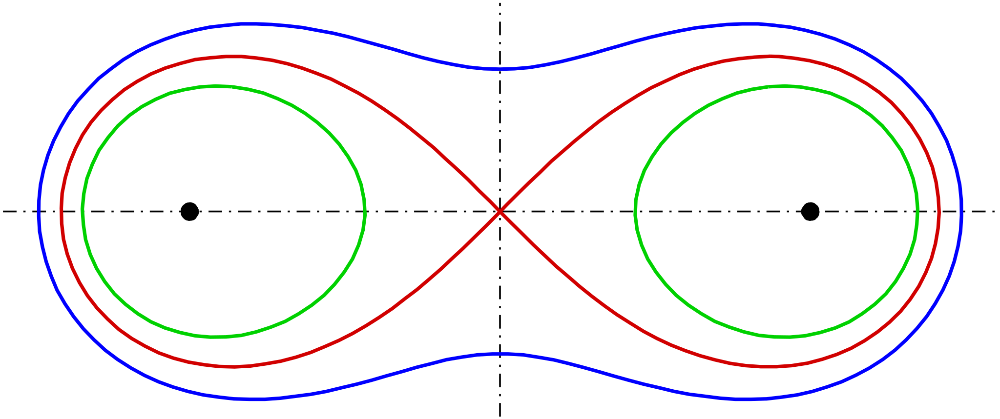
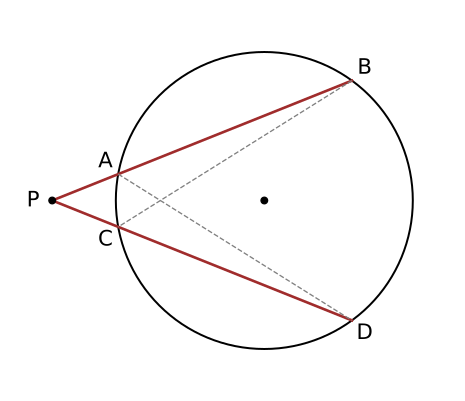

# 解析几何 {#_1}

## 二次曲线 {#_2}

### 圆锥截线 {#_3}

用一平面去截双顶圆锥，得到的截线就是圆锥曲线。圆锥曲线是平面上满足距某定点（焦点）的距离与距某定直线（准线）的距离之比为常数 [\$e\$]{.arithmatex} 的点的轨迹。

不妨设 [\$\alpha\$]{.arithmatex} 指母线与轴的夹角（[\$0\<\alpha\<90\^\circ\$]{.arithmatex}），切平面与轴的夹角为 [\$\beta\$]{.arithmatex}（[\$0\le\beta\le90\^\circ\$]{.arithmatex}），则所得截线的离心率 [\$e\$]{.arithmatex} 仅由这两个角决定：

::: {.arithmatex}
\$\$ e = \dfrac{\cos\beta}{\cos\alpha} \$\$
:::

角度---类型---离心率的对照：

- [\$\beta \> \alpha\$]{.arithmatex}：椭圆，且 [\$e \< 1\$]{.arithmatex}；[\$\beta = 90\^\circ\$]{.arithmatex} 时 [\$e=0\$]{.arithmatex}，为圆。
- [\$\beta = \alpha\$]{.arithmatex}：抛物线，[\$e = 1\$]{.arithmatex}（此时平面与某条母线平行）。
- [\$\beta \< \alpha\$]{.arithmatex}：双曲线，[\$e \> 1\$]{.arithmatex}（平面切到两片圆锥）。

离心率与行星运动，以牛顿大炮为例（忽略太阳的引力作用）：

- 以第一宇宙速度发射：圆形。

- 大于第一宇宙速度，小于第二宇宙速度：椭圆形。

- 第二宇宙速度：抛物线。

- 大于第二宇宙速度：双曲线。

更加具体的几何构造，由于代数手段可以简单的解决，纯几何手段通常很少使用。但是我们最基本的要掌握用丹德林双球构造，去证明圆锥截线是一个圆锥曲线。其核心原理是，球外一点到球的所有切线，从点到切点的距离相等。根据这个，我们首先猜想平面与双球的两个交点即为二次曲线的焦点，进而取曲线上任意一点，将其到两焦点的距离转化为到圆锥侧面的交点的距离，进而得出距离之和或之差恒定。

高考中有一类综合问题，把圆锥曲线（或者直线和圆）的部分知识，融合迁移到立体几何中出题。这类问题的核心构想是，将例题问题转化为平面问题，最简单的方法显然是直接推导边角关系，通常也能得出一部分关系，其次就是转化思想，取空间几何体的某个切面，然后通过空间的构造，进而在切面中求解。丹德林双球就是一类经典的问题，如果我们要进一步求解圆锥曲线的特征，通常就需要构造界面，然后通过相似、解三角形的知识求解了，这类问题有一个简化版：

用一个平面截一个无限高的圆柱，设平面与圆柱底面的夹角为 [\$\theta(0\<\theta\<90\^\circ)\$]{.arithmatex}，则截面是一个椭圆，离心率为 [\$\sin\^2\theta\$]{.arithmatex}。

### 一般方程 {#_4}

二次曲线（二次平面曲线）是圆锥曲线的别称，本身圆锥曲线就包括我们熟知的椭圆、双曲线、抛物线之外的一些"退化"的图像，但是我们在高中课本中最常讨论的是他们的标准形式，也就是说我们已经将这些退化的图形踢出了，我们为了保持与课本的一定对应关系，我们此处讨论这些退化的，或者更一般的圆锥曲线，统一按照"二次曲线"来称呼。

二次曲线（圆锥曲线）的一般方程：在笛卡尔坐标系内，二元二次方程的图像可以表示圆锥曲线，其一般方程为：

::: {.arithmatex}
\$\$ f(x,y)=Ax\^2+Bxy+Cy\^2+Dx+Ey+F=0 \$\$
:::

容易发现，一般方程一定可以表示任何一个圆锥曲线（或者退化的圆锥曲线），而标准方程就只能表示中心在原点（对于椭圆和双曲线来讲）、焦点在坐标轴上的一个非常"标准"的圆锥曲线。

五点确定圆锥曲线：

- 我们发现六个系数 [\$A,B,C,D,E,F\$]{.arithmatex} 齐次于比例，故参数空间是五维。通常情况下，平面上任意五个点，只要没有四个或四个以上的点共线，就能唯一地确定一条圆锥曲线。这条曲线是否退化，取决于这五个点的具体位置。

- 我们不妨带入这五个点（公式略），这是一个有 [\$5\$]{.arithmatex} 个方程、[\$6\$]{.arithmatex} 个未知数的齐次线性方程组。根据线性代数理论，这样的方程组总是有非零解。如果解空间的维数是 [\$1\$]{.arithmatex}，那么所有的非零解都是成比例的，它们对应同一条圆锥曲线。

- 五个点唯一确定了一条圆锥曲线。若任意三点不共线，则可以确定唯一一个非退化的圆锥曲线。这五个点的位置关系直接决定了最终曲线的类型。例如，如果五个点构成一个凸五边形，那么它们确定的曲线必定是椭圆。如果一个点"远离"其他四个点，则很可能形成双曲线或抛物线。

一旦通过五个点解出了方程 [\$Ax\^2 + Bxy + Cy\^2 + Dx + Ey + F = 0\$]{.arithmatex} 的系数 [\$A, B, C\$]{.arithmatex}，我们就可以通过代数方法来判断其类型。在此之前，我们先引入二次曲线的矩阵形式表达，我们不妨记二次项矩阵为 [\$Q\$]{.arithmatex}：

::: {.arithmatex}
\$\$ Q=\bmatrix{A & B/2 \\ B/2 & C} \$\$
:::

以及在齐次坐标下的增广矩阵 [\$M\$]{.arithmatex}：

::: {.arithmatex}
\$\$ M=\bmatrix{A & B/2 & D/2 \\ B/2 & C & E/2 \\ D/2 & E/2 & F} \$\$
:::

这样，二次曲线就可以被表示为：

::: {.arithmatex}
\$\$ f(x,y)=\bmatrix{x & y} Q \bmatrix{x \\ y} + \bmatrix{D & E}\bmatrix{x \\ y} + F = 0 \$\$
:::

或者用齐次坐标下的增广矩阵形式：

::: {.arithmatex}
\$\$ f(x,y)=\bmatrix{x & y & 1} M \bmatrix{x \\ y \\ 1} = 0 \$\$
:::

这里面有经典的三大不变量与一半不变量，我们为了方便书写取一部分（部分字母可能存在差异，这里仅供参考）例如：

::: {.arithmatex}
\$\$ \Delta_3=\det M \$\$
:::

::: {.arithmatex}
\$\$ \Delta_2=\det Q=AC-\dfrac{B\^2}{4} \$\$
:::

对于后者，我们通常使用它的一个变体，即：

::: {.arithmatex}
\$\$ \delta=-4\Delta_2=B\^2-4AC \$\$
:::

一个二次曲线是否退化是由 [\$\Delta_3\$]{.arithmatex} 决定的，而其具体的形状是由 [\$\delta(\Delta_2)\$]{.arithmatex} 决定的：

- 如果 [\$\Delta_3\neq 0\$]{.arithmatex}，则曲线是非退化的（标准的圆锥曲线）。

  - 如果 [\$\delta\<0\$]{.arithmatex} 即 [\$\Delta_2\>0\$]{.arithmatex}，则曲线为椭圆。

  - 如果 [\$\delta=0\$]{.arithmatex} 即 [\$\Delta_2=0\$]{.arithmatex}，则曲线为抛物线。

  - 如果 [\$\delta\>0\$]{.arithmatex} 即 [\$\Delta_2\<0\$]{.arithmatex}，则曲线为双曲线。

    特殊的，当 [\$A+C=0\$]{.arithmatex} 时，其渐近线相互垂直，称为直角双曲线。

- 如果 [\$\Delta_3=0\$]{.arithmatex}，则曲线是退化的（点、一两条线或无图形）。

  - 如果 [\$\delta\<0\$]{.arithmatex} 即 [\$\Delta_2\>0\$]{.arithmatex}，一个点或无实数图形。

    这种情况下，通常可以求解中心点坐标 [\$x_0,y_0\$]{.arithmatex}，如果 [\$f(x_0,y_0)=0\$]{.arithmatex} 就是一个点，否则无实数图形。

  - 如果 [\$\delta=0\$]{.arithmatex} 即 [\$\Delta_2=0\$]{.arithmatex}，两条平行（或重合）直线，或无实数图形。

    由于 [\$Ax\^2+Bxy+Cy\^2\$]{.arithmatex} 是一个完全平方，我们知道它是平行直线，且方向向量为 [\$(\sqrt{C},-\sqrt{A})\$]{.arithmatex}，设直线方程为 [\$\sqrt{A}x+\sqrt{C}y+k=0\$]{.arithmatex}，带入原方程消去变量，得到一个关于 [\$k\$]{.arithmatex} 的二次方程，解出两个 [\$k\$]{.arithmatex} 即可得到两条平行直线（如果有重根就是一条重合直线，如果无解即为没有实数图形）。

    当 [\$B=0\$]{.arithmatex} 时，还有一些简单方法，但是意义不大。

  - 如果 [\$\delta\>0\$]{.arithmatex} 即 [\$\Delta_2\<0\$]{.arithmatex}，两条相交直线。

    将原方程看作关于 [\$x\$]{.arithmatex}（或 [\$y\$]{.arithmatex}）的二次方程，用求根公式解出 [\$x\$]{.arithmatex}（或 [\$y\$]{.arithmatex}）。

    ::: {.arithmatex}
    \$\$ \Delta=(By+D)\^2-4A(Cy\^2+Ey+F) \$\$
    :::

    是一个关于 [\$y\$]{.arithmatex}（或 [\$x\$]{.arithmatex}）的完全平方式，开方后会得到两个线性方程。

有一些分类可以用矩阵的秩（[\$\rank M\$]{.arithmatex}）快速解决，但是这过于超纲且难以理解，请自行查阅。

### 对角化 {#_5}

我们知道 [\$xy\$]{.arithmatex} 项代表坐标轴相对曲线主轴的旋转，旋转角 [\$\theta\$]{.arithmatex} 记为使新坐标系 [\$(x\',y\')\$]{.arithmatex} 下的 [\$x\'y\'\$]{.arithmatex} 项系数为零的角度，满足双角公式 [\$\cot\theta=\dfrac{A-C}{B}\$]{.arithmatex} [\$\tan 2\theta=\dfrac{B}{A-C}\$]{.arithmatex}。我们需要求出新坐标系下的二项次系数，不妨记 [\$\lambda_1,\lambda_2\$]{.arithmatex} 是矩阵 [\$Q\$]{.arithmatex} 的特征值，即

::: {.arithmatex}
\$\$ \lambda\^2-(A+C)\lambda+(AC-B\^2/4)=0 \$\$
:::

或者

::: {.arithmatex}
\$\$ \lambda\^2-(A+C)\lambda+\Delta_2=0 \$\$
:::

二次方程变为：

::: {.arithmatex}
\$\$ \lambda_1x\'\^2+\lambda_2y\'\^2+D\'x\'+E\'y\'+F=0 \$\$
:::

其中 [\$D\',E\'\$]{.arithmatex} 是原 [\$D,E\$]{.arithmatex} 在新坐标系下的分量。

### 消除平移 {#_6}

对于有中心对称的曲线（椭圆、双曲线），其中心 [\$(x_0,y_0)\$]{.arithmatex} 是函数 [\$f(x,y)\$]{.arithmatex} 的梯度为零的点，我们列出：

::: {.arithmatex}
\$\$ \dfrac{\partial f}{\partial x}=2Ax+By+D=0 \$\$
:::

::: {.arithmatex}
\$\$ \dfrac{\partial f}{\partial y}=Bx+2Cy+E=0 \$\$
:::

解得：

::: {.arithmatex}
\$\$ \left\\\begin{aligned} x_0&=\dfrac{BE-2CD}{B\^2-4AC}&=\dfrac{BE-2CD}{\delta}\\ y_0&=\dfrac{BD-2AE}{B\^2-4AC}&=\dfrac{BD-2AE}{\delta} \end{aligned}\right. \$\$
:::

注意到 [\$\delta=0\$]{.arithmatex} 是显然无解的，这再次说明抛物线没有中心。

### 标准方程 {#_7}

我们先将任一坐标 [\$(x,y)\$]{.arithmatex} 旋转 [\$\theta\$]{.arithmatex}，然后将坐标原点平移到 [\$(x_0,y_0)\$]{.arithmatex}，即可得到二次曲线的标准方程：

::: {.arithmatex}
\$\$ \lambda_1(x\'\')\^2+\lambda_2(y\'\')\^2+F\'=0 \$\$
:::

常数项可以通过将 [\$(x_0,y_0)\$]{.arithmatex} 带入原方程得到，也有更优雅的公式：

::: {.arithmatex}
\$\$ F\'=f(x_0,y_0)=\dfrac{\Delta_3}{\Delta_2} \$\$
:::

如果二次曲线是椭圆，则根据上面的方程，其参数 [\$a,b\$]{.arithmatex} 分别为：

::: {.arithmatex}
\$\$ \left\\\environment{aligned}{ a\^2&=-\dfrac{\Delta_3}{\lambda_1\Delta_2}\\ b\^2&=-\dfrac{\Delta_3}{\lambda_2\Delta_2} }\right. \$\$
:::

然后我们就可以按部就班的求出新坐标系下的焦点坐标（求出 [\$c\$]{.arithmatex} 即可）：

::: {.arithmatex}
\$\$ c\^2=\|a\^2-b\^2\|=\vert{\dfrac{\Delta_3(\lambda_1-\lambda_2)}{\Delta_2\lambda_1\lambda_2}}=\vert{\dfrac{\Delta_3(\lambda_1-\lambda_2)}{\Delta_2\^2}} \$\$
:::

将焦点坐标变换回原始坐标系即可：

::: {.arithmatex}
\$\$ \pmatrix{x\\y}=\pmatrix{\cos\theta&-\sin\theta\\\sin\theta&\cos\theta}\pmatrix{x\'\'\\ y\'\'}+\pmatrix{x_0\\ y_0} \$\$
:::

将 [\$F\_{1,2}\'\'\$]{.arithmatex} 的坐标（注意焦点在哪个坐标轴上）代入上式，即可得到原始坐标系下的焦点坐标。

离心率统一公式：

::: {.arithmatex}
\$\$ e={\sqrt {\frac {2{\sqrt {(A-C)\^{2}+B\^{2}}}}{\eta (A+C)+{\sqrt {(A-C)\^{2}+B\^{2}}}}}} \$\$
:::

此处 [\$\eta=-\op{sgn}\Delta_3\$]{.arithmatex}，即 [\$\Delta_3\$]{.arithmatex} 为负则 [\$\eta =1\$]{.arithmatex}，否则 [\$\eta=-1\$]{.arithmatex}。

圆锥曲线的极坐标定义：

::: {.arithmatex}
\$\$ \rho=\dfrac{ep}{1\pm e\cos\theta}=\dfrac{L}{1\pm e\cos\theta} \$\$
:::

这个形式极为简洁，其中 [\$L\$]{.arithmatex} 为半通径，在椭圆中有 [\$L=a(1-e\^2)\$]{.arithmatex}，常在焦点三角形中用到，我们会在那里详细解释。

### 模糊设法 {#_8}

我们知道一个方程（对于非退化的椭圆和双曲线来说）：

::: {.arithmatex}
\$\$ mx+ny=1 \$\$
:::

既可以表示椭圆，也可以表示双曲线，也可以表示二者的焦点在 [\$x,y\$]{.arithmatex} 轴上。

这种设法，在某些题目中可以减少不必要的分类讨论，称为模糊设法，我们知道判断这样一个方程是什么图形，只需要看 [\$m,n\$]{.arithmatex} 的正负和绝对值大小即可。

齐次化的方法：我们通常用一个一次的去乘给另一个等式中低次项，得出的式子既是齐次的、又是联立的，直接解出来就可以得到交点坐标。一个顶点、两个动点，且是求斜率之和、之积类问题，是经典的齐次化题型。通常我们还会结合将顶点平移到原点。

我们知道 [\$Ax\^2+Bxy+Cy\^2=0\$]{.arithmatex} 可以表示两条过原点的直线，那么，当我们处理一条直线 [\$\lambda x+\mu y=1\$]{.arithmatex} 和圆锥曲线的两个交点时，不妨用一的代换将圆锥曲线齐次化。将圆锥曲线方程中的一次项乘以 [\$\lambda x+\mu y\$]{.arithmatex}，常数项乘以 [\$(\lambda x+\mu y)\^2\$]{.arithmatex}，例如：

::: {.arithmatex}
\$\$ \begin{aligned} \dfrac{x\^2}{a\^2}+\dfrac{y\^2}{b\^2}=1\\ b\^2x\^2+a\^2y\^2-a\^2b\^2=0\\ b\^2x\^2+a\^2y\^2-a\^2b\^2(\lambda x+\mu y)\^2=0\\ b\^2x\^2+a\^2y\^2-a\^2b\^2(\lambda\^2x\^2+\lambda\mu xy+\mu\^2y\^2)=0\\ b\^2(1-a\^2\lambda\^2)x\^2-2a\^2b\^2\lambda\mu xy+a\^2(1-b\^2\mu\^2)y\^2=0 \end{aligned} \$\$
:::

这个式子就表示原点 [\$O\$]{.arithmatex} 和两个交点 [\$A,B\$]{.arithmatex} 构成的直线 [\$OA,OB\$]{.arithmatex}。例如，如果我们知道 [\$OA\perp OB\$]{.arithmatex}，那么只需要令

::: {.arithmatex}
\$\$ b\^2(1-a\^2\lambda\^2)+a\^2(1-b\^2\mu\^2)=0 \$\$
:::

即可，非常方便，不妨记这三项分别为 [\$A,B,C\$]{.arithmatex}，那么：

| 直线 [\$OA,OB\$]{.arithmatex} 满足的条件 | 转化的代数条件 |
|:--:|:--:|
| 垂直 | [\$A+C=0\$]{.arithmatex} |
| 关于 [\$x\$]{.arithmatex} 轴对称 | [\$B=0\$]{.arithmatex} |
| 夹角为 [\$\theta\$]{.arithmatex} | [\$\tan\theta=\dfrac{\sqrt{B\^2-4AC}}{\vert{A+C}}\$]{.arithmatex} |
| 斜率之和为定值 [\$K\$]{.arithmatex} | [\$-\dfrac{B}{C}=K\$]{.arithmatex} |
| 斜率之积为定值 [\$K\$]{.arithmatex} | [\$\dfrac{A}{C}=K\$]{.arithmatex} |

根据这些要求可以求出参数满足的条件，进而下一步解题即可。

## 其他曲线 {#_9}

### 卡西尼卵形线 {#_10}

卡西尼卵形线，是平面内到两个定点的距离之积为常数的点的轨迹，我们不妨设两顶点 [\$F_1=(-c,0),F_2=(c,0)\$]{.arithmatex}，曲线上的点 [\$P(x,y)\$]{.arithmatex} 满足

::: {.arithmatex}
\$\$ \|PF_1\|\cdot\|PF_2\|=b\^2 \$\$
:::

卵形线的形状与比值 [\$b/c\$]{.arithmatex} 有关：

- 如果 [\$b/c\$]{.arithmatex} 大于 [\$1\$]{.arithmatex}，则轨迹是一条闭曲线。

- 如果 [\$b/c\$]{.arithmatex} 小于 [\$1\$]{.arithmatex}，则轨迹是两条不相连的闭曲线。

- 如果 [\$b/c\$]{.arithmatex} 等于 [\$1\$]{.arithmatex}，则是伯努利双扭线。

{width="50%"}

伯努利双纽线的形状类似无穷大的符号，是双曲线关于圆心在双曲线中心的圆的反演图形。

卡西尼卵形线的推导相对复杂，尤其是纯坐标运算，很难快速得出有用的结论，但是我们有一些简化的技巧，先不妨写出坐标方程：

::: {.arithmatex}
\$\$ \[(x+c)\^2+y\^2\]\[(x-c)\^2+y\^2\]=b\^4 \$\$
:::

::: {.arithmatex}
\$\$ (x\^2+c\^2+y\^2+2cx)(x\^2+c\^2+y\^2-2cx)=b\^4 \$\$
:::

::: {.arithmatex}
\$\$ (x\^2+c\^2+y\^2)\^2-4c\^2x\^2=b\^4 \$\$
:::

注意到左侧 [\$x\^2+y\^2\$]{.arithmatex} 的形式很好看，不妨设：

::: {.arithmatex}
\$\$ \begin{cases} x=\rho\cos\varphi\\ y=\rho\sin\varphi \end{cases} \$\$
:::

因此：

::: {.arithmatex}
\$\$ (\rho\^2+c\^2)\^2-4c\^2\rho\^2\cos\^2\varphi=b\^4 \$\$
:::

::: {.arithmatex}
\$\$ \cos\^2\varphi=\dfrac{\rho\^2+c\^4-b\^4+2c\^2}{4c\^2} \$\$
:::

我们考虑双纽线 [\$b=c\$]{.arithmatex}，就会得到一个相当简单的式子：

::: {.arithmatex}
\$\$ \cos\^2\varphi=\dfrac{\rho\^2+2c\^2}{4c\^2} \$\$
:::

::: {.arithmatex}
\$\$ \rho\^2=2c\^2\cos2\varphi \$\$
:::

因此：

::: {.arithmatex}
\$\$ \begin{cases} x\^2=2c\^2\cos\^2\varphi\cos2\varphi\\ y\^2=2c\^2\sin\^2\varphi\cos2\varphi \end{cases} \$\$
:::

如果我们要求最值的话，不妨：

::: {.arithmatex}
\$\$ \begin{cases} x\^2=2c\^2\cos\^2\varphi(2\cos\^2\varphi-1)\\ y\^2=2c\^2\sin\^2\varphi(1-2\sin\^2\varphi) \end{cases} \$\$
:::

然后就是简单的二次函数问题了。

### 拉梅曲线 {#_11}

超椭圆也称为拉梅曲线，是在笛卡儿坐标系下满足以下方程式的点的集合：

::: {.arithmatex}
\$\$ \vert{\dfrac{x}{a}}\^n+\vert{\dfrac{y}{b}}\^n=1 \$\$
:::

其中 [\$a, b, n\$]{.arithmatex} 为正数。上述方程式的解是一个在 [\$-a \le x \le a\$]{.arithmatex} 及 [\$-b \le y \le b\$]{.arithmatex} 矩形内的封闭曲线，参数 [\$a\$]{.arithmatex} 及 [\$b\$]{.arithmatex} 称为曲线的半直径。

- 当 [\$0 \< n \< 1\$]{.arithmatex} 时，超椭圆的图形类似一个四角星，四边向内凹。
- 当 [\$n = 1\$]{.arithmatex} 时，超椭圆的图形为一菱形，四个顶点为 [\$(\pm a, 0)\$]{.arithmatex} 及 [\$(0, \pm b)\$]{.arithmatex}。
- 当 [\$1 \< n \< 2\$]{.arithmatex} 时，超椭圆的图形类似菱形，但四边是向外凸的曲线，越接近顶点曲率越大。
- 当 [\$n = 2\$]{.arithmatex} 时，超椭圆的图形即为椭圆（若 [\$a = b\$]{.arithmatex} 则为圆）。
- 当 [\$n \> 2\$]{.arithmatex} 时，超椭圆的图形类似圆角矩形，在 [\$(\pm a, 0)\$]{.arithmatex} 及 [\$(0, \pm b)\$]{.arithmatex} 四点处的曲率为 [\$0\$]{.arithmatex}。
- 其中 [\$n = 4\$]{.arithmatex} 的超椭圆也称为方圆形。[\$n \< 2\$]{.arithmatex} 的超椭圆称为次椭圆，[\$n \> 2\$]{.arithmatex} 的超椭圆称为过椭圆。

{width="100%"}

内摆线（圆内螺线）是所有形式为：

::: {.arithmatex}
\$\$ \begin{cases} x = \cos\theta + \dfrac{1}{n}\cos n\theta \\ y = \sin\theta - \dfrac{1}{n}\sin n\theta \end{cases} \$\$
:::

的曲线，其中 [\$n\$]{.arithmatex} 为正实数。

{width="80%"}

### 勒洛多边形 {#_12}

勒洛三角形，又被称为弧三角形或曲边三角形，是除了圆形以外，最简单易懂的勒洛多边形，一个定宽曲线。

::: {.grid}

:::

勒洛多边形是勒洛三角形的拓展：

{width="80%"}

将一个曲线图放在两条平行线中间，使之与这两平行线相切，则可以做到：无论这个曲线图如何运动，只要它还是在这两条平行线内，就始终与这两条平行线相切。

## 方程联立 {#_13}

双曲线联立直线，一定要先把一般方程化为整式。

注意直线不一定都可以表示为 [\$y=kx+b\$]{.arithmatex}，平行于 [\$y\$]{.arithmatex} 轴的斜率不存在。

若直线过曲线的左顶点或者右顶点，我们应该设直线方程为 [\$x = ty + m\$]{.arithmatex}；若直线过曲线的上顶点或者下顶点，我们应该设直线方程为 [\$y = kx + m\$]{.arithmatex}。

若直线过曲线的顶点，一般来说我们都将另---个交点的坐标求出。

### 椭圆联立 {#_14}

椭圆与直线有三种情况，相切、相交、相离

我们设椭圆的一般方程

::: {.arithmatex}
\$\$ \dfrac{x\^2}{a\^2}+\dfrac{y\^2}{b\^2}=1 \$\$
:::

不妨先化为整式

::: {.arithmatex}
\$\$ b\^2x\^2+a\^2y\^2=a\^2b\^2 \$\$
:::

设直线方程为 [\$y=kx+m\$]{.arithmatex}，带入

::: {.arithmatex}
\$\$ \begin{aligned} b\^2x\^2+a\^2(kx+m)\^2&=a\^2b\^2\\ b\^2x\^2+a\^2(k\^2x\^2+m\^2+2kmx)&=a\^2b\^2 \end{aligned} \$\$
:::

化简得到

::: {.arithmatex}
\$\$ (b\^2+a\^2k\^2)x\^2+2kma\^2x+a\^2m\^2-a\^2b\^2=0 \$\$
:::

我们知道

::: {.arithmatex}
\$\$ \begin{aligned} \Delta&=4k\^2m\^2a\^4-4a\^2(m\^2-b\^2)(b\^2+a\^2k\^2)\\ &=4a\^2\[k\^2m\^2a\^2-(m\^2-b\^2)(b\^2+a\^2k\^2)\]\\ &=4a\^2b\^2(b\^2+a\^2k\^2-m\^2) \end{aligned} \$\$
:::

- 相交：[\$b\^2+a\^2k\^2-m\^2\ge0\$]{.arithmatex}。
- 相切：[\$b\^2+a\^2k\^2-m\^2=0\$]{.arithmatex}。
- 相离：[\$b\^2+a\^2k\^2-m\^2\<0\$]{.arithmatex}。

如果相交，此时两交点之间的距离有

::: {.arithmatex}
\$\$ \begin{aligned} \|AB\|&=\sqrt{k\^2+1}\cdot\|x_a-x_b\|\\ &=\sqrt{k\^2+1}\cdot\dfrac{2ab\sqrt{b\^2+a\^2k\^2-m\^2}}{b\^2+a\^2k\^2} \end{aligned} \$\$
:::

前者为硬解定理，后者为弦长公式。

直线 [\$\ell:y = kx + m\$]{.arithmatex} 与曲线相交于 [\$A, B\$]{.arithmatex}，若弦长或三角形的面积已知，则斜率 [\$k\$]{.arithmatex} 与 [\$m\$]{.arithmatex} 必定满足某一个方程。

### 双曲线联立 {#_15}

根据双曲线的两条渐近线，因此双曲线与直线有也有三种情况，相切、相交、相离

我们设双曲线的一般方程

::: {.arithmatex}
\$\$ \dfrac{x\^2}{a\^2}-\dfrac{y\^2}{b\^2}=1 \$\$
:::

不妨先化为整式

::: {.arithmatex}
\$\$ b\^2x\^2-a\^2y\^2=a\^2b\^2 \$\$
:::

设直线方程为 [\$y=kx+m\$]{.arithmatex}，带入

::: {.arithmatex}
\$\$ \begin{aligned} b\^2x\^2-a\^2(kx+m)\^2&=a\^2b\^2\\ b\^2x\^2-a\^2(k\^2x\^2+m\^2+2kmx)&=a\^2b\^2 \end{aligned} \$\$
:::

化简得到

::: {.arithmatex}
\$\$ (b\^2-a\^2k\^2)x\^2-2kma\^2x-a\^2m\^2-a\^2b\^2=0 \$\$
:::

我们分类讨论二项式系数

:::: {.admonition .note}
如果 [\$b\^2=a\^2k\^2\$]{.arithmatex}

即 [\$k=\pm\dfrac{b}{a}\$]{.arithmatex}，此时

::: {.arithmatex}
\$\$ 2kma\^2x+a\^2m\^2+a\^2b\^2=0 \$\$
:::

此时

- 若 [\$m\neq0\$]{.arithmatex}，则有一个交点

- 若 [\$m=0\$]{.arithmatex}，则无焦点。

我们注意到这个 [\$k\$]{.arithmatex} 就是渐近线斜率，也就是说平行于渐近线最多只有一个焦点。
::::

::::: {.admonition .note}
如果 [\$b\^2\neq a\^2k\^2\$]{.arithmatex}

则讨论二次函数

::: {.arithmatex}
\$\$ \begin{aligned} \Delta&=4k\^2m\^2a\^4+4a\^2(m\^2+b\^2)(b\^2-a\^2k\^2)\\ &=4a\^2\[k\^2m\^2a\^2+(m\^2+b\^2)(b\^2-a\^2k\^2)\]\\ &=4a\^2b\^2(b\^2-a\^2k\^2+m\^2) \end{aligned} \$\$
:::

- 相交：[\$b\^2-a\^2k\^2+m\^2\ge0\$]{.arithmatex}。
- 相切：[\$b\^2-a\^2k\^2+m\^2=0\$]{.arithmatex}。
- 相离：[\$b\^2-a\^2k\^2+m\^2\<0\$]{.arithmatex}。

如果相交，此时两交点之间的距离有

::: {.arithmatex}
\$\$ \begin{aligned} \|AB\|&=\sqrt{k\^2+1}\cdot\|x_a-x_b\|\\ &=\sqrt{k\^2+1}\cdot\dfrac{2ab\sqrt{b\^2-a\^2k\^2+m\^2}}{\|b\^2-a\^2k\^2\|} \end{aligned} \$\$
:::

前者为硬解定理，后者为弦长公式。
:::::

注意，如果直线与双曲线有一个交点，则可能有两种情况。

### 抛物线联立 {#_16}

不妨设抛物线

::: {.arithmatex}
\$\$ y\^2=2px \$\$
:::

联立直线 [\$y=kx+m\$]{.arithmatex}，得到

::: {.arithmatex}
\$\$ k\^2x\^2+(2km-2p)x+m\^2=0 \$\$
:::

若 [\$k=0\$]{.arithmatex}，则有一个交点。

若 [\$k\neq0\$]{.arithmatex}，我们知道

::: {.arithmatex}
\$\$ \Delta=4p\^2-8kmp=4p(p-2km) \$\$
:::

因此：

- 若 [\$p-2km\ge0\$]{.arithmatex}：相交。

- 若 [\$p-2km=0\$]{.arithmatex}：相切。

- 若 [\$p-2km\<0\$]{.arithmatex}：相离。

同样有弦长公式

::: {.arithmatex}
\$\$ \begin{aligned} \|AB\|&=\sqrt{k\^2+1}\cdot\|x_a-x_b\|\\ &=\sqrt{k\^2+1}\cdot\dfrac{\sqrt{p(p-2km)}}{k\^2} \end{aligned} \$\$
:::

如果我们知道直线与 [\$x\$]{.arithmatex} 轴的交点，例如过抛物线的焦点，不妨设直线方程 [\$x=ky+m\$]{.arithmatex}，联立的时候直接带入，得到

::: {.arithmatex}
\$\$ y\^2-2pky-2pm=0 \$\$
:::

此时就可以避免平方了。

### 硬解定理 {#_17}

### 二次曲线系 {#_18}

我们知道两条直线 [\$L_1=0,L_2=0\$]{.arithmatex} 可以共用一个退化的"二次曲线"来表示，即为 [\$L_1\cdot L_2=0\$]{.arithmatex}，这给我们一个启示，两条直线与圆锥曲线联立，不妨用这个二次曲线去联立。

例如，两条平行直线交双曲线 [\$E:\dfrac{x\^2}{a\^2}-\dfrac{y\^2}{b\^2}=1(a,b\>0)\$]{.arithmatex} 左、右支于四个点 [\$A,B,C,D\$]{.arithmatex}，不妨设 [\$AB(L_1),CD(L_2)\$]{.arithmatex} 交于点 [\$P(x_c,y_c)\$]{.arithmatex}，我们不妨设：

::: {.arithmatex}
\$\$ \begin{cases} L_1:&Ax+By+C_1=0\\ L_2:&Ax+By+C_2=0 \end{cases} \$\$
:::

我们不妨设：

::: {.arithmatex}
\$\$ C:L_1\cdot L_2 \$\$
:::

我们知道 [\$A,B,C,D\$]{.arithmatex} 即过 [\$E\$]{.arithmatex}，也过 [\$C\$]{.arithmatex}，因此不妨构造：

::: {.arithmatex}
\$\$ \Gamma:E+\lambda C=E+\lambda L_1L_2 \$\$
:::

那么一定存在一个 [\$\lambda\$]{.arithmatex} 使得 [\$\Gamma\$]{.arithmatex} 过点 [\$P\$]{.arithmatex}，即为过 [\$P\$]{.arithmatex} 的两条相交直线，我们不妨写出这个二次曲线的中心点坐标，令其即为 [\$(x_0,y_0)\$]{.arithmatex}，即可得到参数的关系。

这里有一个二级结论：两条斜率为 [\$k\$]{.arithmatex} 的平行直线分别与双曲线相交，则同一支上两个交点连线，两条直线的交点 [\$P\$]{.arithmatex} 一定满足：

::: {.arithmatex}
\$\$ k\cdot k\_{OP}=\dfrac{b\^2}{a\^2} \$\$
:::

即 [\$P\$]{.arithmatex} 一定在：

::: {.arithmatex}
\$\$ y=\dfrac{b\^2}{a\^2k}x \$\$
:::

上面。

### 切线方程 {#_19}

方法一（判别式）：

- 我们知道相切即有且仅有一个交点，利用判别式：

  设切线为 [\$y=kx+b\$]{.arithmatex}，联立曲线方程，令判别式 [\$\Delta=0\$]{.arithmatex}。

方法二（求导法）：

- 我们令曲线方程为 [\$F(x,y)=0\$]{.arithmatex}，对 [\$F\$]{.arithmatex} 求导。

- 我们利用导数中讲的隐函数求导：

  将 [\$y\$]{.arithmatex} 看作 [\$f(x)\$]{.arithmatex}，利用链式法则进行求导。

- 或者更简单的，我们利用偏导：

  ::: {.arithmatex}
  \$\$ y\'=-\dfrac{F_x}{F_y} \$\$
  :::

  其中

  ::: {.arithmatex}
  \$\$ \begin{aligned} F_x&=\dfrac{\partial F}{\partial x}(x,y)\\ F_y&=\dfrac{\partial F}{\partial y}(x,y) \end{aligned} \$\$
  :::

- 对于求导后的结果，带入曲线上的点即可得到曲线在该处的切线。

经过推导，我们得出椭圆的切线方程

::: {.arithmatex}
\$\$ \dfrac{x_0x}{a\^2}+\dfrac{y_0y}{b\^2}=1 \$\$
:::

同理，双曲线的切线方程

::: {.arithmatex}
\$\$ \dfrac{x_0x}{a\^2}-\dfrac{y_0y}{b\^2}=1 \$\$
:::

对于一般的圆锥曲线

::: {.arithmatex}
\$\$ Ax\^2+Bxy+Cy\^2+Dx+Ey+F=0 \$\$
:::

其切线方程就是

::: {.arithmatex}
\$\$ Ax_0x+B\cdot\dfrac{x_0y+xy_0}{2}+Cy_0y+D\cdot\dfrac{x_0+x}{2}+E\cdot\dfrac{y_0+y}{2}+F=0 \$\$
:::

也就是说我们替换

::: {.arithmatex}
\$\$ \begin{cases} x\^2&\gets x_0x\\ y\^2&\gets y_0y\\ x&\gets\dfrac{x_0+x}{2}\\ y&\gets\dfrac{y_0+y}{2}\\ xy&\gets\dfrac{x_0y+xy_0}{2} \end{cases} \$\$
:::

得到的就是 [\$F\$]{.arithmatex} 在 [\$(x_0,y_0)\$]{.arithmatex} 处的切线方程。

切点弦方程：设过椭圆外一点 [\$A=(x_0,y_0)\$]{.arithmatex} 有椭圆的切线 [\$AB,AC\$]{.arithmatex}，其中 [\$B=(x_1,y_1),C=(x_2,y_2)\$]{.arithmatex} 为切点，则 [\$BC\$]{.arithmatex} 的方程也为

::: {.arithmatex}
\$\$ \dfrac{x_0x}{a\^2}+\dfrac{y_0y}{b\^2}=1 \$\$
:::

证明：根据 [\$AB,AC\$]{.arithmatex} 是切线，列出 [\$AB,AC\$]{.arithmatex} 的直线方程

::: {.arithmatex}
\$\$ \begin{cases} \dfrac{x_1x}{a\^2}+\dfrac{y_1y}{b\^2}=1\\ \dfrac{x_2x}{a\^2}+\dfrac{y_2y}{b\^2}=1\\ \end{cases} \$\$
:::

我们知道 [\$A(x_0,y_0)\$]{.arithmatex} 在这两条直线上，因此带入 [\$(x,y)=(x_0,y_0)\$]{.arithmatex}

::: {.arithmatex}
\$\$ \begin{cases} \dfrac{x_1x_0}{a\^2}+\dfrac{y_1y_0}{b\^2}=1\\ \dfrac{x_2x_0}{a\^2}+\dfrac{y_2y_0}{b\^2}=1\\ \end{cases} \$\$
:::

因此不妨令直线

::: {.arithmatex}
\$\$ \dfrac{x_0x}{a\^2}+\dfrac{y_0y}{b\^2}=1 \$\$
:::

则一定有 [\$B(x_1,y_1),C(x_2,y_2)\$]{.arithmatex} 一定在这条直线上。

### 设而不求 {#_20}

通过合适的设，可以大大简化计算量。

（2011 江苏）已知椭圆 [\$\dfrac{x\^2}{4} + \dfrac{y\^2}{2} = 1\$]{.arithmatex}，过坐标原点的直线交椭圆于 [\$P, A\$]{.arithmatex} 两点，其中点 [\$P\$]{.arithmatex} 在第一象限，过点 [\$P\$]{.arithmatex} 作 [\$x\$]{.arithmatex} 轴的垂线，垂足为 [\$C\$]{.arithmatex}，连接 [\$AC\$]{.arithmatex} 并延长交椭圆于点 [\$B\$]{.arithmatex}，设直线 [\$PA\$]{.arithmatex} 的斜率为 [\$k\$]{.arithmatex}，证明：对任意 [\$k \> 0\$]{.arithmatex}，求证：[\$PA \perp PB\$]{.arithmatex}。

注意到本题中，点 [\$P\$]{.arithmatex} 与点 [\$A\$]{.arithmatex} 关于原点对称，点 [\$C\$]{.arithmatex} 是点 [\$P\$]{.arithmatex} 在 [\$x\$]{.arithmatex} 轴上的射影。而且我们知道求出来的点 [\$P\$]{.arithmatex} 的横坐标比较复杂（需要开方），所以干脆不去求，直接设 [\$P(m, km)\$]{.arithmatex}。则立即能知道 [\$A(-m, -km), C(m, 0)\$]{.arithmatex}。因而可以求得直线 [\$AC\$]{.arithmatex} 的斜率为 [\$k\_{AC} = \dfrac{km}{2m} = \dfrac{k}{2}\$]{.arithmatex}。此时可设直线 [\$AC\$]{.arithmatex} 的方程为 [\$y = \dfrac{k}{2}(x - m)\$]{.arithmatex}。联立直线 [\$AC\$]{.arithmatex} 和椭圆方程，消去变量 [\$y\$]{.arithmatex} 并整理可得

::: {.arithmatex}
\$\$ \begin{cases} \dfrac{x\^2}{4} + \dfrac{y\^2}{2} = 1 \\ y = \dfrac{k}{2}(x - m) \end{cases} \Rightarrow (k\^2 + 2)x\^2 - 2mk\^2x + k\^2m\^2 - 8 = 0 \$\$
:::

由韦达定理得 [\$x_B + x_A = \dfrac{2mk\^2}{k\^2 + 2}\$]{.arithmatex}，因为 [\$x_A = -m\$]{.arithmatex}。因此有 [\$x_B = \dfrac{2mk\^2}{k\^2 + 2} + m = \dfrac{3mk\^2 + 2m}{k\^2 + 2}\$]{.arithmatex}，代入直线 [\$AC\$]{.arithmatex} 得

::: {.arithmatex}
\$\$ y_B = \dfrac{k}{2}\left(\dfrac{3mk\^2 + 2m}{k\^2 + 2} - m\right) = \dfrac{mk\^3}{k\^2 + 2} \$\$
:::

最后一步就是去求 [\$PB\$]{.arithmatex} 的斜率，则有

::: {.arithmatex}
\$\$ k\_{PB} = \dfrac{\dfrac{mk\^3}{k\^2 + 2} - km}{\dfrac{3mk\^2 + 2m}{k\^2 + 2} - m} = -\dfrac{1}{k} \$\$
:::

所以 [\$PA \perp PB\$]{.arithmatex}。

直线斜率互补：

- 若 [\$A(x_0, y_0)\$]{.arithmatex} 为椭圆 [\$\dfrac{x\^2}{a\^2} + \dfrac{y\^2}{b\^2} = 1(a\>b\>0)\$]{.arithmatex} 上的点，[\$E, F\$]{.arithmatex} 是椭圆上的两个动点，直线 [\$AE\$]{.arithmatex} 的倾斜角与直线 [\$AF\$]{.arithmatex} 的倾斜角互补，则直线 [\$EF\$]{.arithmatex} 的斜率为定值 [\$(1-e\^2)\dfrac{x_0}{y_0}\$]{.arithmatex}，且和椭圆在点 [\$A\$]{.arithmatex} 处的切线的斜率互为相反数。（其中 [\$e\$]{.arithmatex} 为椭圆的离心率）

- 若 [\$A(x_0, y_0)\$]{.arithmatex} 为双曲线 [\$\dfrac{x\^2}{a\^2} - \dfrac{y\^2}{b\^2} = 1(a\>0, b\>0)\$]{.arithmatex} 上的点，[\$E,F\$]{.arithmatex} 是双曲线上的两个动点，直线 [\$AE\$]{.arithmatex} 的倾斜角与直线 [\$AF\$]{.arithmatex} 的倾斜角互补，则直线 [\$EF\$]{.arithmatex} 的斜率为定值 [\$(1-e\^2)\dfrac{x_0}{y_0}\$]{.arithmatex}，且和双曲线在点 [\$A\$]{.arithmatex} 处的切线的斜率互为相反数。（证明过程可类比上述证明椭圆相关性质的过程）。

- 若 [\$A(x_0, y_0)\$]{.arithmatex} 为抛物线 [\$y\^2 = 2px(p\>0)\$]{.arithmatex} 上的点，[\$E, F\$]{.arithmatex} 是抛物线上的两个动点，直线 [\$AE\$]{.arithmatex} 的倾斜角与直线 [\$AF\$]{.arithmatex} 的倾斜角互补，则直线 [\$EF\$]{.arithmatex} 的斜率为定值 [\$-\dfrac{p}{y_0}\$]{.arithmatex}，且和抛物线在点 [\$A\$]{.arithmatex} 处的切线的斜率互为相反数。

### 曲线上点 {#_21}

在圆锥曲线问题中，常用的简化计算的方法，除了设而不求，还有设线解点、齐次化联立，和一些通过坐标等符号运算的不联立、不韦达做法。

设线解点：已知圆锥曲线上一点，过这一点做直线，与圆锥曲线交于另外一点，则可以直接设出这条直线的斜率，用点斜式表示直线，联立直线，然后用韦达定理得出两根之积、和，因为已知一点坐标，因此另一点坐标可以用已知点和两个之和或之积直接得出，如果有一个是零，那么用和，否则一般用积。

齐次化联立：齐次化后，在二次曲线中一般是得到齐二次式，通过除去二次，可以得到关于某一比值的一元二次方程，再根据韦达定理可以得出这个比值的两个取值的关系。这个比值通常就是斜率。当给出过一点两条直线斜率的关系时，就可以这么做。设线时根据线不过这一点 [\$P(x_0,y_0)\$]{.arithmatex} 设为 [\$\ell:m(x-x_0)+n(y-y_0)=1\$]{.arithmatex}，然后一次二次联立，用上式进行其次化，将一次，或者零次带入若干次，最终得到化简的二次式，即可得到关于 [\$P\$]{.arithmatex} 点的斜率之积和之和了。

### 定点定线 {#_22}

通常来说，求一个点在定直线上，求一条直线过定点，这类问题经常能够转化为极点极线问题，或者是极点极线的思想------射影几何------对偶性，即点和线是可以相互转化的，定点和定直线之间存在互极的关系。

Frégier 定理（费雷吉尔定理）是关于圆锥曲线的几何定理，描述了二次曲线上定点 [\$P\$]{.arithmatex} 的两条连线斜率之积与弦 [\$PM\$]{.arithmatex} 经过定点的关系。若 [\$P\$]{.arithmatex} 是圆锥曲线 [\$E\$]{.arithmatex} 上一点，弦 [\$MN\$]{.arithmatex} 的两端连线 [\$PM,PN\$]{.arithmatex} 斜率之积 [\$k_1,k_2\$]{.arithmatex} 为定值，则弦 [\$MN\$]{.arithmatex} 必过一特定点，该定点通常称为Frégier 点。Frégier 定理适用范围于椭圆、双曲线、抛物线等圆锥曲线，以椭圆为例：

具体形式：对于椭圆 [\$\dfrac{x\^2}{a\^2}+\dfrac{y\^2}{b\^2}=1(a\>b\>0)\$]{.arithmatex}，当点 [\$P\$]{.arithmatex} 处的两条斜率满足 [\$k_1k_2=\lambda\$]{.arithmatex}，弦 [\$MN\$]{.arithmatex} 经过定点 [\$D(\mu x_0,-\mu y_0)\$]{.arithmatex}，其中

::: {.arithmatex}
\$\$ \mu=\dfrac{\lambda a\^2+b\^2}{\lambda a\^2-b\^2} \$\$
:::

可以用齐次化构造，将曲线平移或直接构造代数化的隐坐标解决，当然如果 [\$\lambda=\dfrac{b\^2}{a\^2}\$]{.arithmatex} 需要单独讨论。

这个性质非常好用，建议背过。这一类模型俗称"手电筒模型"，参考 [定点之Fregier定理 - 知乎](https://zhuanlan.zhihu.com/p/673855234) 和 [圆锥曲线Fregier定理：定点与定斜率和积 - 知乎](https://zhuanlan.zhihu.com/p/1971264129353384768)。

## 拓展定理 {#_23}

### 托勒密定理 {#_24}

托勒密定理指出：圆内接凸四边形中，两组对边的乘积之和等于两条对角线的乘积。

::: {.arithmatex}
\$\$ AB\cdot CD+AD\cdot BC=AC\cdot BD \$\$
:::

广义托勒密定理指出，任意凸四边形左式大于等于右式，取等当且仅当为圆内接。

::: {.arithmatex}
\$\$ AB\cdot CD+AD\cdot BC\ge AC\cdot BD \$\$
:::

若线段 [\$AB\$]{.arithmatex} 与 [\$CD\$]{.arithmatex} 相交于 [\$M\$]{.arithmatex}，则 [\$A, B, C, D\$]{.arithmatex} 四点共圆等价于 [\$\|MA\| \cdot \|MB\| = \|MC\| \cdot \|MD\|\$]{.arithmatex}。

### 相交弦定理 {#_25}

圆的两条弦 [\$AB,CD\$]{.arithmatex} 相交于点 [\$P\$]{.arithmatex}，如图

{width="50%"}

则

::: {.arithmatex}
\$\$ \|PA\|\cdot\|PB\|=\|PC\|\cdot\|PD\| \$\$
:::

如果 [\$P\$]{.arithmatex} 在圆内也成立。

### 圆幂定理 {#_26}

\[TODO\]

### 西姆松定理 {#_27}

点 [\$P\$]{.arithmatex} 到 [\$\triangle ABC\$]{.arithmatex} 各边的投影共线，当且仅当 [\$P\$]{.arithmatex} 位于该三角形的外接圆上（如图左）。

::: {.grid}
{width="80%"}

{width="85%"}
:::

斯坦纳线定理：一个三角形外接圆上任意一点（该点不为三角形顶点）关于三角形三边的对称点，这三个对称点是共线的，并且这条直线（称为斯坦纳线）必经过该三角形的垂心。

如右图，假设点 [\$P\$]{.arithmatex} 位于三角形 [\$ABC\$]{.arithmatex} 的外接圆上。在外接圆上选择一点 [\$B\'\$]{.arithmatex}，使得直线 [\$PB\'\$]{.arithmatex} 垂直于 [\$AC\$]{.arithmatex}。那么 [\$BB\'\$]{.arithmatex} 平行于 [\$P\$]{.arithmatex} 的西姆松线。

推论：当点 [\$P\$]{.arithmatex} 沿圆周移动时，西姆松线以弧 [\$PA\$]{.arithmatex} 变化率的一半的速率向相反方向旋转。

### 定点速求 {#_28}

对于动直线 [\$MN\$]{.arithmatex}，如果可以将其上任意两点的坐标用一个参数 [\$t\$]{.arithmatex} 表示，例如 [\$M(f,g),N(u,v)\$]{.arithmatex}，其中省略了 [\$(t)\$]{.arithmatex}，则可以用下面的方法判断并求出直线过的定点。

首先，我们引入齐次坐标，设 [\$\bm p=(f,g,1),\bm q=(u,v,1)\$]{.arithmatex}，如果式子中有分式，通常直接把分母乘上，此时后面的 [\$1\$]{.arithmatex} 也要乘上对应的系数，我们在后面的例题中详细展示。

我们知道，直线 [\$MN\$]{.arithmatex} 此时可以表示为：

::: {.arithmatex}
\$\$ \bm L=\bm p\times\bm q \$\$
:::

我们此时用行列式的方法求出矢量积，此处的方向不重要，重点是求出直线的形式。然后我们知道，如果直线过定点 [\$\bm X\$]{.arithmatex}，那么对于任意时刻 [\$t\$]{.arithmatex}，定点 [\$\bm X\$]{.arithmatex} 都在直线 [\$\bm L\$]{.arithmatex} 上，可以表示为：

::: {.arithmatex}
\$\$ \bm L(t)\cdot\bm X=0 \$\$
:::

我们对两边求导，两个式子都对任意 [\$t\$]{.arithmatex} 成立：

::: {.arithmatex}
\$\$ \bm L\'(t)\cdot\bm X=0 \$\$
:::

因此我们发现 [\$\bm X\$]{.arithmatex} 就是 [\$\bm L(t)\$]{.arithmatex} 和 [\$\bm L\'(t)\$]{.arithmatex} 的法向量（与两个向量均垂直），因此不妨取：

::: {.arithmatex}
\$\$ \bm X=\bm L\times\bm L\' \$\$
:::

最后归一化求出其在笛卡尔坐标系的对应坐标即可。

容易知道，如果最后化出来的坐标是常数，那么过定点；如果不是常数，那么就不过定点了，此时这条直线应当为某个曲线的包络线方程，具体的，我们将其横纵坐标进行代数运算，消去未知量 [\$t\$]{.arithmatex}，得到的方程就应该是曲线方程，这个方法可以用于由包络线方程求曲线方程。

下面我们给出几道例题，展示一下完整的求解过程。

::::::::: {.admonition .note}
例题一：简单整式

已知点 [\$P(0,3-2t),Q(1,3-t)\$]{.arithmatex}，首先写出点向量：

::: {.arithmatex}
\$\$ \begin{aligned} \bm p&=(0,3-2t,1)\\ \bm q&=(1,3-t,1) \end{aligned} \$\$
:::

写出直线向量：

::: {.arithmatex}
\$\$ \bm L=\bm p\times\bm q=\vmatrix{\bm i&\bm j&\bm k\\ 0&3-2t&1\\1&3-t&1}=(-t,1,2t-3) \$\$
:::

也就是说，此时直线方程为：

::: {.arithmatex}
\$\$ -tx+y+2t-3=0 \$\$
:::

不妨带入两点，发现是满足的，验证无误。

然后我们对 [\$L\$]{.arithmatex} 求导，也就是分别对每一项求导：

::: {.arithmatex}
\$\$ \bm L\'=(-1,0,2) \$\$
:::

然后写出定点向量：

::: {.arithmatex}
\$\$ \bm X=\bm L\times\bm L\'=\vmatrix{\bm i&\bm j&\bm k\\-t&1&2t-3\\-1&0&2}=(2,3,1) \$\$
:::

此时归一化除以 [\$1\$]{.arithmatex}，得到在笛卡尔坐标系下的定点坐标：

::: {.arithmatex}
\$\$ X(2,3) \$\$
:::

即为所求。
:::::::::

:::::::: {.admonition .note}
例题二：分式包络方程

考虑一个经典的倒数截距问题，[\$P(t,0)\$]{.arithmatex}，[\$Q(0,1/t)\$]{.arithmatex}，我们不妨写出点向量，其中 [\$Q\$]{.arithmatex} 的点向量不妨乘上 [\$t\$]{.arithmatex}：

::: {.arithmatex}
\$\$ \begin{aligned} \bm p&=(t,0,1)\\ \bm q&=(0,1,t) \end{aligned} \$\$
:::

求出直线向量：

::: {.arithmatex}
\$\$ \bm L=\bm p\times\bm q=(-1,-t\^2,t) \$\$
:::

求导数向量：

::: {.arithmatex}
\$\$ \bm L\'=(0,-2t,1) \$\$
:::

求定点向量：

::: {.arithmatex}
\$\$ \bm X=\bm L\times\bm L\'=(t\^2,1,2t) \$\$
:::

归一化得到笛卡尔坐标：

::: {.arithmatex}
\$\$ X\paren{\dfrac{t}{2},\dfrac{1}{2t}} \$\$
:::

注意到这符合双曲线 [\$xy=\dfrac{1}{4}\$]{.arithmatex} 的特征，因此直线为该曲线的包络线。
::::::::
