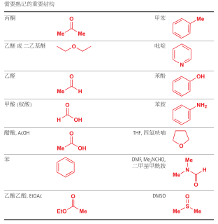

# 有机化学概述 \{#\_1}

## 有机化学 \{#\_2}

### 有机化合物 \{#\_3}

有机物指的是含碳元素的化合物，研究有机物的化学则称为有机化学。有机物中除了碳通常还含有氢、氧、氮、硫、卤素、磷等元素。碳氧化物、碳酸盐、碳酸氢盐、碳化物等虽然含有碳但是不算为有机物。

与无机物相比，有机物普遍具有以下性质：

- 物理性质：大多熔点较低，且难溶于水，易溶于汽油、乙醇、苯等有机溶剂。
- 热稳定性：大多数有机物易燃，受热会分解。
- 化学反应：有机物的化学反应较为复杂，常伴有副反应，许多反应需在加热、光照或催化剂作用下进行。

### 碳的成键特点 \{#\_4}

碳原子有四个价电子，使其不易失去或得到电子形成离子，故与各非金属元素之间形成共价键，但是有机物不一定就只能是共价化合物，离子化合物如有机酸盐等。

碳原子在有机物中，通常与四个原子直接相连，即配位数为 $4$，与一个碳原子相连的原子既可以是碳原子、也可以是其他原子，碳原子的这种独特的成键能力，是有机化合物多样性的根本原因。

:::note

为什么硅没有形成硅基有机化合物？

1. 碳碳单键稳定性强，增强了有机物的稳定性。

2. 碳的原子半径小，更容易形成双键和三键，增加了有机物的多样性。

3. 碳具有适中的电负性，可以与很多非金属原子形成共价键，使有机物更稳定。

4. 同样，原子半径小，空间位阻小，可以连接多个基团，形成复杂的、紧凑的三维结构。

:::

碳原子间的共价键可以是：单键（$\ce\{C - C}$）、双键（$\ce\{C = C}$）、三键（$\ce\{C # C}$）。

**碳骨架**：多个碳原子之间可以结合成碳链（包括直链和支链）或碳环，构成有机物分子链的碳骨架。多个碳原子之间可以结合形成碳链，碳链既可以是一条直链，也可以带有支链；碳原子间也可以结合成碳环，环上的碳原子还可以连接支链。

- 饱和碳原子：单键碳原子。

- 不饱和碳原子：双键碳原子、三键碳原子、苯环碳原子。

含有不饱和键的有机化合物分子由于双键或三键中有**部分键**容易断裂；双键或三键两端的碳原子还可以结合其他原子或原子团，一般易于发生加成反应（苯环结构具有特殊性）。

### 不饱和度 \{#\_5}

不饱和度的定义：

$\Omega=$ 重键数 $+$ 最简环数

也就是说，一个不饱和度，也就是少了一对氢原子，例如，$\ce\{C=C}$ 不饱和度为 $1$，$\ce\{C#C}$ 为 $2$。

同时，不饱和度 $\Omega$ 也可以通过分子式求出：

$$
\begin\{aligned} \Omega(\ce\{C\_xH\_y})&=\dfrac\{(2x+2)-y}\{2}\ \Omega(\ce\{C\_xH\_ySi\_aX\_m})&=\dfrac\{2(x+a)+2-(y+m)}\{2}\ \Omega(\ce\{C\_xH\_yO\_qS\_p})&=\dfrac\{(2x+2)-y}\{2}\ \Omega(\ce\{C\_xH\_yN\_b})&=\dfrac\{2(x+b)+2-(y+b)}\{2}&=\dfrac\{2x+2-y+b}\{2} \end\{aligned}
$$

- 卤素原子 $\ce\{X}$ 视为氢原子、硅视为碳原子。

- $\ce\{C-O}$ 和 $\ce\{C=O}$ 不影响不饱和度，硫也是。

- 一个苯环 $=$ 三个双键一个环，不饱和度为 $4$。

应用：

- 根据图算出不饱和度，又知道了除了氢原子个数以外的，直接通过不饱和度求氢原子数。

## 有机化合物 \{#\_6}

### 有机物的表示 \{#\_7}

<table>
<thead>
<tr>
<th style="text-align: center;"></th>
<th>表示方式</th>
<th style="text-align: center;">示例</th>
</tr>
</thead>
<tbody>
<tr>
<td style="text-align: center;">分子式</td>
<td>用元素符号表示物质的分子组成</td>
<td style="text-align: center;"></td>
</tr>
<tr>
<td style="text-align: center;">最简式（实验式）</td>
<td>用元素符号表示化合物中各元素原子个数的最简整数比</td>
<td style="text-align: center;"></td>
</tr>
<tr>
<td style="text-align: center;">电子式</td>
<td>在元素符号周围用「」或「」表示原子的最外层电子的成键情况</td>
<td style="text-align: center;"></td>
</tr>
<tr>
<td style="text-align: center;">结构式</td>
<td>用短线「」来表示 1 个共价键，将所有原子连接起来</td>
<td style="text-align: center;"></td>
</tr>
<tr>
<td style="text-align: center;">结构简式</td>
<td>省略结构式中的单键「」，将与碳原子相连的其他原子写在其旁边，在右下角注明其个数</td>
<td style="text-align: center;"></td>
</tr>
<tr>
<td style="text-align: center;">键线式</td>
<td>省略结构简式中与碳原子直接相连的氢原子，每个拐点或端点均表示一个碳原子，不足的用氢原子补足</td>
<td style="text-align: center;"></td>
</tr>
<tr>
<td style="text-align: center;">球棍模型</td>
<td>小球表示原子，短棍表示化学键</td>
<td style="text-align: center;"></td>
</tr>
<tr>
<td style="text-align: center;"><nowrap>空间填充模型</nowrap></td>
<td>用不同体积的小球表示不同大小的原子，相对大小关系应与原子实际相对大小关系一致</td>
<td style="text-align: center;"></td>
</tr>
</tbody>
</table>

- 书写结构简式时，同一个碳原子上的相同原子或原子团可以合并，相邻且相同的原子团亦可以合并。

- 结构简式不能表示有机化合物的真实空间结构。

### 有机物的分类 \{#\_8}

同系物：结构相似，在分子组成上相差一个或若干个 $\ce\{CH2}$ 原子团的化合物互称为同系物。烷烃就是一个同系物系列。

|   类别   | 通式                                |
| :----: | --------------------------------- |
|   链烷烃  | $\ce\{C\_n H\_\{2n+2} (n \ge 1)}$ |
|   单烯烃  | $\ce\{C\_n H\_\{2n} (n \ge 2)}$   |
|   环烷烃  | $\ce\{C\_n H\_\{2n} (n \ge 3)}$   |
|   炔烃   | $\ce\{C\_n H\_\{2n-2} (n \ge 2)}$ |
|   二烯烃  | $\ce\{C\_n H\_\{2n-2} (n \ge 4)}$ |
| 苯及其同系物 | $\ce\{C\_n H\_\{2n-6} (n \ge 6)}$ |

- 同系物因组成和结构相似，化学性质相似，而物理性质如熔沸点、密度，一般呈规律性变化。

- 同系物定义中的「结构相似」是指碳链和成键方式相同、官能团相同、官能团数目相同、官能团与其他原子的连接 方式相同等。

|   类别  |  官能团名称 |        官能团结构        |  类别 |  官能团名称  |     官能团结构     |
| :---: | :----: | :-----------------: | :-: | :-----: | :-----------: |
|   烯烃  |  碳碳双键  |     $\ce\{C=C}$     |  炔烃 |   碳碳三键  |  $\ce\{C#C}$  |
|  卤代烃  |   碳卤键  |      $\ce\{-X}$     | 醇/酚 | 醇羟基/酚羟基 |  $\ce\{-OH}$  |
|   醚   |   醚键   |     $\ce\{-O-}$     |  胺  |    氨基   |  $\ce\{-NH2}$ |
|   醛   |   醛基   |     $\ce\{-CHO}$    |  酮  |   酮羰基   |  $\ce\{-CO-}$ |
|   羧酸  |   羧基   |    $\ce\{-COOH}$    |  酯  |    酯基   | $\ce\{-COOR}$ |
| 酰胺/酰卤 | 酰胺/酰卤基 | $\ce\{-CONH2/-COX}$ |  腈  |    氰基   |  $\ce\{-CN}$  |

### 有机物的命名 \{#\_9}

俗称命名法：

- 给予复杂分子的简单名称，并不考虑分子的真实结构、功能。

- 很多时候，有机化合物的俗称来源于它们被首次分离时所来源的有机体的名称，例如蚁酸。

习惯命名法：

- 根据碳原子数量：

  十以下：依次用甲、乙、丙、丁、戊、己、庚、辛、壬、癸表示。

  十以上：用中文数字表示。

- 碳原子数相同时：正（直链无支链的烷烃）、异（带有一个支链的烷烃）、新（带有两个支链的烷烃），正戊烷的主链是丁烷。

国际纯粹与应用化学联合会（IUPAC）发展了一套**系统命名法**，这是一套可以给予任意一个化合物一个唯一的名称的规则，这种名称可以直接地从其化学结构上推导出来。反过来，从系统名称也可以推出一个分子的结构。系统命名的问题在于，除了最简单的分子外，其他分子的名称都荒诞地不能读出来。在日常的演讲或写作中，化学家往往会漠视它们，使用系统和俗称命名法的混合。

系统名称可以分为三个部分：其一描述了碳氢骨架，其二描述了官能团，还有一个阐释了官能团在碳氢骨架上的位置。

1. 定主链：

   定主链要遵循「长」「多」原则：

   以最长的连续碳链为主链，以此主链决定烷烃的基本名称。

   当有几个相同长度的不同碳链时，选择含支链最多的一个作为主链。

   

2. 定编号：

   以阿拉伯数字表示取代基或官能团的位置编号，以中文数字表示取代基个数，阿拉伯数字与汉字间以短横线「$-$」分开。

   

   多个取代基，编号位要遵循「近」「简」「小」原则：

   - 首先考虑「近」：以 离支链较近 的一端给主链碳原子编号。

   - 同「近」考虑「简」：有两个不同的支链，且分别处于距主链两端同近的位置则从支链较简单的一端开始编号。

   - 同「近」同「简」考虑「小」：若有两个相同的支链，且分别处于距主链两端同近的位置，而中间还有其他支链，从主链的两个方向编号，可得到两种不同的编号序列，两序列中各支链位次和最小者即为正确的编号。

   

- 对于烯烃和炔烃：

  单烯烃、单炔烃：主链必须是含有碳碳双键或碳碳三键的最长碳链、从距离碳碳双键或碳碳三键最近的一端开始编号，先写取代基的位置和名称，再写碳碳双键或碳碳三键的位置。

  若分子中同时含有碳碳双键与碳碳三键，可用某烯炔作结尾，并给予双键、三键尽可能低的位号，如果位号有选择时，使双键位号比三键小，书写时先烯后炔。

  

  多烯烃、多炔烃：将含有碳碳双键或碳碳三键最多的最长碳链作为主链，称为「某几烯」或「某几炔」，从距离碳碳双键或碳碳三键最近的一端开始，将支链作为取代基，写在「某几烯」或「某几炔」的前面，并用阿拉伯数字标明碳碳双键或碳碳三键的位置，写出有机物的名称。

- 对于环状化合物：环状化合物的命名通常选择环作为母体，从环上连有最简单取代基的碳原子开始编号

  并没有链端，但我们可以用编号显示两个基团间的距离------从带有其中一个官能团的碳原子开始，沿环计数。这个规则在碳氢骨架是链状或环状时可使用，但很多骨架还带有分支。我们可以将支链视作官能团处理。

  

  以苯环作为命名的母体，苯环上的侧链烷基为取代基进行命名，如苯环上的一个氢原子被甲基取代称为甲苯，苯环上的一个氢原子被乙基取代称为乙苯。当苯环上有两个取代基时，根据取代基在苯环上的相对位置，可分别用「邻」（1,2-二取代）「间」（1,3-二取代）「对」（1,4-二取代）来表示，当苯环上有三个相同取代基时，根据取代基在苯环上的相对位置，可分别用「连」（1,2,3-三取代）「偏」（1,2,4-三取代）「均」（1,3,5-三取代）来表示。

  

  当苯环上连接不饱和基团或虽为饱和基团，但体积较大或结构比较复杂时，可将苯作为取代基。

- 对于烃的衍生物：卤素原子、硝基、亚硝基等，将官能团作为取代基，仍以烷烃为母体，按烷烃的命名原则来命名。

  将含有官能团的最长主链作为母体化合物：将含有母体官能团的最长碳链作为主链，将支链作为取代基，根据主链的碳原子数称为某醇、醛、酮、酸、酰卤、酰胺、腈等。

  酯的命名：酯是羧酸与醇脱水缩合形成的产物，命名时先把羧酸名称放在前面，将醇的名称放在后面，先删去「醇」字，而后加上「酯」字。

  含多种官能团的烃衍生物的系统命名：当分子中含有多种官能团时，首先要确定一个主官能团，确定主官能团的顺序是羧酸、酯、酰胺/卤、醛、酮、醇、酚、胺、醚、烯、炔。然后，选择含有主官能团及尽可能含较多官能团的最长碳链为主链。

**半系统命名法（Semi-systematic Nomenclature）** 是有机化学命名中一种介于"习惯命名（俗名）"和"严格系统命名（IUPAC 命名）"之间的命名方式。它在化学文献、工业生产以及日常交流中非常常见，甚至在某些情况下被 IUPAC 列为"保留名"（Retained Names），允许与系统命名混用。

半系统命名法的特点是：**保留一个历史上形成的、被广泛接受的"母体名称"（Parent Name），然后对其余部分采用系统命名的规则（如编号、取代基顺序）进行描述。**

- **不是完全的系统命名：** 因为它没有把整个分子拆解成最基础的碳链来命名（例如，它不叫"甲基苯"，而叫"甲苯"）。

- **不是完全的俗名：** 因为它不是完全随意的（例如，它不叫"苦味酸"，而叫"2,4,6-三硝基苯酚"）。

最常见的应用场景：苯的衍生物，通常不叫"某基苯"，而是有专用的母体名：

| 结构        | 系统命名（严格）   | **半系统命名（常用/保留）**       | 英文名          |
| :-------- | :--------- | :--------------------- | :----------- |
| 苯环 + 甲基   | 甲基苯        | **甲苯 (Toluene)**       | Toluene      |
| 苯环 + 羟基   | 羟基苯        | **苯酚 (Phenol)**        | Phenol       |
| 苯环 + 氨基   | 氨基苯        | **苯胺 (Aniline)**       | Aniline      |
| 苯环 + 醛基   | 苯甲醛        | **苯甲醛 (Benzaldehyde)** | Benzaldehyde |
| 苯环 + 羧基   | 苯甲酸        | **苯甲酸 (Benzoic acid)** | Benzoic acid |
| 苯环 + 乙烯基  | 乙烯基苯       | **苯乙烯 (Styrene)**      | Styrene      |
| 苯环 + 两个甲基 | 二甲基苯       | **二甲苯 (Xylene)**       | Xylene       |
| 苯环 + 异丙基  | (1-甲基乙基) 苯 | **异丙苯 (Cumene)**       | Cumene       |

一旦确定了母体，其他取代基的位置编号遵循以下原则：

1. **母体官能团定为 $1$ 号位：** 例如在"甲苯"中，甲基所在的碳自动定为 $1$ 号，不需要写"1-甲基..."。
2. **其余取代基位次最小：** 从 $1$ 号位开始，向其余取代基最近的方向编号。
3. **邻、间、对：** 对于二取代苯，常用汉字"邻、间、对"或字母 o/m/p 来代替数字编号。

脂肪族化合物中的半系统命名：在烷烃和烷基的命名中，也保留了特定的前缀来表示异构体。

- **异 (Iso-)：** 指链端有 `(CH₃)₂CH-` 结构。例：异丁烷 (Isobutane)、异丙基 (Isopropyl)。系统命名对应：2-甲基丙烷、1-甲基乙基。

- **新 (Neo-)：** 指链端有 `(CH₃)₃C-` 结构（季碳）。例：新戊烷 (Neopentane)。系统命名对应：2,2-二甲基丙烷。

- **叔 (tert- / t-)：** 指官能团连在叔碳上。例：叔丁醇 (tert-Butyl alcohol)。系统命名对应：2-甲基 -2-丙醇。

为什么需要半系统命名？

1. **简洁性：** "对硝基甲苯"比"1-甲基 -4-硝基苯"读起来更顺口，且在化工行业（如 TNT 炸药的生产）中是标准术语。
2. **历史传承：** 许多化合物在被系统命名法统一之前就已经广泛使用（如甲苯、苯酚），强行更改会造成混乱。
3. **IUPAC 的认可：** IUPAC 蓝皮书中列出了许多"Preferred IUPAC Names (PINs)"，其中包含大量半系统命名。例如，**Toluene（甲苯）** 和 **Phenol（苯酚）** 在 IUPAC 中本身就是优选名，比 Methylbenzene 和 Benzenol 更推荐。

**半系统命名法是化学界的"通用语"**。它保留了核心习惯（如甲苯、苯乙烯），但在修饰语上遵循逻辑（如 2,4,6-三硝基...）。

- 对于**简单常见物**（甲苯、苯酚、苯乙烯）：半系统命名是首选。
- 对于**复杂取代物**（如 1,4-二甲基 -3-乙基苯这类）：应回归严格系统命名（1-乙基 -2,5-二甲基苯），以避免歧义。

## 研究的方法 \{#\_10}

### 元素分析法 \{#\_11}

现代化的元素分析仪可以测出有机物含有元素，例如 $\ce\{C,H,O}$ 的质量比，可以根据这个推算出为止有机物的实验式（最简式）。

有机物完全燃烧的规律：

- 燃烧热：则每个碳原子对燃烧热的贡献大约是 $\pu\{400kJ/mol}$，每个氢原子对燃烧热的贡献大约是 $\pu\{150kJ/mol}$。也就是说近似的：

  $$
  Q(\ce\{C\_xH\_y})\approx 400x+150y
  $$

  假设产物水为液态，这个公式对于碳数小于 $20$ 的烷烃是较为准确的，对于烯烃、炔烃、芳香烃等就误差较大了。

- 耗氧量：实际上上面的燃烧热的近似公式，也是可以用耗氧量来估算的，有一个经验规律是，烃的燃烧热与其完全燃烧的耗氧量，非常接近一个线性关系。我们不妨先写出燃烧的方程式：

  $$
  \ce\{C\_xH\_y + $\paren\{x+\dfrac\{y}\{4}}$O2 ->\[点燃] xCO2 + \dfrac\{y}\{2}H2O(g)}
  $$

  对于等物质的量的有机物，$\paren\{x+\dfrac\{y}\{4}}$ 的值越大，耗氧量越多、燃烧热越大；对于等质量的有机物，$y/x$ 的值越大，耗氧量越多，燃烧热越大。

如果已知有机物的元素组成，也可以通过燃烧，检测水和二氧化碳的方法来测定。

### 质谱仪质谱法 \{#\_12}

质谱法使用质谱仪，用高能电子流轰击样品分子，对于高中而言，唯一的用处就是，图像上相对分子量最大的一条杠就是有机物的相对分子量。

根据相对分子质量，以及实验式，可以求出物质的分子式。

### 核磁共振氢谱 \{#\_13}

氢原子具有磁性，通过核磁共振仪得到的氢谱上各个吸收峰的面积，得到结构中的不同化学环境氢原子的信息。

吸收峰的个数为等效氢的个数，而吸收峰的面积比即为各个化学环境的氢的个数之比。

### 红外光谱法 \{#\_14}

有机物分子中，组成化学键或官能团的原子处于不断震动的状态，其振动频率与红外光的振动频率相当。

用红外光照射有机物分子时，化学键或官能团可以发生振动吸收，可以直接确定有机物中存在的化学键或官能团。

### 分子光谱 \{#\_15}

分子光谱与分子内部的运动密切相关，涉及的分子运动方式主要为：

1. **分子的转动**：吸收或发射的光处在远红外区或微波区，称为远红外光谱或微波谱。

2. **分子中原子间的振动**：通常振动光谱在近红外区和中红外区，一般称为红外光谱（IR）。

3. **分子中电子在不同能级的分子轨道间跃迁**：得到紫外-可见光谱（UV-Vis）。

因此：

- 键长缩短、键能加强，化学键的伸缩振动频率升高，在红外光谱中对应吸收峰值的频率依次增加。

- 基于红外光谱中吸收峰值的频率可以推测分子中存在的官能团，进而为推测分子结构提供证据。

- 物质的浓度越高，其特征吸收峰的强度则越大，因此分子光谱还被广泛用于测定物质浓度。

## 神奇的有机物 \{#\_16}

### 金刚烷 \{#\_17}

金刚烷，分子式 $\ce\{C10H16}$，它的碳架结构相当于金刚石晶格网络中的一个晶胞，故得名金刚烷。它是一种脂环烃，具有类似樟脑的气味，是无色晶体，容易结晶，其衍生物可以用作药物。

金刚烷的化学性质较为复杂，课内不涉及，其性质详见 [金刚烷 - 维基百科](https://zh.wikipedia.org/zh-hans/金刚烷#化学性质)。

### 环氧乙烷 \{#\_18}

从 2-氯乙醇中脱去氯化氢，是实验室中制取环氧乙烷最普遍的方法：

$$
\ce\{Cl–CH2CH2–OH + NaOH ->\[\triangle] (CH2CH2)O + NaCl + H2O}
$$

氯乙醇可由乙烯与次氯酸反应制备：

$$
\ce\{CH2=CH2 + HOCl -> HO–CH2CH2–Cl}
$$

环氧乙烷通常用于制备乙二醇：

$\ce\{+ H2O ->}\quad$

乙烯在 Ag 催化剂的作用下与氧气发生氧化反应，生成环氧化合物：

$$
\ce\{2CH2=CH2 + O2 ->\[Ag]\[\triangle] 2C2H4O}
$$

这是一个经典的工业反应，注意如果是钯/铜催化剂则是生成乙醛，但银催化剂特指生成环氧乙烷。

$$
\ce\{C2H4O + H2O -> HO-CH2-CH2-OH}
$$

环氧化合物的开环水解反应。环氧乙烷在酸性或中性条件下与水反应，碳氧键断裂，两端各连上一个羟基（-OH）。

### 季戊四醇 \{#\_19}

季戊四醇也称为【数据删除】醇。

季戊四醇是白色或淡黄色的结晶粉末，稍溶于乙醇，溶于水、甲醇、甘油、乙二醇、甲酰胺，不溶于丙酮、苯、石蜡、醚和四氯化碳。易被一般有机酸酯化，与稀氢氧化钠溶液同煮无反应。

季戊四醇分子中含有四个等同的羟甲基，具有高度的对称性，因此常被用作多官能团化合物的制取原料。由它硝化可以制得季戊四醇四硝酸酯（太安，PETN），是一种烈性炸药；酯化可得季戊四醇三丙烯酸酯（PETA），用作涂料。

### 交酯内酯 \{#\_20}

交酯指的是两分子以上羟基酸相互发生分子间酯化形成的环状内酯。

其中一分子羟基酸的羟基与另一分子羟基酸的羧基缩合脱去一分子水生成酯，同时这一分子羟基酸的羧基又与另一分子羟基酸的羟基缩合生成另一个酯基。

内酯即环状羧酸酯，为羟基羧酸的环酯，是由同一有机化合物中的羧基与羟基相互作用脱水（发生分子内缩合环化）而形成的环状酯。内酯键或环酯键即为存在于一个环状分子内部的特殊酯键。

内酯可通过多种方法合成，最常见的是羟基酸（例如葡萄糖酸）发生分子内酯化：

内酯的化学性质与酯相似。除五元环内酯外，所有的内酯在催化剂作用下都会发生开环聚合反应。

内酯与碱（如氢氧化钠）共热会发生水解，生成母体羟基酸，是内酯合成的逆反应。不同内酯发生水解的程度不同，有些是可逆反应，一般反应的平衡常数要大于对应的直链酯类，水解更加容易，原因是两者反应的焓变相差不大，但内酯的水解在熵变上有利。内酯加酸亦会水解生成相应的羟基酸。
